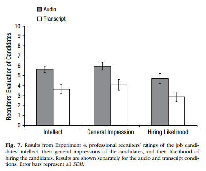

## InClass Activity

**Comparing the Means of Two Samples**

Two-sample designs are very common in Psychology as often we want to know whether there is a difference between groups on a particular variable.  There are different types of two-sample designs depending on whether or not the two groups are independent (e.g. different participants on different conditions) or not (e.g. same participants on different conditions).  In today's exercise we will focus on **independent samples**, which typically means that the observations in the two groups are unrelated - usually meaning different people.  In the next lab you will examine cases where the observations in the two groups are from pairs (**paired samples**) - most often the same people but could also be a matched pairs design.

`r hide("Portfolio Point - All the different names for one thing!")`
```{block, type ="info"}
Now that we are progressing through the semester we will start to reduce the pointers for things that you should make a note of. By now you should have a really good idea yourself about what you need to remember.  That said, one of the really confusing things about research design is that there are many names for the same type of design.  This is definitely something you should be writing out in your own words, to remember it better, if it is something you struggle with.

E.g.

* independent and between-subjects design typically mean the same thing - different participants in different conditions
* within-subjects, dependent, paired samples, and repeated measures tend to mean the same participants in all conditions
* matched pairs design means different people in different conditions but you have matched participants across the conditions so that they are effectively the same person (e.g. age, IQ, Social Economic Status, etc)
* mixed design is when there is a combination of within-subjects and between-subjects designs in the one experiment. For example, say you are looking at attractiveness and dominance of male and female faces. Everyone might see both male and female faces (within) but half of the participants do ratings of attractiveness and half do ratings of trustworthiness (between). The paper we are looking at today technically uses a mixed design at times but we will use the between element to show you how to run independent t-tests.

Spend sometime when reading articles to really figure out the design they are using.
```
`r unhide()`  
<br>
**Background**

For this lab we will be revisiting the data from Schroeder and Epley (2015), which you first encountered as part of the homework for Lab 5. You can take a look at the Psychological Science article here:

Schroeder, J. and Epley, N. (2015). <a href = "https://doi.org/10.1177/0956797615572906" target = "_blank">The sound of intellect: Speech reveals a thoughtful mind, increasing a job candidate's appeal.</a> *Psychological Science, 26, 277--891*.

The abstract from this article explains more about the different experiments conducted (we will be specifically looking at the dataset from Experiment 4, courtesy of the <a href = "https://sites.trinity.edu/osl/data-sets-and-activities/t-test-activities" target = "_blank">Open Stats Lab</a>:

"**A person's mental capacities, such as intellect, cannot be observed directly and so are instead inferred from indirect cues. We predicted that a person's intellect would be conveyed most strongly through a cue closely tied to actual thinking: his or her voice. Hypothetical employers (Experiments 1-3b) and professional recruiters (Experiment 4) watched, listened to, or read job candidates' pitches about why they should be hired. These evaluators (the employers) rated a candidate as more competent, thoughtful, and intelligent when they heard a pitch rather than read it and, as a result, had a more favorable impression of the candidate and were more interested in hiring the candidate. Adding voice to written pitches, by having trained actors (Experiment 3a) or untrained adults (Experiment 3b) read them, produced the same results. Adding visual cues to audio pitches did not alter evaluations of the candidates. For conveying one's intellect, it is important that one's voice, quite literally, be heard.**"

To recap on Experiment 4, 39 professional recruiters from Fortune 500 companies evaluated job pitches of M.B.A. candidates from the University of Chicago Booth School of Business. The methods and results appear on pages 887--889 of the article if you want to look at them specifically for more details. The original data, in **wide** format, can be found at the <a href = "https://drive.google.com/open?id=0Bz-rhZ21ShvOei1MM24xNndnQ00" target = "_blank">Open Stats Lab</a> website for later self-directed learning. Today however, we will be working with a modfied version in "tidy" format which can be <a href = "https://www.psy.gla.ac.uk/~phil/L2Labs_201819/semester_one/lab_06/inclass/Lab6_data.zip" target = "_blank">downloaded from here</a> or from Moodle. Likewise, if you are unsure about tidy format, refer back to the inclass activity of Lab 2.

**Today's Goal!**

Our task today is to reproduce a figure and the results from the article (p. 887). The two packages you will need are `tidyverse`, which we have used a lot, and `broom`, which is new to you but will become your friend. One of the main functions we use in broom is `broom::tidy()` - this is an incredibly useful function that converts the output of an inferential test in R from a combination of text and lists, that are really hard to work with, into a table that you can then use much more easily. Might that be worth making a note of? We will show you how to do this today and then ask you to use it over the coming assignments.

If you are using the Boyd Orr labs, `broom` is already installed and just needs called to the `library()`. If you are using your own machine, you will need to install it one time to begin with if you have never installed it before.

### Task 1: Evaluators {#Ch6InClassQueT1}

1. Open a new script and call `broom` and the `tidyverse` into your library. **Note:** Order is important when calling multiple libraries - if two libraries have a function named the same thing, R will use the function from the library loaded in last.

2. The file called `evaluators.csv` contains the demographics of the 39 raters. After downloading and unzipping the data, and of course setting the working directory, read in the information from this file and store it in a variable called `evaluators`.

3.  Now, use a line of code to calculate the overall mean and standard deviation of the age of the evaluators. Next, use a separate line of code to count up how many male and how many female evaluators there were in the study. Note that there are NAs in the data so you will need to include a call to `na.rm = TRUE`.

`r hide("Helpful Hint")`
```{block, type ="info"}
* Remember to load the libraries you need! 
* Also make sure you've downloaded and saved the data in the folder you're working from.
* You can use `summarise()` and `count()` or a pipeline with `group_by()` to complete this task.
* When analysing the number of male and female evaluators it isn't initially clear that '1' represents males and '2' represents females. 
* We can use `recode()` to convert the numeric names to indicate something more meaningful. Have a look at`?recode` to see if you can work out how to use it. It'll help to use `mutate()` to create a new variable to `recode()` the numeric names for evaluators. 
* This website is also incredibly useful and one to save for anytime you need to use recode(): https://debruine.github.io/recode.html.
* For your own analysis and future reproducible analyses, it's a good idea to make these representations clearer to others. 
```
`r unhide()`  
<br>
```{r ch6-task1-dataload, include = FALSE}
library("tidyverse")
library("broom") # you'll need broom::tidy() later

evaluators <- read_csv("data/06-s01/inclass/evaluators.csv")

evaluators %>%
  summarize(mean_age = mean(age, na.rm = TRUE))

evaluators %>%
  count(sex)

# If using `recode()`:
evaluators %>%
  count(sex) %>%
  mutate(sex_names = recode(sex, "1" = "male", "2" = "female"))

```

<span style="font-size: 22px; font-weight: bold; color: var(--green);">Quickfire Questions</span> 

From your results:

* What was the mean age of the evaluators in the study? Type in your answer to one decimal place: `r fitb("30.9")`
* What was the standard deviation of the age of the evaluators in the study? Type in your answer to two decimal place: `r fitb("6.24")`
* How many participants were noted as being female: `r fitb("30")`
* How many participants were noted as being male: `r fitb("4")`

<span style="font-size: 22px; font-weight: bold; color: var(--pink);">Group Discussion Point</span>

The paper claims that the mean age of the evaluators was 30.85 years (SD = 6.24) and that there were 9 male and 30 female evaluators. Do you agree? Why might there be differences?

`r hide("Explain This - Why is there a discrepancy?")`
```{block, type ="info"}
This paper claimed there were 9 males, however looking at your results you can see only 4 males, with 5 NA entries making up the rest of the participant count. It looks like the NA and male entries have been combined! That information might not be clear to a person re-analysing the data.

This is why it's important to have reproducible data analyses for others to examine. Having another pair of eyes examining your data can be very beneficial in spotting any discrepancies - this allows for critical evaluation of analyses and results and improves the quality of research being published. All the more reason to emphasize the importance of conducting replication studies! #ReproducibleScience
```
`r unhide()` 
<br>    
### Task 2: Ratings {#Ch6InClassQueT2}

We are now going calculate an overall intellect rating given by each evaluator - how intellectual the evaluators thought candidates were overall depending on whether or not the evaluators **read** or **listened** to the candidates' resume pitches. This is calculated by averaging the ratings of `competent`, `thoughtful` and `intelligent` for each evaluator; held within `ratings.csv`. **Note:** we are not looking at ratings to individual candidates; we are looking at overall ratings for each evaluator. This is a bit confusing but makes sense if you stop to think about it a little.

We will then combine the overall intellect rating with the overall impression ratings and overall hire ratings for each evaluator, with the end goal of having a tibble called `ratings2` - which has the following structure:

```{r ratings_structure, echo=FALSE, message=FALSE}

ratings2 <- read_csv("data/06-s01/inclass/ratings.csv") %>%
  filter(Category %in% c("competent", "thoughtful", "intelligent")) %>%
  group_by(eval_id) %>%
  summarise(Rating = mean(Rating)) %>%
  mutate(Category = "intellect")

## combine into a single table
ratings3 <- read_csv("data/06-s01/inclass/ratings.csv") %>%
  filter(Category %in% c("impression", "hire")) %>%
  bind_rows(ratings2) %>%
  inner_join(evaluators, "eval_id") %>%
  select(-age, -sex) %>%
  mutate(Rating = round(Rating, 3)) %>%
  arrange(eval_id, Category)

ratings3 %>%
  slice(1:12)
```

The following steps describe how to create the above tibble but you might want to have a bash yourself without reading them first. The trick when doing data analysis and data wrangling is to first think about what you want to achieve - the end goal - and then what function do I need to use. You know what you want to end up with - the above table - now how do you get there?

Steps 1-3 calculate the new `intellect` rating. Steps 4 and 5 combine this rating to all other information.

1. Load the data found in `ratings.csv` into a tibble called `ratings`. 

2. `filter()` only the relevant variables (**thoughtful**, **competent**, **intelligent**) into a new tibble (call it what you like - we use `iratings`), and calculate a mean `Rating` for each evaluator.  

3. Add on a new column called `Category` where every entry is the word `intellect`. This tells us that every number in this tibble is an intellect rating.  

4. Now create a new tibble called `ratings2` and filter into it just the "impression" and "hire" ratings from the original `ratings` tibble. Next, bind this tibble with the tibble you created in step 3 to bring together the intellect, impression, and hire ratings, in `ratings2`.  

5. Join `ratings2` with the `evaluator` tibble that we created in Task 1. Keep only the necessary columns as shown above and arrange by Evaluator and Category.  

Don't forget to use the hints and the solution at the bottom if you are really stuck.

`r hide("Helpful Hint")`
```{block, type ="info"}
1. Make sure you've downloaded and saved the data into the folder you're working from.

2. `filter(Category %in% c())` might work and then use `group_by()` and `summarize()` to calculate a mean `Rating` for each evaluator.

3. Use `mutate()` to create a new column.

4. `bind_rows()` from Lab 2 will help you to combine these variables from two separate tibbles.

5. Use `inner_join()` with the column common in both tibbles. `select()` and `arrange()` will help you here too.
```
`r unhide()`
<br>

```{r ch6-task2-hidden, include = FALSE}
# 1. load in the data
ratings <- read_csv("data/06-s01/inclass/ratings.csv")

# 2. first step: pull out the ratings associated with intellect
iratings <- ratings %>%
  filter(Category %in% c("competent", "thoughtful", "intelligent"))

# second step: calculate means for each evaluator
imeans <- iratings %>%
  group_by(eval_id) %>%
  summarise(Rating = mean(Rating))

# 3. add Category variable 
# this way we can combine with 'impression' and 'hire' into a single table, very useful!
imeans2 <- imeans %>%
  mutate(Category = "intellect")

# 4. & 5. combine into a single table
ratings2 <- ratings %>%
  filter(Category %in% c("impression", "hire")) %>%
  bind_rows(imeans2) %>%
  inner_join(evaluators, "eval_id") %>%
  select(-age, -sex) %>%
  arrange(eval_id, Category)
```

### Task 3: Creating a Figure {#Ch6InClassQueT3}

To recap, we now have `ratings2` which contains an overall `Rating` score for each evaluator on the three `Category` (within: hire, impression, intellect) depending on which `condition` that evaluator was in (between: listened or read). Great! Now we have all the information we need to replicate Figure 7 in the article (page 888), shown here:

```{r img-lab6-figure7, echo = FALSE, out.width='50%', fig.cap = "Figure 7 from Schroeder and Epley (2015) which you should try to replicate."}



```

Replace the `NULL`s below to create a very basic version of this figure. You did something like this for Lab 5 assignment and again in the Lab 3 Visualisation tasks.

```{r figure-7-almost, eval = FALSE}
group_means <- group_by(ratings2, NULL, NULL) %>%
  summarise(Rating = mean(Rating))

ggplot(group_means, aes(NULL, NULL, fill = NULL)) +
  geom_col(position = "dodge")
```

<span style="font-size: 22px; font-weight: bold; color: var(--pink);">Group Discussion Point</span>

**Improve This Figure:** Discuss with others how you could improve this plot. What other `geom_()` options could you try? Are barcharts that informative or would something else be better? How would you add or change the labels of your plot? Could you change the colours in your figure?

Next, have a look at the below possible solution to see a **modern** way of presenting this information. There are some new functions in this solution that you should play about with to understand what they do. Remember it is a layering system, so remove lines and see what happens. Note how in the solution the Figure shows the raw data points as well as the means in each condition; this gives a better impression of the true data as just showing the means can be misleading. You can continue your further exploration of visualisations by reading this paper later when you have a chance: <a href = "https://doi.org/10.1371/journal.pbio.1002128" target = "_blank">Weissberger et al., 2015, Beyond Bar and Line Graphs: Time for a New Data Presentation Paradigm</a>

`r hide("Possible Solution")`
```{r ch6-fig7-possible, results='asis', fig.cap='A possible alternative to Figure 7'}

group_means <- ratings2 %>%
  group_by(condition, Category) %>%
  summarise(Rating = mean(Rating))

ggplot(ratings2, aes(condition, Rating, color = condition)) +
  geom_jitter(alpha = .2) +
  geom_violin(aes(fill = condition), alpha = .2) +
  facet_wrap(~Category) +
  geom_point(data = group_means, size = 2) +
  labs(x = "Category", y = "Recruiters' Evaluation of Candidates") +
  coord_cartesian(ylim = c(0, 10), expand = FALSE) +
  guides(color = "none", fill = "none") +
  theme_bw()
```
`r unhide()`
<br>
### Task 4: t-tests {#Ch6InClassQueT4}

Brilliant! So far we have checked the descriptives and the last thing now is to check the inferential tests; the t-tests. You should still have `ratings2` stored from Task 2. From this tibble let's reproduce the **t-test** results from the article and at the same time show you how to run a t-test. Refer back to the lectures to understand the maths behind it but essentially it is a measure between the difference in means over the variance about those means. 

Here is a paragraph from the paper describing the results (p. 887):

"**The pattern of evaluations by professional recruiters replicated the pattern observed in Experiments 1 through 3b (see Fig. 7). In particular, the recruiters believed that the job candidates had greater intellect---were more competent, thoughtful, and intelligent---when they listened to pitches (M = 5.63, SD = 1.61) than when they read pitches (M = 3.65, SD = 1.91), t(37) = 3.53, p < .01, 95% CI of the difference = [0.85, 3.13], d = 1.16. The recruiters also formed more positive impressions of the candidates---rated them as more likeable and had a more positive and less negative impression of them---when they listened to pitches (M = 5.97, SD = 1.92) than when they read pitches (M = 4.07, SD = 2.23), t(37) = 2.85, p < .01, 95% CI of the difference = [0.55, 3.24], d = 0.94. Finally, they also reported being more likely to hire the candidates when they listened to pitches (M = 4.71, SD = 2.26) than when they read the same pitches (M = 2.89, SD = 2.06), t(37) = 2.62, p < .01, 95% CI of the difference = [0.41, 3.24], d = 0.86.**"

We are going to run the t-tests for Intellect, Hire and Impression; each time comparing evaluators overall ratings for the listened group versus overall ratings for the read group to see if there was a significant difference between the two conditions: i.e. did the evaluators who **listened** to pitches give a significant higher or lower rating than evaluators that **read** pitches. 

`r hide("Portfolio Point - A vs B or B vs A in a t-test?")`
```{block, type ="info"}
Now would be a good time to add to your notes about what is the difference between a positive and negative value as the outcome to a t-test? Remember? It just tells you which group had the bigger mean - the absolute value will be the same.  Most commonly, t-tests are reported as a positive value.
")
```
`r unhide()`
<br>
You will need the function `t.test()` and you will use `broom::tidy()` to pull out the results from each t-test into a table. Below we show you how to create the group means and then run the t-test for intellect. Run these lines and have a look at what they do.

1. First we calculate the group means:

```{r ch6-task4-steps1, echo = TRUE, eval = TRUE, results="hide"}
group_means <- ratings2 %>%
  group_by(condition, Category) %>%
  summarise(m = mean(Rating), sd = sd(Rating))
```

2. And we can call them and look at them by typing:
```{r ch6-task4-steps2, echo = TRUE, eval = TRUE, results="hide"}
group_means
```

3. Now to just look at intellect ratings we need to filter them into a new tibble:
```{r ch6-task4-steps3, echo = TRUE, eval = TRUE, results="hide"}
intellect <- filter(ratings2, Category == "intellect")
```

4. And then we run the actual t-test and tidy it into a table.
    * `t.test()` requires two vectors as input
    * `pull()` will pull out a single column from a tibble, e.g. Rating from intellect
    * `tidy()` takes information from a test and turns it into a table. Try running the t.test with and without piping into `tidy()` to see what it does differently.
 
```{r ch6-task4-steps4, echo = TRUE, eval = TRUE, results="hide"}

intellect_t <- t.test(intellect %>% filter(condition == "listened") %>% pull(Rating),
                      intellect %>% filter(condition == "read") %>% pull(Rating),
                      var.equal = TRUE) %>%
  tidy()
```

Now lets look at the `intellect_t`tibble we have created (assuming you piped into `tidy()`): 

```{r ch6-task4-table, echo = FALSE, results = 'asis'}
knitr::kable(intellect_t, digits = 3, caption = "The t-test output of those in the intellect condition.")
```

From the resultant tibble, `intellect_t`, you can see that you ran a Two Sample t-test (meaning between) with a two sided hypothesis test ("two.sided"). The mean for the listened condition, `estimate1`, was `r intellect_t$estimate1 %>% round(3)`, whilst the mean for the read condition, `estimate2` was `r intellect_t$estimate2 %>% round(3)`. So an overall difference of `r (intellect_t$estimate1 - intellect_t$estimate2) %>% round(3)`. The degrees of freedom, `parameter`, was `r intellect_t$parameter %>% round(3)`. The t-value, `statistic`, was `r intellect_t$statistic %>% round(3)`, and it was significant as the p-value, `p.value`, was `r intellect_t$p.value %>% round(4)` (lower than alpha ($a$) = .05 - the Type 1 error rate).  

The t-test would be written up as: t(`r intellect_t$parameter %>% round(3)`) = `r intellect_t$statistic %>% round(3)`, p = `r intellect_t$p.value %>% round(3)`.

**Now:**

1. Run the remaining t-tests for `hire` and for `impression`. Store them in tibbles called `hire_t` and `impress_t` respectively.  

2. Bind the rows of `intellect_t`, `hire_t` and `impress_t` to create a table of the three t-tests called `results`. It should look like this:

```{r ch6-task4-fulldata, echo = FALSE, eval = TRUE}
intellect <- filter(ratings2, Category == "intellect")
intellect_t <- t.test(intellect %>% filter(condition == "listened") %>% pull(Rating),
                      intellect %>% filter(condition == "read") %>% pull(Rating),
                      var.equal = TRUE) %>% tidy()
hire <- filter(ratings2, Category == "hire")
hire_t <- t.test(hire %>% filter(condition == "listened") %>% pull(Rating),
                      hire %>% filter(condition == "read") %>% pull(Rating),
                      var.equal = TRUE) %>% tidy()
impression <- filter(ratings2, Category == "impression")
impression_t <- t.test(impression %>% filter(condition == "listened") %>% pull(Rating),
                      impression %>% filter(condition == "read") %>% pull(Rating),
                      var.equal = TRUE) %>% tidy()
results <- bind_rows(intellect_t, hire_t, impression_t)
```

```{r lab6-task4-table2, echo = FALSE, results = 'asis'}
knitr::kable(results, caption = "Table Caption")
```

```{r table-test, echo = FALSE, results = 'asis'}
iris %>%
  group_by(Species) %>%
  summarise_all(mean) %>%
  knitr::kable(digits = 3, caption = "Example table with kable.")
```

<span style="font-size: 22px; font-weight: bold; color: var(--green);">Quickfire Questions</span> 

* Were your results for `hire` significant? Enter the mean estimates and t-test results (means and t-value to 2 decimal places, p-value to 3 decimal places):

    + Mean `estimate1` (listened condition) = `r fitb("4.71")`  
    
    + Mean `estimate2` (read condition) = `r fitb("2.89")`  
    
    + t(`r fitb("37")`) = `r fitb("2.62")`, p = `r fitb(c("0.013",".013"))`  
    

* Were your results for `impression` significant? Enter the mean estimates and t-test results (means and t-value to 2 decimal places, p-value to 3 decimal places):

    + Mean`estimate1` (listened condition) = `r fitb("5.97")`  
    
    + Mean `estimate2` (read condition) = `r fitb("4.07")`  
    
    + t(`r fitb("37")`) = `r fitb("2.85")`, p = `r fitb(c("0.007",".007"))` 
    
`r hide("Helpful Hint")`
```{block, type ="info"}
Your t-tests answers should have the following structure:

`t(degrees of freedom) = t-value, p = p-value`,

where:

* degrees of freedom = `parameter`, 
* t-value = `statistic`, 
* and p-value = `p.value`.
```
`r unhide()`  
<br>

<span style="font-size: 22px; font-weight: bold; color: var(--blue);">Job Done - Activity Complete!</span>

So to recap, we looked at the data from Schroeder and Epley (2015), both the descriptives and inferentials, we plotted a figure, and we confirmed that, as in the paper, there are significant differences in each of the three rating categories (hire, impression and intellect), with the listened condition receiving a higher rating than the read condition on each rating. All in, our interpretation would be that people rate you hire when they hear you speak your resume as opposed to them just reading your resume!

Well done for completing this inclass activity on independent samples t-tests! Are there any useful points in this activity about t-tests or plots that you think could be useful to include in your portfolio? Make sure to include them now! Also, if you have more time, you might want to visit this website that will give you better understanding of the relationship between the $t$ distribution and the normal distribution: <a href="https://gallery.shinyapps.io/tdist/" target = "_blank">gallery.shinyapps.io/tdist</a>

You should now be ready to complete the Homework Assignment for this lab. **The assignment for this Lab is FORMATIVE and is NOT to be submitted and will NOT count towards the overall grade for this module**. However you are strongly encouraged to do the assignment as it will continue to boost your skills which you will need in future assignments. If you have any questions, please post them on the slack forum under the channel **#level2_2018**.
