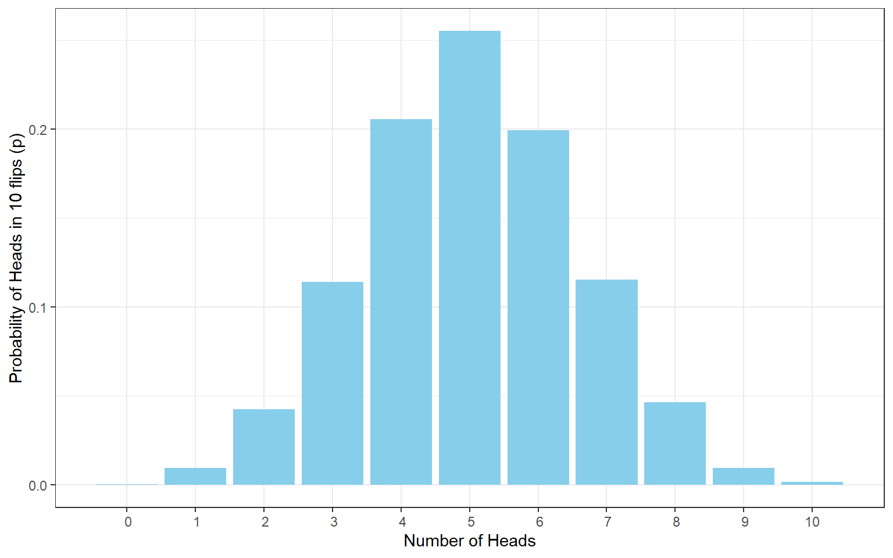
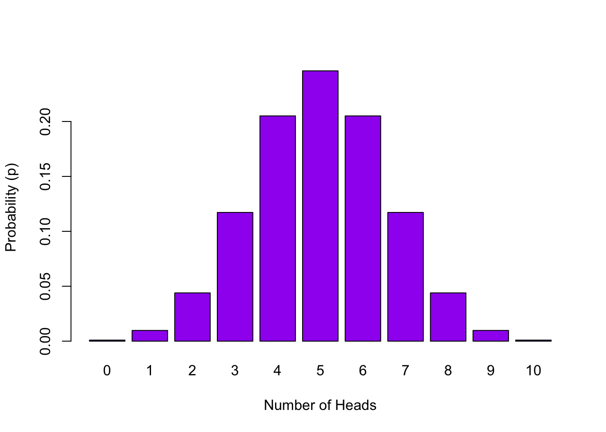
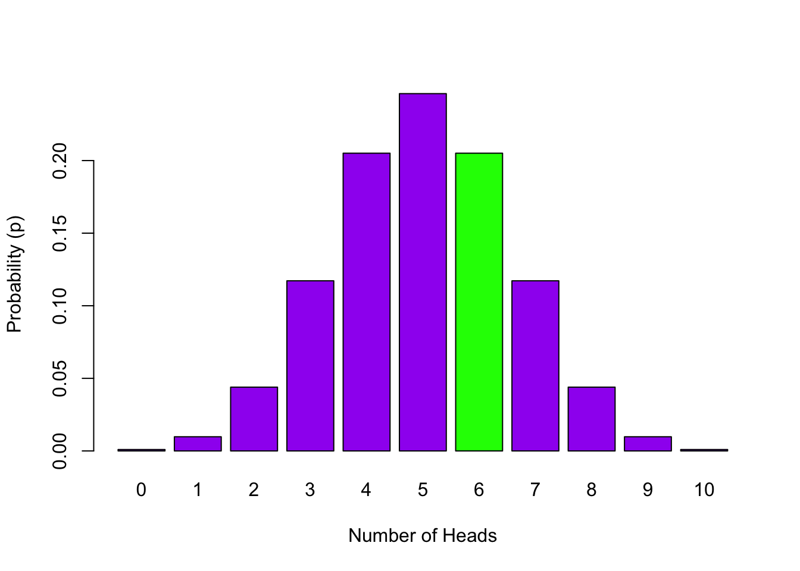

## PreClass Activity 1

### General Probability Calculations

Today we will being by recapping the concepts of probability calculations from Level 1, looking at discrete distributions. If you are unsure about discrete vs continuous you should try the other quick tutorial on it, to be found on Moodle. At the end of this section there are three Quickfire Questions to test your understanding. Any that you aren't clear on bring them to class next week for discussion.

Probability is the extent to which an event is likely to occur and is represented by a number between 0 and 1, and the letter **p**. For example, the probability of flipping a coin and it landing on 'tails', most people would say, is estimated at **p = .5**, i.e. the likelihood of getting tails is $p = \frac {1}{2}\ $ as there is one desired outcome (tails) and two possibilities (heads or tails).  
<br>
Calculating the probability  of any discrete event occuring can be formulated as:

$$p = \frac{number \  of  \ ways \ the \ event \ could \  arise}{number \ of \ possible \ outcomes}$$

**For example:**

**1.** The probability of drawing the ten of clubs from a standard pack of cards would be 1 in 52:  $p = \frac {1}{52} \ = .019$. One outcome (ten of clubs) with 52 possible outcomes (all the cards)

**2.** Likewise, the probability of drawing **either** a ten of clubs or a seven of diamonds as the the first card that you draw would be 2 in 52: $p = \frac {2}{52} \ = .038$. In this case you are adding to the chance of an event occurring by giving two possible outcomes, so it becomes **more likely** to happen than when you only had one outcome.  

**3.** Now say you have two standard packs of cards **mixed** together. The probability of drawing the 10 of clubs from this mixed pack would be 2 in 104: $p = \frac{2}{104}= .019$. Two possible outcomes **but more alternatives** than above, 104 this time, meaning it is **less likely**.

**4.** Let's instead say you have two **separate** packs of cards. The probability of drawing the 10 of clubs from **both** packs would be: $p = \frac{1}{52} \times \frac{1}{52}= .0004$. The probability has gone down again because you have created an event that is **even more unlikely** to happen - this is called the `cumulative probability` - multiplying the two individual probabilities of **separate events** to find the combined or cumulative probability. 

**5.** What about the probability of drawing the 10 of clubs from a pack of 52, putting it back (i.e. **replacement**), and subsequently drawing the 7 of diamonds? Again, this would be represented by multiplying together the probability of each of these events happening to obtain the `cumulative probability`: $p = \frac{1}{52} \times \frac{1}{52}= .0004$.

**6.** Finally, say you draw the 10 of clubs from a pack of 52 but this time **don't replace it**. What is the probability that you will draw the 7 of diamonds in your next draw (again without replacing it) and the 3 of hearts in a third draw? This time the number of cards in the pack is **fewer** for the second (51 cards) and third draws (50 cards) so you take that into account in your multiplication:  $p = \frac{1}{52} \times \frac{1}{51}\times \frac{1}{50}= .000008$.


<div class='solution'><button>Portfolio Point - Presenting probabilities</button>

<div class="info">
<p>So the probability of an event is the number of all the possible ways an event could happen, divided by all the possible outcomes. When you combine probabilities of two separate events you multiple them together to obtain the cumulative probability.</p>
<p>But you may have noticed that sometimes we write p = .008, for example, and sometimes p = 0.008. What is the difference? Well nothing really. However, there is a convention that as probability can never go above 1, then the 0 before the decimal place is pointless. Meaning that most people will write p = .008 instead of p = 0.008. We have allowed either version in the answers to this point, but try to get in the habit of writing it without the 0 before the decimal place.</p>
</div>

</div>

<br>
<span style="font-size: 22px; font-weight: bold; color: var(--green);">Quickfire Questions</span>

* What is the probability of randomly drawing your name out of a hat of 12 names where one name is definitely your name? Enter your answer to 3 decimal places: <input class='solveme nospaces' size='5' data-answer='["0.083",".083"]'/>

* What is the probability of randomly drawing your name out of a hat of 12 names, putting it back, and drawing your name again? Enter your answer to 3 decimal places: <input class='solveme nospaces' size='5' data-answer='["0.007",".007"]'/>

* **Tricky**: In a stimuli set of 120 faces, where 10 are inverted and 110 are the right way up, what is the probability of randomly removing one inverted face on your first trial, not replacing it, and then removing another inverted face on the second trial? Enter your answer to three decimal places:<input class='solveme nospaces' size='5' data-answer='["0.006",".006"]'/>


<div class='solution'><button>Helpful Hint</button>

<div class="info">
<ol style="list-style-type: decimal">
<li><p>Out of 12 possible outcomes you are looking for one possible event.</p></li>
<li><p>There are two separate scenarios here: in both scenarios there are 12 possible outcomes in which you are looking for one possible event. Since there are two separate scenarios, does this make it more or less likely that you will draw your name twice?</p></li>
<li><p>Think about the first trial: there are 120 possible outcomes (faces) in which you are looking for 10 possible events (inverted faces). In the second trial you have removed the first inverted face from the stimuli set so there are now only 119 trials in total and 9 inverted faces. Remember you need to combine the probabilities of the first trial and second trial results together!</p></li>
</ol>
</div>

</div>
  


<div class='solution'><button>Explain This - I don't get these answers</button>

<div class="info">
<ol style="list-style-type: decimal">
<li><p>p = 0.083 or p = .083. One outcome (your name) out of 12 possibilities, i.e. 1/12</p></li>
<li><p>p = 0.007 or p = .007. Because you replace the name on both draws it is 1/12. So 1/12*1/12 and then rounded to three decimal places</p></li>
<li><p>p = 0.006 or p = .006. It starts off as 10 out of 120, but as you remove one inverted face the second round is 9 out of 119. So the formula is (10/120)*(9/119)</p></li>
</ol>
</div>

</div>


### Creating a Simple Probability Distribution 

We will now recap plotting probability distributions by looking at the probability distributions of a simulated coin toss. Work through this example and then apply the logic to the quickfire questions at the end of the section.

Imagine we want to know the probability of getting X number of heads in 10 coin flips. To simulate 10 coin flips we used the `sample()` function where we randomly sample (with replacement) from all possible events: i.e. either **heads** or **tails**. 

* Open a new script and copy in the code lines below. The last argument in the code above provides the instruction to sample with or without replacement by setting it to `TRUE` or `FALSE` respectively.
* **Note1:** Because our event labels are strings (text), we enter them into the function as a vector; i.e. in "quotes"
* **Note2:** Below the lines of code, you will see the output that we got when we ran our code. Don't worry if your sequence of heads and tails is different from the above output; this is to be expected as we are generating a random sample.


```r
library("tidyverse")
sample(c("HEADS", "TAILS"), 10, TRUE) 
```

```
##  [1] "HEADS" "TAILS" "HEADS" "HEADS" "HEADS" "HEADS" "HEADS" "HEADS"
##  [9] "HEADS" "HEADS"
```


<div class='solution'><button>Portfolio Point - Sampling and Replacement</button>

<div class="info">
<p>Sampling is simply choosing or selecting something - here we are randomly choosing one of the possible options. Other psychology experiment 'sampling' could include randomly selecting participants, randomly choosing which stimuli to present on a given trial, or randomly assigning participants to a condition e.g.drug or placebo...etc.</p>
<p>Replacement is putting the sampled option back into the 'pot' of possible options. For example, on the first turn you randomly sample HEADS from the options of HEADS and TAILS with replacement, meaning that on the next you have the same two options again; HEADS or TAILS. Sampling without replacement means that you remove the option from subsequent turns. So say on the first turn you randomly sample HEADS from the options HEADS and TAILS but without replacement. Now on the second turn you only have the option of TAILS to 'randomly' sample from. On the third turn without replacement you would have no options. So replacement means putting the option back for the next turn.</p>
</div>

</div>

<br>
Why would you or why wouldn't you want to use sampling with replacement in our coin toss scenario? If you aren't sure then set replacement as `FALSE` and run the code again. The code will stop working after 2 coin flips. We want to sample with replacement here because we want both options available at each sampling - and if we didn't then we would run out of options very quickly since we're doing 10 flips.

So far our code returns the outcomes from the 10 flips; either heads or tails. If we want to count how many 'heads' we have we can simply sum up the heads. However, heads isn't a number, so to make life easier we can re-label our events as **0 for tails** and **1 for heads**. Now if we run the code again we can pipe the sample into a `sum()` function to total up all the 1s (heads) from the 10 flips. 

* Run this line of code a number of times, what do you notice about the output?
* **Note1:** As our event labels are now numeric, we don't need the vector.
* **Note2:** `0:1` means all numbers from 0 to 1 in steps of 1. So basically, 0 and 1.


```r
sample(0:1, 10, TRUE) %>% sum() 
```

```
## [1] 8
```

The ouptut of this line changes every time we run the code as we are randomly sampling 10 coin flips each time. And to be clear, if you get an answer of 6 for example, this means 6 heads, and in turn, 4 tails. By running this code over and over again we are basically demonstrating how a **sampling distribution** is created. 


<div class='solution'><button>Portfolio Point - What's a sampling distribution?</button>

<div class="info">
<p>A sampling distribution shows you the probability of each possible outcome; e.g. the probability of 5 heads in 10 flips, or the probability of 4 heads in 10 flips, or the probability of X heads in 10 flips of the coin.</p>
</div>

</div>
  
<br>
But in order to create a full and accurate sampling distribution we need to replicate these 10 flips a number of times. The more replications we do the more reliable the estimates. Let's do 10000 replications of our 10 coin flips. This means we flip the coin 10 times, count how many heads, save that number, and then repeat it 10000 times. We could do it the slow way we demonstrated above, just running the same line over and over and over again and noting the outcome each time. Or we could use the `replicate` function. 

* Copy this line of code into your script and run it.
* Here we are doing exactly as we said and saving the 10000 outputs (counts of heads) in the variable called `heads10k` (k is shorthand for thousand).


```r
heads10k <- replicate(10000, sample(0:1, 10, TRUE) %>% sum())   
```


```
##  int [1:10000] 4 5 6 2 6 5 5 5 4 6 ...
```

The results of these 10000 replications are now stored in a vector called `heads10k`. If you have a look at `heads10k`, as shown in the bottom box, it is a series of 10000 numbers between 0 and 10 each indicating the number of heads, or more specifically 1s, that you got in a set of 10 flips.  

Now in order to complete our distribution we need to:

1. convert the vector (list of numbers for the heads counts) into a data frame (a table) so we can work on it. 
2. Then group the results by the number of possible `heads`; i.e. group all the times we got 5 heads together, all the times we got 4 heads together, etc. 
3. Finally, we work out the probability of a `heads` result, (e.g. probability of 5 heads), by totaling the number of observations for each possible result (e.g. 5 heads) and submitting it to our probability formula above (number of outcomes of event divided by all possible outcomes) 
    - so the number of times we got a specific number of heads (e.g. 5 heads) divided by the total number of outcomes (i.e. the number of replications - 10000). 

We can carry out these steps using the following code:

* Copy the below code into your script and run it.


```r
data10k <- data_frame(heads = heads10k) %>%   # convert to a data frame 
                group_by(heads) %>%           # group by number of possibilities
                summarise(n = n(), p=n/10000) # count occurances of possibility,
```

```
## Warning: `data_frame()` is deprecated, use `tibble()`.
## This warning is displayed once per session.
```

```r
                                              # & calculate probability (p) of
                                              # each
```

We now have a discrete probability distribution of the number of heads in 10 coin flips. Use the `View()` function  to have  look at your `data10k` variable. You should now see for each heads outcome, the total number of occurrences in 10000 replications (`n`) plus the probability of that outcome (`p`). 

It might be useful to visualize the distribution as a histogram:


```r
ggplot(data10k, aes(heads,p)) + 
  geom_col(fill = "skyblue") + 
  labs(x = "Number of Heads", y = "Probability of Heads in 10 flips (p)") +
  theme_bw() +
  scale_x_discrete(limits=0:10)
```

<div class="figure" style="text-align: center">

<p class="caption">(\#fig:10khist)Probability Distribution of Number of Heads in 10 Flips</p>
</div>

So in our analysis, the probability of getting 5 heads in 10 flips is **0.2472**. But remember, do not be surprised if you get a slightly different value. Ten thousand replications is a lot but not a huge amount compared to infinity. If you run the analysis with more replications your numbers would become more stable, e.g. `100K`.

Note that as the possible number of heads in 10 flips are all related to one another, then summing up all the probabilities of the different number of heads will give you a total of 1. You can use this informaiton to start asking questions such as what would be the probability of obtaining 2 or less Heads in 10 flips?  Well, if the probability of no heads in this distribution is **0.0011**, and the probability of 1 heads is **0.0108**, and the probability of 2 heads is **0.0459**, then the probability of 2 or less Heads in this distribution is simply the sum of these values: **0.0578**

<span style="font-size: 22px; font-weight: bold; color: var(--green);">Quickfire Questions</span>

Look at the probability values corresponding to the number of coin flips you created in the `data10k` sample distribution (use `View()` to see this):

* Choose from the following options, if you wanted to calculate the probability of getting 4, 5 or 6 heads in 10 coin flips you would: <select class='solveme' data-answer='["sum individual probabilities together"]'> <option></option> <option>multiply individual probabilities together</option> <option>sum individual probabilities together</option></select>

* Choose from the following options, if you wanted to calculate the probability of getting 6 or more heads in 10 coin flips you would: <select class='solveme' data-answer='["sum individual probabilities together"]'> <option></option> <option>multiply individual probabilities together</option> <option>sum individual probabilities together</option></select>

* Choose from the following options, the distribution we have created is: <select class='solveme' data-answer='["discrete"]'> <option></option> <option>continuous</option> <option>discrete</option></select>


<div class='solution'><button>Explain This - I don't understand the answers!</button>

<div class="info">
<p>If you think about it, we can't get 5.5 heads or 2.3 heads, we can only get whole numbers, 2 heads or 5 heads. This means that the data and the distribution is discrete. (Don't be confused by one of the functions saying continuous)</p>
<p>To find the probability of getting say 4, 5, or 6 heads in 10 coin flips, you are combining related scenarios together, therefore you need to find the individual probabilities of getting 4, 5 or 6 heads in 10 coin flips, then sum the probabilities together to get the appropriate probability of obtaining 4, 5 or 6 heads. It is the same with 6 or more heads, just sum the probabilities of 6, 7, 8, 9 and 10 heads to get the probability of 6 or more heads.</p>
<p>Not sure if you should be summing or multiplying probabilities? A good way to remember, from both the coin flip examples and from the pack of cards examples earlier, is that if the scenarios are <strong>related</strong> you are summing probabilities, if scenarios are <strong>separate</strong> you are multiplying probabilities. <strong>Related</strong> scenarios are usually asking you about the probability of <strong>'either / or'</strong> scenarios occuring, whereas <strong>separate</strong> scenarios usually ask about the probability of one scenario <strong>'and'</strong> another scenario both occuring.</p>
<p>Your sample distribution <code>data10k</code> has already completed the first part of this calculation for you (finding individual probabilities of n heads in 10 coing flips), so all you need to to is sum the required probailities together!</p>
</div>

</div>


### The Binomial Distribution - Creating a Discrete Distribution

Great, so we are now learning how probabilities and distributions work. However, if we had wanted to calculate the probability of 8 heads from 10 coin flips we don't have to go through this entire procedure each time. Instead, because we have a dichotomous outcome, "heads or tails", we can calculate probabilities using the **binomial distribution** - effectively what you just created. You can look up the R help page on the binomial distribution (type `?dbinom` directly into the console) to understand how to use it but we will walk through some essentials here.

We'll use 3 functions to work with the binomial distribution: 

* `dbinom` - the density function: gives you the probability of `x` successes (heads) given the `size` (trials) and probability of success `prob` on a single trial (here it's 0.5, because we assume we're flipping a fair coin)

* `pbinom` - the distribution function: gives you the probability of getting a number of successes below a certain cut-off point (e.g. probability of getting 0 to 5 heads out of 10 flips), given the `size` and the `prob`.

* `qbinom` - the quantile function: is the inverse of`pbinom` in that it gives you the x axis value below (and including the value) which the summation of probabilities is greater than or equal to a given probability `p`, plus given the `size` and `prob`.

### **`dbinom`** - The Density Function

Using the `dbinom` function we can create probabilities for any possible outcomes of `heads` (e.g. 3) in 10 flips.:


```r
dbinom(3, 10, 0.5)
```

or all possible outcomes of heads (0:10) in 10 flips:


```r
dbinom(0:10, 10, 0.5)
```

And if we plot the probability of all possible outcomes in 10 flips it would look like this:

<div class="figure" style="text-align: center">

<p class="caption">(\#fig:binom-distrib1)Probability Distribution of Number of Heads in 10 Flips</p>
</div>

The dbinom (**d**ensity **binom**) function takes the format of `dbinom(x, size, prob)`, where the arguments we give are: 

* `x` the number of 'heads' we want to know the probability of. Either a single one, `3` or a series `0:10`.
* `size` the number of trials (flips) we are doing; in this case, 10 flips. 
* `prob` the probability of 'heads' on one trial. Here chance is 50-50 which as a probability we state as 0.5 or .5

Now say if we wanted to know the probability of 6 heads out of 10 flips, we would write:


```r
dbinom(6, 10, 0.5)  # we only have to change the first (x) argument
```

```
## [1] 0.2050781
```

As such the probability of 6 heads, using `dbinom` is p = 0.2050781. If you compare this value to the `data10k` value for 6 you will see they are similar but not quite the same because `dbinom` uses a lot more replications than the 10000 we used. 

In terms of visualising what we have just calculated. That number represents the height of the green bar in the plot below. 
<div class="figure" style="text-align: center">

<p class="caption">(\#fig:binom-plot1)Probability Distribution of Number of Heads in 10 Flips with the probability of 6 out of 10 Heads highlighted in green</p>
</div>

<span style="font-size: 22px; font-weight: bold; color: var(--green);">Quickfire Questions</span>

* To three decimal places, what is the probability of 2 heads out of 10 flips? <input class='solveme nospaces' size='10' data-answer='["0.044",".044"]'/>


<div class='solution'><button>Explain This - I can't get the right answer</button>

<div class="info">
<p>You want to know the probability of 2 heads in 10 flips. X is therefor 2; Size is therefore 10; and the probability stays the same at .5, meaning that the code would look like this:</p>
<p><code>dbinom(2, 10, 0.5)</code> = .04394531 or rounded = .044</p>
</div>

</div>
  

### **`pbinom`** - The Cumulative Probability Function

What if we wanted to know the probability of **up to and including** 3 heads out of 10 flips? We can either use `dbinom` for each outcome up to 3 heads and sum the results:


```r
dbinom(0:3, 10, 0.5) %>% sum()
```

```
## [1] 0.171875
```

Or we can use the `pbinom` function; known as the **cumulative probability distribution function** or the **cumulative density function**. The first argument we give is the **cut-off** value up to and including which we want to know the probability of (here it's up to 3 `heads`). Then, as before, we tell it how many flips we want to do and the probability of `heads` on a single trial. 

* Copy this line into your script and run it:


```r
pbinom(3, 10, 0.5, lower.tail = TRUE)  
```

```
## [1] 0.171875
```

So the probability of **up to and including 3 heads** (as `lower.tail = TRUE`) out of 10 flips is **0.172**. For visualization, what we have done is calculated the cumulative probability of the lower tail of the distribution up to our cut-off of 3 (in green below):

<div class="figure" style="text-align: center">

<p class="caption">(\#fig:binom-plot2)Probability Distribution of Number of Heads in 10 Flips with the probability of 0 to 3 Heads highlighted in green - `lower.tail = TRUE` </p>
</div>

So the `pbinom` function gives us the **cumulative probability** of outcomes **up to and including the cut-off**. 

But what if we wanted to know the probability of outcomes **including and above** a certain value? Say we want to know the probability of 7 heads or more out of 10 coin flips. The code would be this:


```r
pbinom(6, 10, 0.5, lower.tail = FALSE) 
```

```
## [1] 0.171875
```

We still specify our cut-off as 6 heads, even though we want 7 and above, but we switch the `lower.tail` call from `TRUE` to `FALSE` to tell `pbinom` we don't want the lower tail this time (to the left of and including the cut-off), we want the **upper tail, to the right of the cut-off**. This results in the cumulative probability for the upper tail of the distribution down to our cut-off value (shown in green below). We set the cut-off as '6' because in the discrete distribution, only the `lower.tail = TRUE` includes the cut-off (6 and below) whereas the `lower.tail = FALSE`  would be everything above the cut-off **but not including** the cut-off (7 and above).

<div class="figure" style="text-align: center">

<p class="caption">(\#fig:binom-plot3)Probability Distribution of Number of Heads in 10 Flips with the probability of 7 or more Heads highlighted in green - `lower.tail = FALSE`</p>
</div>


<div class='solution'><button>Portfolio Point - Am all in a Tail Spin! Lower TRUE or FALSE</button>

<div class="info">
<p>The most confusing part for people we find is the concept of <code>lower.tail</code>. If you look at a distribution, say the binomial, you find a lot of the high bars are in the middle of the distribution and the smaller bars are at the far left and right of the distribution. Well the far left and right of the distribution is called the <strong>tail</strong> of the distribution - they tend to be an extremity of the distribution that taper off like a.....well like a tail. A lot of the time we will talk of left and right tails but here in the <code>pbinom</code> function it only ever considers the data in relation to the left side of the data - this is what it calls the <code>lower.tail</code>.</p>
<p>Let's consider <code>lower.tail = TRUE</code>, this is the default, so if you dont state <code>lower.tail</code> then this is what is considered to be what you want. <code>lower.tail = TRUE</code> means all the values to the left of your value including the value you state. So on the binomial distribution if you say give me the probability of 5 heads or less, then you would set <code>lower.tail = TRUE</code> and you would be counting and summing the probability of 0, 1, 2, 3, 4 and 5 heads. You can check this with <code>dbinom(0:5, 10, .5) %&gt;% sum()</code>.</p>
<p>However, if you say give me the probability of 7 or more heads, then you need to do <code>lower.tail = FALSE</code>, to consider the right-hand side tail, but also, you need to set the code as <code>pbinom(6, 10, .5, lower.tail = FALSE)</code>. Why 6 and not 7? Because the <code>pbinom</code> function, when <code>lower.tail = FALSE</code>, starts at the value <strong>plus one to the value you state</strong>; it always considers the value you state as being part of the <code>lower.tail</code> so if you say 6, it includes 6 in the <code>lower.tail</code> and then gives you 7, 8, 9 and 10 as the upper tail. If you said 7 with <code>lower.tail = FALSE</code>, then it would only give you 8, 9 and 10. This is tricky but worth keeping in mind when you are using <code>pbinom</code> function. And remember, you can always check it by using <code>dbinom(7:10, 10, .5) %&gt;% sum()</code> and seeing whether it matches <code>pbinom(6, 10, 0.5, lower.tail=FALSE)</code> or <code>pbinom(7, 10, 0.5, lower.tail=FALSE)</code></p>
</div>

</div>
  
<br>
<span style="font-size: 22px; font-weight: bold; color: var(--green);">Quickfire Questions</span>

* Using the format of the above `pbinom` function, enter the code that would determine the probability of **up to and including** 5 heads out of 20 flips, assuming a probability of 0.5: <input class='solveme nospaces' size='45' data-answer='["pbinom(5, 20, 0.5)","pbinom(5, 20, .5)","pbinom(5, 20, 0.5, lower.tail=TRUE)","pbinom(5, 20, .5, lower.tail=TRUE)"]'/>

* To two decimal places, what is the probability of obtaining **more than but not including** 50 heads in 100 flips? <input class='solveme nospaces' size='15' data-answer='[".46","0.46"]'/>


<div class='solution'><button>Helpful Hint</button>

<div class="info">
<ol style="list-style-type: decimal">
<li><p>You are looking to calcuate the probability of 5 or less heads (<code>x</code>) out of 20 flips (<code>size</code>), with the probability of 'heads' in one trial (<code>prob</code>) remaining the same. Do you need the <code>lower.tail</code> call here if you are calculating the cumulative probability of the lower tail of the distribution?</p></li>
<li><p>You are looking to calculate the probability of 51 or more heads (<code>x</code>), out of 100 flips (<code>size</code>), with the probability of 'heads' in one trial (<code>prob</code>) remaining the same. Do you need the <code>lower.tail</code> call here if you are calculating the cumulative probability of the upper tail of the distribution? Remember, because you are not looking at the <code>lower.tail</code>, the value of heads that you enter in <code>pbinom</code> will <strong>not</strong> be included in the final calculation, e.g. entering <code>pbinom(3, 100, lower.tail = FALSE)</code> will give you the probability for 4 and above heads. If you were instead looking at the <code>lower.tail</code>, entering <code>pbinom(3, 100, lower.tail = TRUE)</code> would give you the probability of 3 and below heads.</p></li>
</ol>
</div>

</div>
  


<div class='solution'><button>Explain This - I can't get these answers</button>

<div class="info">
<ol style="list-style-type: decimal">
<li><p>The code for the first one would be: <code>pbinom(5, 20, 0.5)</code> or <code>pbinom(5, 20, 0.5, lower.tail = TRUE)</code></p></li>
<li><p>The code for the second one would be: <code>pbinom(50, 100, 0.5, lower.tail = FALSE)</code>, giving an answer of .46. Remember you can confirm this with: <code>dbinom(51:100, 100, 0.5) %&gt;% sum()</code></p></li>
</ol>
</div>

</div>

<br>

### **`qbinom`** - The Quartile Function

Finally, the `qbinom` function is useful if you want to know the minimum number of successes ('heads') that would be needed to achieve a particular probability. This time the cut-off we specify is not the number of 'heads' we want but the **probability** we want. For example say we want to know the minimum number of 'heads' out of 10 flips that would result in a 5% heads success rate (a probability of .05), we would use the following code.  


```r
qbinom(.05, 10, 0.5) 
```

```
## [1] 2
```

As you can see we would need at least 2 Heads in 10 flips to maintain a probability of .05. 


<div class='solution'><button>Portfolio Point - I don't understand qbinom arguments</button>

<div class="info">
<p>We found a lot of students asking about <code>qbinom</code> and how it works when you are inputting two different probabilities as the arguments for <code>qbinom</code>. Let us try and make things clearer.</p>
<p>The function is set up as <code>qbinom(p, size, prob)</code>. First of all, you have used <code>prob</code> in the previous two functions, <code>dbinom</code> and <code>pbinom</code>, and it represents the probability of success on a single trial (here it is the probability of 'heads' in one coin flip, .5). Now, <code>prob</code> represents the probability of success in <strong>one</strong> trial, whereas <code>p</code> represents the overall probability of success <strong>across all trials</strong> and gives you the number of heads that would give that probability. So you ask it for the minimum number of successes (e.g. heads) to maintain an overall probability of .05, in 10 flips, when the probability of a success on any one flip is .5. And it tells you the answer is 2.</p>
<p><code>qbinom</code> also uses the <code>lower.tail</code> argument and it works in a similar fashion to <code>pbinom</code>.</p>
</div>

</div>
  
<br>
<span style="font-size: 22px; font-weight: bold; color: var(--green);">Quickfire Questions</span>

* Type in the box, the number of heads required to maintain an overall probability rate of 10% (.1) in 17 flips: <input class='solveme nospaces' size='1' data-answer='["6"]'/>


<div class='solution'><button>Explain This - I can't get the answer</button>

<div class="info">
<p>The answer would be 6 because the code would be:</p>
<p><code>qbinom(0.1, 17, 0.5, lower.tail = TRUE)</code></p>
<p>Remember that you want an overall probability of 10% (<code>p</code> = .1), you have 17 flips in each go (<code>size</code> = 17), and the probability of heads on any one flip is .5 (<code>prob</code> = .5). And you want the minimum number so the <code>lower.tail</code> is TRUE.</p>
</div>

</div>

<br>
<span style="font-size: 22px; font-weight: bold; color: var(--blue);">Job Done - Activity Complete!</span>

Excellent! We have now recapped some general probability concepts as well as going over the binomial distribution again. We will focus on the normal distribution in the lab but it would help to read the brief section on it which can be found on Moodle. Keep in mind that what you are trying to get an understanding of is that every value in a distribution has a probability of existing in that distribution.  That probability may be very large, meaning that it is from the middle of the distribution, or that probability might be rather low, meaning it is from the tail, but ultimately every value of a distribution has a probability.

If you have any questions please post them on the Moodle forum of the slack forum <a href = "https://rguppies.slack.com/" target = "_blank">rguppies.slack.com</a> under the channel **#level2_2018**. Finally, don't forget to add any useful information to your Portfolio before you leave it too long and forget. That is all for now. See you in the lab!
