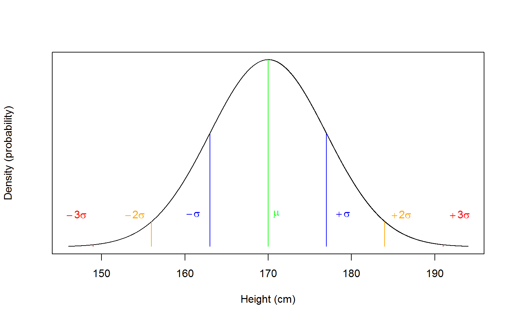
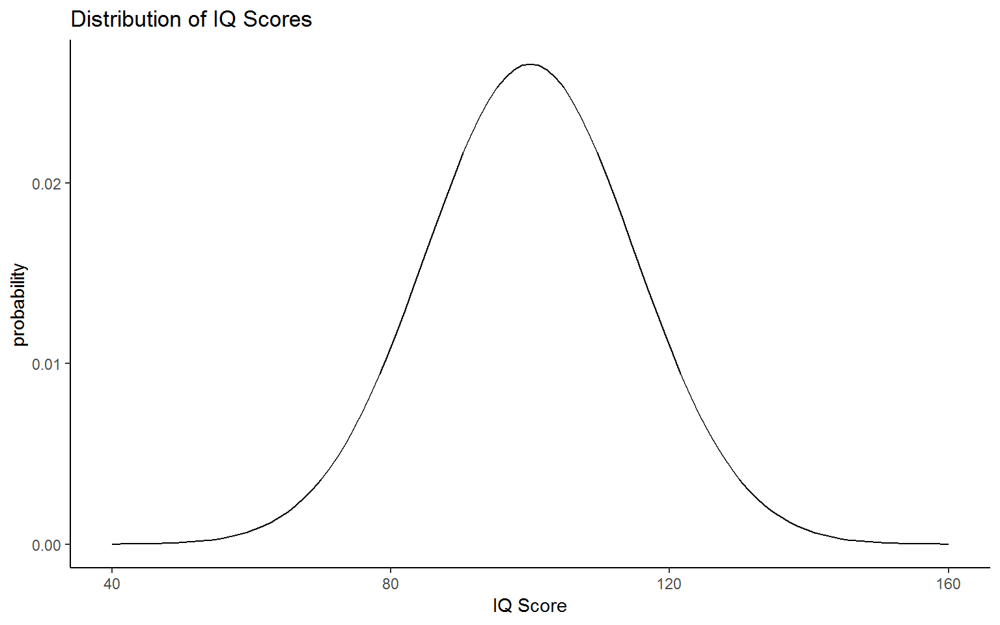
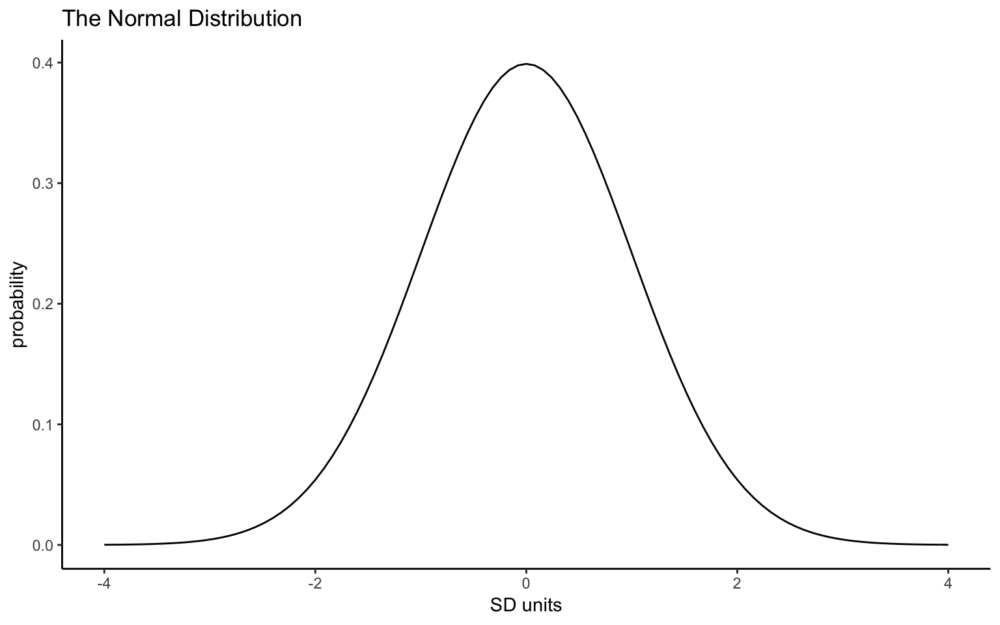
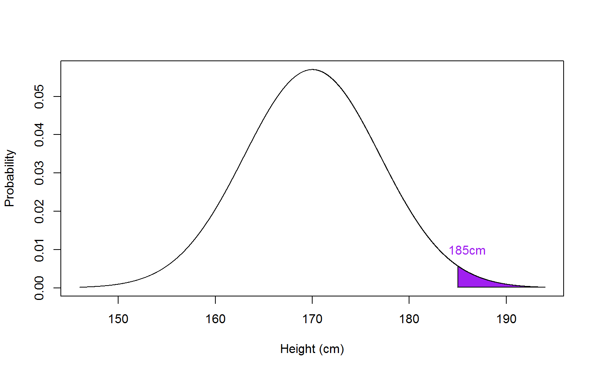
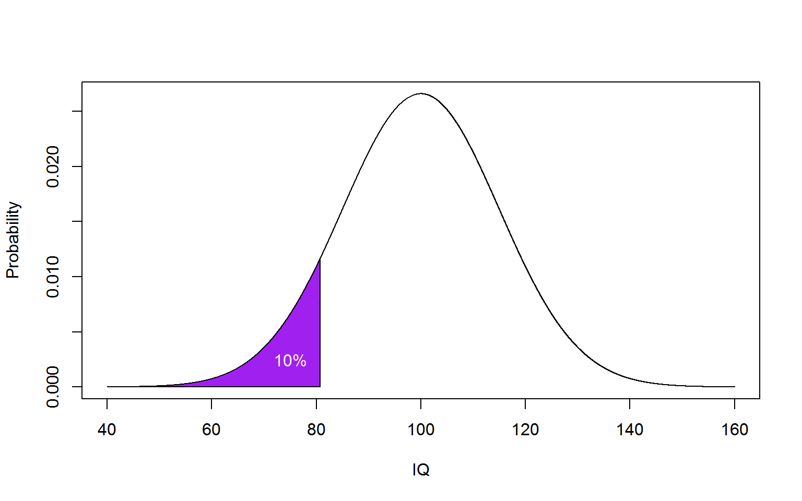

## InClass Activity 1

Today we are going to continue our study of distibrutions and probability to help gain an understanding of how we can end up with an inference about a population from a sample. In the preclass activity we focussed a lot on basic probability and **binomial distributions**. In the lab today we will focus more on the **normal distribution**, is one of the key distributions in Psychology. 

It will be really beneficial to you when it comes to doing the assignment to have run through both the preclass and inclass activities. The assignment for this lab is formative and should not be submitted. This of course does not mean that you should not do it. As will all the formative labs, completing them and understanding them, will benefit you when it comes to completing the summative labs. You may also want to refer to the Lecture series for help. If you are unclear at any stage please do ask; probability is challenging to grasp at first.


<div class='solution'><button>Portfolio Point - Always be adding to your knowledge in your own words</button>

<div class="info">
<p>Remember to add useful information to you Portfoilio! One of the main reasons we do this is because there is a wealth of research that says the more interactive you are with your learning, the deeper your understanding of the topic will be. This relates to the Craik and Lockhart (1972) levels of processing model you will hear about in lectures. Always make notes about what you are learning to really get an understanding for the concepts. And, most importantly, in your own words!</p>
<p><a href="https://www.sciencedirect.com/science/article/pii/S002253717280001X">Craik, F. I. M., &amp; Lockhart, R. S. (1972). Levels of processing: A framework for memory research. Journal of Verbal Learning and Verbal behavior, 11, 671-684.</a></p>
</div>

</div>


### Continuous Data and the Normal Distribution

Many of the variables we will encounter in Psychology will:  

* be **continuous** as opposed to discrete. 
* tend to show a **normal distribution**. 
* look similar to below - the bell-shaped curve - when plotted.

But can you name any? Take a couple of minutes as a group to think of variables that we might encounter that are normally distributed. 

<div class="figure" style="text-align: center">

<p class="caption">(\#fig:normplot1)The Normal Distribution</p>
</div>

### Estimating from the Normal Distribution

We won't ask you to create a normal distribution as it is more complicated than the binomial distribution you estimated in the preclass. Unlike coin flips, the outcome in the normal distribution is not just 50/50. Instead, just as with the binomial distribution (and other distributions) there are functions that allow us to estimate the normal distribution and to ask questions about the distribution. These are:

* `dnorm()` - the density function
* `pnorm()` - the probability or distribution function
* `qnorm()` - the quantile function

They work in a similar way to their binomial counterparts. If you are unsure about how a function works you can call the help on it by typing in the console, for example, `?dnorm` or `?dnorm()`, but the brackets aren't essential for the help.
<br>
<span style="font-size: 22px; font-weight: bold; color: var(--green);">Quickfire Questions</span>

* Type in the box the binomial counterpart to `dnorm()`? <input class='solveme nospaces' size='10' data-answer='["dbinom()"]'/>

* Type in the box the binomial counterpart to `pnorm()`? <input class='solveme nospaces' size='10' data-answer='["pbinom()"]'/>

* Type in the box the binomial counterpart to `qnorm()`? <input class='solveme nospaces' size='10' data-answer='["qbinom()"]'/>


<div class='solution'><button>Explain This - I don't get the answers</button>

<div class="info">
<p>The counterpart functions all start with the same letter, d, p, q, it is just the distribution name that changes, <code>binom</code>, <code>norm</code>, <code>t</code> - though we haven't quite come across the t-distribution yet.</p>
<ol style="list-style-type: decimal">
<li><p><code>dbinom()</code> is the binomial equivalent to <code>dnorm()</code></p></li>
<li><p><code>pbinom()</code> is the binomial equivalent to <code>pnorm()</code></p></li>
<li><p><code>qbinom()</code> is the binomial equivalent to <code>qnorm()</code></p></li>
</ol>
<p>There is also <code>rnorm()</code> and <code>rbinom()</code> but we will look at them another time.</p>
</div>

</div>


### **`dnorm()`** - The Density Function for the Normal Distribution

Using `dnorm`, like we did with `dbinom`, we can plot a normal distribution. This time however we need: 

* `x`, a vector of quantiles (in other words, values on the x axis) 
* the `mean` of our data
* and standard deviation `sd` of our data. 

We will use IQ as an example. Many Psychologists are interested in studying IQ, perhaps in terms of heritability, or interested in controlling for IQ in their own studies to rule out any effect (e.g. clinical and autism studies).  

#### Task 1: Standard Deviations and IQ Score Distribution {#Ch4InClassQueT1}

1. Copy the below code into a new script and run it. Remember that you will need to call `tidyverse` to your library first. e.g. `library("tidyverse")`. 

This code creates the below plot showing a normal distribution of IQ scores (M = 100, SD = 15) ranging from 40 to 160. These are values considered typical for the general population.


```r
# First we set up our range of values from 40 to 160
IQ_data <- tibble(IQ_range = c(40, 160))

# Then we plot the distribution of IQ_data, where we have M = 100 and SD = 15
ggplot(IQ_data, aes(IQ_range)) + 
  stat_function(fun = dnorm, args = list(mean = 100, sd = 15)) +
  labs(x = "IQ Score", y = "probability") +
  theme_classic()
```

<div class="figure" style="text-align: center">

<p class="caption">(\#fig:normplot)Distribution of IQ scores</p>
</div>

* Which part of the code do you need to change to alter the SD of your plot? <select class='solveme' data-answer='["sd = 15"]'>
    <option></option>
    <option>mean = 100</option>
    <option>sd = 15</option>
    <option>(40, 160)</option>
</select>


2. Now copy and edit the above code to plot a distribution with `mean = 100` and `sd = 10`, and compare the first plot to your own plot. 
<br>
<span style="font-size: 22px; font-weight: bold; color: var(--pink);">Group Discussion Point</span>

What does changing the `sd` do to the shape of the distribution? Spend a few minutes editing the code and discussing with your group to answer the following questions:

* What happens to the shape of the distribution if you change the `sd` from 10 to 20? <select class='solveme' data-answer='["the distribution gets wider"]'>
    <option></option>
    <option>the distribution gets narrower</option>
    <option>the distribution gets wider</option>
</select>


* What happens to the shape of the distribution if you change the `sd` from 10 to 5? <select class='solveme' data-answer='["the distribution gets narrower"]'>
    <option></option>
    <option>the distribution gets narrower</option>
    <option>the distribution gets wider</option>
</select>


* What does a small or large standard deviation in your sample tell you about the data you have collected?


<div class='solution'><button>Explain This - I don't get Standard Deviations!</button>

<div class="info">
<ol style="list-style-type: decimal">
<li>Changing the SD from 10 to 20 means a larger standard deviation so you will have a wider distribution.</li>
<li>Changing the SD from 10 to 5 means a smaller standard deviation so you will have a narrower distribution.</li>
<li>Smaller SD results in a narrower distribution meaning that the data is less spread out; larger SD results in a wider distribution meaning the data is more spread out.</li>
</ol>
<p><strong>A note on the Standard Deviation</strong>:</p>
<p>You will know from your lectures that you can estimate data in two ways: point-estimates and spread estiamtes. The mean is a point-estimate and condenses all your data down into one data point - it tells you the average value of all your data but tells you nothing about how spread out the data is. The standard deviation however is a spread estimate and gives you an estimate of how spread out your data is from the mean - it is a measure of the standard deviation from the mean.</p>
<p>So imagine we are looking at IQ scores and you test 100 people and get a mean of 100 and an SD of 5. This means that the vast majority of your sample will have an IQ around 100 - probably most will fall within 1 SD of the mean, meaning that most of your participants will have an IQ of between 95 and 105.</p>
<p>Now if you test again and find a mean of 100 and an SD of 20, this means your data is much more spread out. If you take the 1 SD approach again then most of your participants will have an IQ of between 80 and 120.</p>
<p>So one sample has a very tight range of IQs and the other sample has a very wide range of IQs. All in, from the point-estimate and spread estimate of your data you can tell the shape of your sample distribution.</p>
</div>

</div>

<br>
So far so good! But in the above example we told `dnorm()` the values at the limit of our range and it did the rest; we said give us a range of 40 to 160 IQ scores. However, we could plot it another way by telling `dnorm()` the sequence, or range, of values we want and how much precision we want between them.  

#### Task 2: Changing Range and Step Size of The Normal Distribution {#Ch4InClassQueT2}

1. Copy the code below in to your script and run it. 
Here we plot the standard Normal Distribution from -4 to 4 in steps of 0.01. We have also stated a mean of 0 and a sd of 1.


```r
ND_data <- tibble(ND_range = seq(-4, 4, 0.01))
ggplot(ND_data, aes(ND_range)) + 
  stat_function(fun = dnorm, args = list(mean = 0, sd = 1)) +
  labs(x = "SD units", y = "probability", title = "The Normal Distribution") +
  theme_classic()
```

<div class="figure" style="text-align: center">

<p class="caption">(\#fig:ND-example)The Normal Distribution with Mean = 0 and SD = 1</p>
</div>
<br>
<span style="font-size: 22px; font-weight: bold; color: var(--green);">Quickfire Questions</span>

* Fill in the box to show what you would type to get a range and step size of `-10` to `10` in steps of `.05`:

**ND_data** <- <input class='solveme nospaces' size='40' data-answer='["tibble(ND_range = seq(-10, 10, 0.05))","tibble(ND_range = seq(-10, 10, .05))"]'/>

Now that you know what to change, plot the normal distribution with the range of -10 to 10, in steps of 0.05, with a mean of 0, and a standard deviation of 1.

* Compare your new plot the the original one we created. What change is there in the distribution? <select class='solveme' data-answer='["No change in distribution"]'>
    <option></option>
    <option>Distribution widens</option>
    <option>No change in distribution</option>
    <option>Distribution narrows</option>
</select>


* To three decimal places, what is the probability of the value 0 in the normal distribution (M = 0, SD = 1): <input class='solveme nospaces' size='10' data-answer='["0.399",".399"]'/>


<div class='solution'><button>Explain This - I don't understand the answer!</button>

<div class="info">
<p>To change the distribution you would write: <code>ND_data &lt;- tibble(ND_range = seq(-10, 10, 0.05))</code></p>
<p>However, when comparing the plots, whilst the plot itself may look thinner, the distribution has not changed. The change in appearance is due to the range of <code>sd</code> values which have been extended from -4 and 4 to -10 and 10. The density of values within those values has not changed however and you will see, more clearly in the second plot, that values beyond -3 and 3 are very unlikely. You can test this by looking at the <code>dnorm()</code> function. Note that it only looks at the mean and the standard deviation. So if you asked for <code>dnorm(x = 0, mean = 0, sd = 1)</code> you will get p = .399 every time because the range does not matter!</p>
</div>

</div>


### **`pnorm()`** - The Probability or Distribution Function

Just as `dnorm()` works like `dbinom()`, `pnorm()` works just like `pbinom()`. So, `pnorm()`, given the  `mean` and `sd` of our data, returns the **cumulative density function (cumulative probability)** that a given probability (`p`) lies at a specified **cut-off point and below**, unless `lower.tail = FALSE` is specified in which case it is from the **cut-off point and above**. 

We will use height to give a concrete example. Say that we test a sample of students (M = 170cm, SD = 7). If we want to calculate the probability that a given student is 150cm or shorter we would do the following:


```r
# lower.tail = TRUE means lower than and including the value of X
# TRUE is the default so we don't actually need to declare it
pnorm(150, 170, 7, lower.tail = TRUE)
```

This tells us that finding the probability of someone 150cm or smaller in our class is **p = 0.0021374** or **0.21%**. This is a very small probability and suggests that it is pretty unlikely to find someone of 150cm in our class. This is mainly because of how small the standard deviation of our distribution is. Think back to what we said earlier about narrow standard deviations round the mean!  

#### Task 3: Calculating Cumulative Probability of Height {#Ch4InClassQueT3}

1. Edit the `pnorm` code above to calculate the probability that a given student is 190cm **or taller**.

To three decimal places, as in Task 3, what is the probability of a student being 190cm or taller in this class? <input class='solveme nospaces' size='3' data-answer='["0.002",".002"]'/>


<div class='solution'><button>Explain This - I don't understand the answer!</button>

<div class="info">
<p>The answer is .002. See the solution code at the bottom of the page to see how to complete Task 3.</p>
<p>There is a difference in where you need to specify the cut-off point in the <code>pbinom</code> (discussed in the preclass activity) and <code>pnorm</code> functions for values <strong>above</strong> <code>x</code>, i.e. when <strong><code>lower.tail = FALSE</code></strong>.</p>
<p>If you had discrete data, say the number of coin flips that result in <code>heads</code>, and wanted to calculate the probability above <code>x</code>, you would apply <code>pbinom</code> and have to specify your cut-off point as <strong><code>x-1</code></strong> to include <code>x</code> in your calculation. For example, to calculate the probability of 4 or more 'heads' occuring in 10 coin flips, you would specify <code>pbinom(3, 10, 0.5, lower.tail = FALSE)</code> as <code>lower.tail</code> includes the value you state.</p>
<p>For continuous data, however, such as height, you would be applying <code>pnorm</code> and therefore can specify your cut-off point simply as <strong><code>x</code></strong>. In the above example, for the cut-off point of 190, a mean of 170 and standard deviation of 7, you can write <code>pnorm(190, 170, 7, lower.tail = FALSE)</code>. The way to think about this is that setting <code>x</code> as 189 on a continuous scale, when you only want all values greater than 190, would also include all the possible values between 189 and 190. Setting <code>x</code> at 190 starts it at 190.0000000...001.</p>
<p>This is a tricky difference between <code>pbinom</code> and <code>pnorm</code> to recall easily, so best include this explanation point in your portfolio to help you carry out the correct analyses in the future!</p>
</div>

</div>
  

#### Task 4: Using Figures to Calculate Cumulative Probability {#Ch4InClassQueT4}

Have a look at the distribution below:

<div class="figure" style="text-align: center">

<p class="caption">(\#fig:pnormplot1)The Normal Distribution of Height with the probability of people of 185cm highlighted in purple</p>
</div>

1. Using the information in the figure, and the mean and SD as above, calculate the cumulative probability of the shaded area.


<div class='solution'><button>Helpful Hint</button>

<div class="info">
<p>You already have your mean and standard deviations to input in <code>pnorm</code>, look at the shaded area to obtain your cut-off point. What should the <code>lower.tail</code> call be set to according to the shaded area?</p>
</div>

</div>

<br>
<span style="font-size: 22px; font-weight: bold; color: var(--green);">Quickfire Questions</span>

To three decimal places, what is the cumulative probability of the shaded area in Task 4?  <input class='solveme nospaces' size='3' data-answer='["0.016",".016"]'/>


<div class='solution'><button>Explain This - I don't get this answer</button>

<div class="info">
<p>The answer should be .016. See the solution code at the end of the Chapter for Task 4. <code>lower.tail</code> is set to FALSE as you want the area to the right.</p>
</div>

</div>
  

### **`qnorm()`** - The Quantile Function

Using `qnorm` we can do the inverse of `pnorm()`, and instead of finding out the cumulative probability from a given set of probabilities, we can find a cut-off value given a desired probability. For example, what is the maximum IQ a student would have if they were in the bottom 10% of the IQ distribution (`M = 100` & `SD = 15`)?


```r
qnorm(0.1, 100, 15) 
# note that we need to convert 10% to a probability (0.1).
```

So anyone with an IQ of **80.8** or lower would be in the bottom 10%. To recap, we have calculated the **inverse cumulative density function (or inverse of the cumulative probability)** of the **lower tail** of the distribution, with a cut-off of a probability of 0.1 (10%), illustrated in purple below:

<div class="figure" style="text-align: center">

<p class="caption">(\#fig:pnormplot2)The Normal Distribution of Height with the bottom 10% of heights highlighted in purple</p>
</div>

#### Task 5: Using **`pnorm`** and **`qnorm`** to find probability and cut-off Values {#Ch4InClassQueT5}

1. Calculate the lowest IQ score a student must have to be in the top 5% of the above distribution.  

2. **More challenging**: Using the appropriate normal distribution function, calculate the probability that a given student will have an IQ between 105 and 110, on a normal distribution of mean = 100, sd = 15.  


<div class='solution'><button>Helpful Hint</button>

<div class="info">
<p>Part 1: Remember to include the <code>lower.tail</code> call if required! If you are unsure, visualise what you are trying to find (i.e. the lowest IQ score you can have to be in top 5%) by sketching it out on a normal distribution curve. It may help to reverse the question to sound more like the previous example.</p>
<p>Part 2: For the second part, each function, not necessarily <code>qnorm</code>, gives one value, so you are looking to do separate calculations for each IQ. Then you have to combine these two values, but are you summing or subtracting them? Is it more or less likely for students to have an IQ that falls between this range than above or below a cut-off?</p>
</div>

</div>

<br>
<span style="font-size: 22px; font-weight: bold; color: var(--green);">Quickfire Questions</span>

* To one decimal place, enter your answer for Task 5 part 1: What is the lowest IQ score a student must have to be in the top 5% of the distribution? <input class='solveme nospaces' size='3' data-answer='["124.7"]'/>

* To two decimal places, enter your answer for Task 5 part 2: What is the probability that a student will have an IQ between 105 and 110, on a normal distribution of mean = 100, sd = 15? <input class='solveme nospaces' size='3' data-answer='["0.12",".12"]'/>
<br>

<div class='solution'><button>Explain This - I dont get this answer</button>

<div class="info">
<ol style="list-style-type: decimal">
<li><p>The question can be rephrased as what value would give you 95% of the distribution - and the answer would be 124.7. See the solution code for Task 5 at the bottom of the page.</p></li>
<li><p>You could use <code>pnorm()</code> to establish the probability of an IQ of 110. And you could use <code>pnorm()</code> again to establish the probability of an IQ of 105. The answer is the difference between these two probabilities and should be .12. So a 12% probability. See the solution code for Task 5 at the bottom of the page.</p></li>
</ol>
</div>

</div>

<br>
<span style="font-size: 22px; font-weight: bold; color: var(--blue);">Job Done - Activity Complete!</span>

You have now recapped probability and the binomial and normal distributions. You should now be ready to complete the Homework Assignment for this lab. **The assignment for this Lab is FORMATIVE and is NOT to be submitted and will NOT count towards the overall grade for this module**. However you are strongly encouraged to do the assignment as it will continue to boost your skills which you will need in future assignments. If you have any questions, please post them on the slack forum under the channel #level2_2018. Finally, don't forget to add any useful information to your Portfolio before you leave it too long and forget.

Excellent work! You are Probably an expert! Now go try the assignment!
