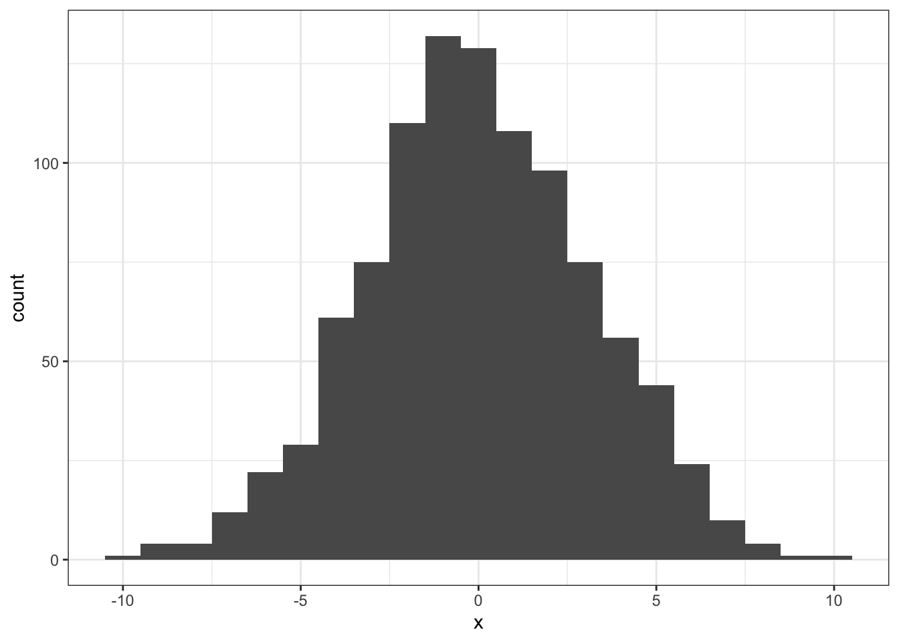

## Solutions to Questions


Below you will find the solutions to the questions for the Activities for this chapter. Only look at them after giving the questions a good try and speaking to the tutor about any issues.

### InClass Activities

#### Step 1


```r
library("tidyverse")

## Note: 
## Here's how we created the data for today's task:
## dat <- tibble(group = rep(c("A", "B"), each = 50),
##               Y = c(rnorm(50, 100, 15),
##                     rnorm(50, 110, 15)))
##
## write_csv(dat, "perm_data.csv")
## You could create a new dataset yourself and try it again.

dat <- read_csv("perm_data.csv") %>% 
  mutate(subj_id = row_number())
```

[Return to Task](#Ch5InClassQueT1)

#### Step 2

**Step 2.1.1 - the basic dat pipeline**


```r
dat %>%
  group_by(group) %>%
  summarise(m = mean(Y))
```

```
## # A tibble: 2 x 2
##   group     m
##   <chr> <dbl>
## 1 A      101.
## 2 B      109.
```


**Step 2.1.2 - using `spread()` to separate the groups**

```r
dat %>%
  group_by(group) %>%
  summarise(m = mean(Y)) %>%
  spread(group, m)
```

```
## # A tibble: 1 x 2
##       A     B
##   <dbl> <dbl>
## 1  101.  109.
```

**Step 2.1.3 - `mutate()` the column of mean differences**

```r
dat %>%
  group_by(group) %>%
  summarise(m = mean(Y)) %>%
  spread(group, m) %>%
  mutate(diff = A - B)
```

```
## # A tibble: 1 x 3
##       A     B  diff
##   <dbl> <dbl> <dbl>
## 1  101.  109. -7.39
```


**Step 2.1.4 - `pull()` out the difference**

```r
dat %>%
  group_by(group) %>%
  summarise(m = mean(Y)) %>%
  spread(group, m) %>%
  mutate(diff = A - B) %>%
  pull(diff)
```

```
## [1] -7.388401
```

**Step 2.2 - setting up the `calc_diff()` function**

```r
calc_diff <- function(x) {
  x %>%
    group_by(group) %>%
    summarise(m = mean(Y)) %>%
    spread(group, m) %>%
    mutate(diff = A - B) %>%
    pull(diff)
}
```

**Step 2.3 - Calculating d_orig using calc_diff()**

```r
d_orig <- calc_diff(dat)
is.tibble(d_orig)
```

```
## Warning: `is.tibble()` is deprecated, use `is_tibble()`.
## This warning is displayed once per session.
```

```r
is.numeric(d_orig)
```

```
## [1] FALSE
## [1] TRUE
```

[Return to Task](#Ch5InClassQueT2)

#### Step 3


```r
permute <- function(x) {
  x %>%
    mutate(group = sample(group))
}

permute(dat)
```

```
## # A tibble: 100 x 3
##    group     Y subj_id
##    <chr> <dbl>   <int>
##  1 B     113.        1
##  2 A      91.0       2
##  3 A      89.2       3
##  4 B     110.        4
##  5 A     118.        5
##  6 B     104.        6
##  7 B     100.        7
##  8 A      94.1       8
##  9 B      94.8       9
## 10 B      92.5      10
## # ... with 90 more rows
```

[Return to Task](#Ch5InClassQueT3)

#### Step 4

**Step 4.1 - the pipeline**

```r
dat %>% permute() %>% calc_diff()
```

```
## [1] -1.53662
```


**Step 4.2 - creating nhd**

```r
nhd <- replicate(1000, dat %>% permute() %>% calc_diff())
```

**Step 4.3 - plotting nhd**

```r
ggplot(tibble(x = nhd), aes(x)) + geom_histogram(binwidth = 1)
```

<div class="figure" style="text-align: center">

<p class="caption">(\#fig:histogram)**CAPTION THIS FIGURE!!**</p>
</div>

[Return to Task](#Ch5InClassQueT4)

#### Step 5

**Step 5.1 - The logical vector**

* This code establishes all the values in nhd that are equal to or greater than the value in d_orig
* It returns all these values as TRUE and all other values as FALSE
* `abs()` tells the code to ignore the sign of the value (i.e. assumes everything is positive)

```r
lvec = abs(nhd) >= abs(d_orig)
```


**Step 5.2 - Sum up all the TRUE values**

* This gives the total number of values greater or equal to d_orig

```r
n_exceeding_orig <- sum(lvec)
```

**Step 5.3 - Calculate the probability**

* The probability of obtaining d_orig or greater is calculated by the number of values equal to or greater than d_orig, divided by the full size of nhd (or in other words, its length)

```r
p <- n_exceeding_orig / length(nhd)
```

[Return to Task](#Ch5InClassQueT5)

<span style="font-size: 22px; font-weight: bold; color: var(--purple);">Chapter Complete!</span>
