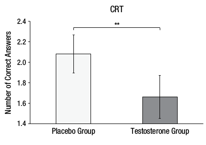
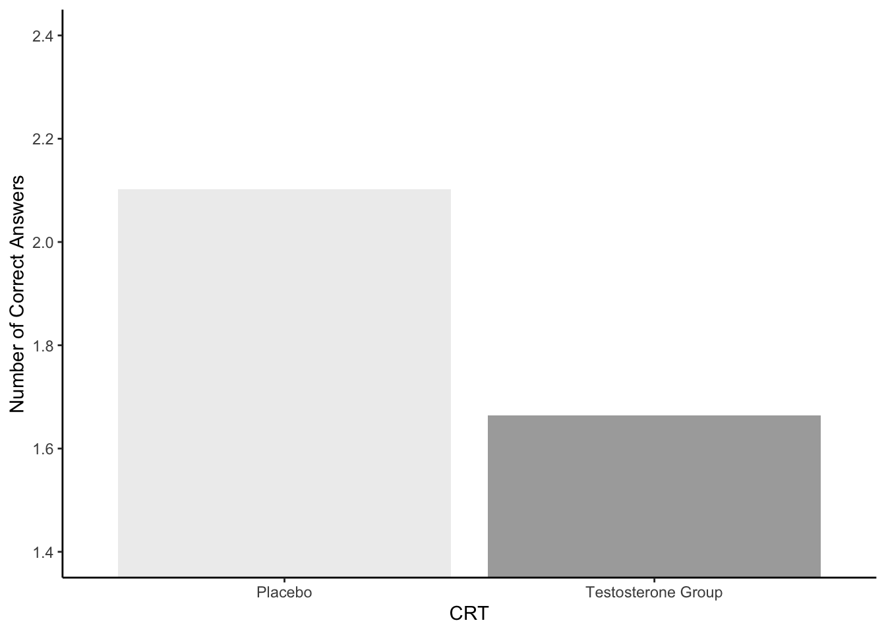

## Solutions to Questions


Below you will find the solutions to the questions for the Activities for this chapter. Only look at them after giving the questions a good try and speaking to the tutor about any issues.

### PreClass Activities

#### Task 1

<div class='solution'><button>Solution Task 1</button>


```r
# phil to remove this and replace with real solution afterwards
ns_data <- tibble(participant = 1:22,
                  valid_rt = c(631.2,800.8,595.4,502.6,604.5,
                               516.9,658.0,502.0,496.7,600.3,
                               714.6,623.7,634.5,724.9,815.7,
                               456.9,703.4,647.5,657.9,613.2,
                               585.4,674.1))
```

</div>

<br>
Click the tab to reveal the solution to the task.

#### Task 2

<div class='solution'><button>Solution Task 2</button>


```r
woods_mean <- 590

n_participants <- ns_data %>%
  filter(valid_rt > woods_mean) %>%
  nrow()
      
n_participants
```

```
## [1] 16
```

</div>

<br>
Click the tab to reveal the solution to the task.

#### Task 3


<div class='solution'><button>Solution Task 3</button>


```r
# You can use the density function:
sum(dbinom(n_participants:nrow(ns_data), nrow(ns_data), .5))

## OR

# The cumulative probability function:
pbinom(n_participants - 1L, nrow(ns_data), .5, lower.tail = FALSE)

# If you were to plug in the numbers directly into the code:
sum(dbinom(16:22,22, .5))

## OR

pbinom(15, 22, .5, lower.tail = FALSE) # Remember we need to specify a value lower than our minimum participant number as lower.tail = FALSE.

## It is better practice to use the first two solutions, which pull the values straight from ns_data, as you run the risk of entering an error into your code if you plug in the values manually.
```

```
## [1] 0.0262394
## [1] 0.0262394
## [1] 0.0262394
## [1] 0.0262394
```

</div>

<br>
Click the tab to reveal the solution to the task.

#### Task 4

<div class='solution'><button>Solution Task 4</button>


```r
ns_data_mean <- ns_data %>%
  summarise(m = mean(valid_rt)) %>%
  pull(m)  
## just get the column m and throw away the rest of the table

ns_data_sd <- ns_data %>%
  summarise(sd = sd(valid_rt)) %>%
  pull(sd)  
## just get the column sd and throw away the rest

## NOTE: You could print them out on the the screen if you wanted to
##      "\n" is the end of line symbol so that they print on
##       different lines
cat("The mean number of hours was", ns_data_mean, "\n")
cat("The standard deviation was", ns_data_sd, "\n")
```

```
## The mean number of hours was 625.4636 
## The standard deviation was 94.30693
```

</div>

<br>
Click the tab to reveal the solution to the task.

#### Task 5


<div class='solution'><button>Solution Task 5</button>


```r
t_obs <- (ns_data_mean - woods_mean) / (ns_data_sd / sqrt(nrow(ns_data)))
    
t_obs
```

```
## [1] 1.763807
```

</div>

<br>
Click the tab to reveal the solution to the task.

#### Task 6


<div class='solution'><button>Solution Task 6</button>


```r
# If using values straight from ns_data:
pval <- pt(abs(t_obs), nrow(ns_data) - 1L, lower.tail = FALSE) * 2L
## we multiply by 2 for a two-tailed test
pval

# You can also get the same answer by plugging the values in yourself:
pt(t_obs, 21, lower.tail = FALSE) * 2
# Though this method runs the risk of error - you are better off using the first calculation as those values come straight from ns_data.
```

```
## [1] 0.09230923
## [1] 0.09230923
```

</div>

<br>
Click the tab to reveal the solution to the task.

#### Task 7

<div class='solution'><button>Solution Task 7</button>


```r
t.test(pull(ns_data, valid_rt), mu = woods_mean)
```

```
## 
## 	One Sample t-test
## 
## data:  pull(ns_data, valid_rt)
## t = 1.7638, df = 21, p-value = 0.09231
## alternative hypothesis: true mean is not equal to 590
## 95 percent confidence interval:
##  583.6503 667.2770
## sample estimates:
## mean of x 
##  625.4636
```

</div>

<br>
Click the tab to reveal the solution to the task.

### InClass Activities

#### Task 1

```
## # A tibble: 1 x 1
##   mean_age
##      <dbl>
## 1     30.9
## # A tibble: 3 x 2
##     sex     n
##   <dbl> <int>
## 1     1     4
## 2     2    30
## 3    NA     5
## # A tibble: 3 x 3
##     sex     n sex_names
##   <dbl> <int> <chr>    
## 1     1     4 male     
## 2     2    30 female   
## 3    NA     5 <NA>
```


<div class='solution'><button>Possible Solution to Task 1</button>


```r
library("tidyverse")
library("broom") # you'll need broom::tidy() later

evaluators <- read_csv("evaluators.csv")

evaluators %>%
  summarize(mean_age = mean(age, na.rm = TRUE))

evaluators %>%
  count(sex)

# If using `recode()`:
evaluators %>%
  count(sex) %>%
  mutate(sex_names = recode(sex, "1" = "male", "2" = "female"))
```

</div>


**Click the tab to reveal the solution**

#### Task 2


<div class='solution'><button>Possible Solution to Task 2</button>


```r
# 1. load in the data
ratings <- read_csv("ratings.csv")

# 2. first step: pull out the ratings associated with intellect
iratings <- ratings %>%
  filter(Category %in% c("competent", "thoughtful", "intelligent"))

# second step: calculate means for each evaluator
imeans <- iratings %>%
  group_by(eval_id) %>%
  summarise(Rating = mean(Rating))

# 3. add Category variable 
# this way we can combine with 'impression' and 'hire' into a single table, very useful!
imeans2 <- imeans %>%
  mutate(Category = "intellect")

# 4. & 5. combine into a single table
ratings2 <- ratings %>%
  filter(Category %in% c("impression", "hire")) %>%
  bind_rows(imeans2) %>%
  inner_join(evaluators, "eval_id") %>%
  select(-age, -sex) %>%
  arrange(eval_id, Category)
```

</div>


**Click the tab to reveal the solution**

#### Task 4


<div class='solution'><button>Possible Solution to Task 4</button>


```r
## 1. First we create the group means
group_means <- ratings2 %>%
  group_by(condition, Category) %>%
  summarise(m = round(mean(Rating), 2), sd = round(sd(Rating), 2))

## and can check them by calling it
group_means

## Now we run the t-tests
## `t.test()` requires two vectors as input
## `pull()` will pull out a single column from the table
## `tidy()` takes information from a test and turns it into a table. Run the t.test with and without piping into tidy to see what it does differently.

## The INTELLECT t-test as shown previously:
intellect <- filter(ratings2, Category == "intellect")
intellect_t <- t.test(intellect %>% filter(condition == "listened") %>% pull(Rating),
                      intellect %>% filter(condition == "read") %>% pull(Rating),
                      var.equal = TRUE) %>%
  tidy()

## Now we repeat for HIRE and IMPRESSION
hire <- filter(ratings2, Category == "hire")
hire_t <- t.test(hire %>% filter(condition == "listened") %>% pull(Rating),
                      hire %>% filter(condition == "read") %>% pull(Rating),
                 var.equal = TRUE) %>%
  tidy()

impress <- filter(ratings2, Category == "impression")
impress_t <- t.test(impress %>% filter(condition == "listened") %>% pull(Rating),
                    impress %>% filter(condition == "read") %>% pull(Rating),
                    var.equal = TRUE) %>%
  tidy()

## 2. Now we can create the table of all three t-tests
results <- bind_rows("hire" = hire_t, 
                     "impression" = impress_t,
                     "intellect" = intellect_t, .id = "id")

results
```

```
## # A tibble: 6 x 4
## # Groups:   condition [2]
##   condition Category       m    sd
##   <chr>     <chr>      <dbl> <dbl>
## 1 listened  hire        4.71  2.26
## 2 listened  impression  5.97  1.92
## 3 listened  intellect   5.63  1.61
## 4 read      hire        2.89  2.05
## 5 read      impression  4.07  2.23
## 6 read      intellect   3.65  1.91
## # A tibble: 3 x 10
##   id    estimate1 estimate2 statistic p.value parameter conf.low conf.high
##   <chr>     <dbl>     <dbl>     <dbl>   <dbl>     <dbl>    <dbl>     <dbl>
## 1 hire       4.71      2.89      2.62 0.0127         37    0.414      3.24
## 2 impr~      5.97      4.07      2.85 0.00709        37    0.548      3.24
## 3 inte~      5.63      3.65      3.53 0.00114        37    0.845      3.13
## # ... with 2 more variables: method <chr>, alternative <chr>
```

</div>


**Click the tab to reveal the solution**

#### Going Further with your coding

There is actually a quicker way to do this analysis of three t-tests which you can have a look at below if you have the time. This uses very advanced coding with some functions we won't really cover in level 2. Do not worry if you can't quite follow it though; the main thing is to understand what we covered in the lab - the outcome is the same.


<div class='solution'><button>Advanced t-test</button>


```r
## here is a more efficient (but also more advanced!) way to do this
## don't worry if you don't understand the code below (yet!)
ratings2 %>%
  group_by(Category) %>%
  nest() %>%
  mutate(ttest = map(data, function(x) {
    t.test(Rating ~ condition, x, var.equal = TRUE) %>% 
      tidy()
  })) %>%
  select(Category, ttest) %>%
  unnest()
```

```
## # A tibble: 3 x 10
##   Category estimate1 estimate2 statistic p.value parameter conf.low
##   <chr>        <dbl>     <dbl>     <dbl>   <dbl>     <dbl>    <dbl>
## 1 hire          4.71      2.89      2.62 0.0127         37    0.414
## 2 impress~      5.97      4.07      2.85 0.00709        37    0.548
## 3 intelle~      5.63      3.65      3.53 0.00114        37    0.845
## # ... with 3 more variables: conf.high <dbl>, method <chr>,
## #   alternative <chr>
```

</div>
  

**Click the tab to reveal the alternative approach**

### Homework Activity

#### Lab 6: Independent samples t-test Assignment

In order to complete this assignment you first have to download the assignment .Rmd file which you need to edit for this assignment: titled `GUID_Level2_Lab6.Rmd`. This can be downloaded within a zip file from the below link. Once downloaded and unzipped you should create a new folder that you will use as your working directory; put the .Rmd file in that folder and set your working directory to that folder through the drop-down menus at the top. <a href="https://www.psy.gla.ac.uk/~phil/L2Labs_201819/semester_one/lab_06/homework/Level2_Lab6_AssignmentFiles.zip", target = "_blank">Download the Assignment .zip file from here</a> or on Moodle.

**Background**

For this assignment we will be using real data from the following paper:

Nave, G., Nadler, A., Zava, D., and Camerer, C. (2017). <a href="http://journals.sagepub.com/doi/suppl/10.1177/0956797617709592", target = "_blank">Single-dose testosterone administration impairs cognitive reflection in men.</a> *Psychological Science*, *28*, 1398--1407.

The full data for these exercises can be downloaded from the <a href="https://osf.io/kzxsh/download", target = "_blank">Open Science Framework repository</a> but for this assignment we will just use the `.csv` file in the zipped folder: **CRT_Data.csv**. You may also want to read the paper, at least in part, to help fully understand this analysis if at times you are unsure. Here is the article's abstract:

**In nonhumans, the sex steroid testosterone regulates reproductive behaviors such as fighting between males and mating. In humans, correlational studies have linked testosterone with aggression and disorders associated with poor impulse control, but the neuropsychological processes at work are poorly understood. Building on a dual-process framework, we propose a mechanism underlying testosterone's behavioral effects in humans: reduction in cognitive reflection. In the largest study of behavioral effects of testosterone administration to date, 243 men received either testosterone or placebo and took the Cognitive Reflection Test (CRT), which estimates the capacity to override incorrect intuitive judgments with deliberate correct responses. Testosterone administration reduced CRT scores. The effect remained after we controlled for age, mood, math skills, whether participants believed they had received the placebo or testosterone, and the effects of 14 additional hormones, and it held for each of the CRT questions in isolation. Our findings suggest a mechanism underlying testosterone's diverse effects on humans' judgments and decision making and provide novel, clear, and testable predictions.**

The critical findings are presented on p. 1403 of the paper under the heading **The influence of testosterone on CRT performance**.  Your task today is to attempt to try and reproduce some of the main results from the paper.  

**NOTE**: Being unable to get the exact same results as the authors doesn't necessarily mean you are wrong!  The authors might be wrong, or might have left out important details. Present what you find.

**Before starting lets check:**

1. The `.csv` file is saved into a folder on your computer and you have manually set this folder as your working directory. 

2. The `.Rmd` file is saved in the same folder as the `.csv` files. For assessments we ask that you save it with the format `GUID_Level2_Lab6.Rmd` where `GUID` is replaced with your `GUID`. Though this is a formative assessment, it may be good practice to do the same here.

#### Task 1A: Libraries

* In today's assignment you will need both the `tidyverse` and `broom` packages. Enter code into the t1A code chunk below to load in both of these libraries.


```r
library(broom)
library(tidyverse)
```

#### Task 1B: Loading in the data

* Use `read_csv()` to replace the `NULL` in the t1B code chunk below to load in the data stored in the datafile `CRT_Data.csv`. Store the data in the variable `crt`. Do not change the filename of the datafile. 


```r
crt <- read_csv("data/06-s01/homework/CRT_Data.csv")
```


```r
crt <- read_csv("CRT_Data.csv")
```

#### Task 2: Identify relevant columns

Have a look at `crt`.  There are three variables in `crt` that you will need to find and extract in order to perform the t-test: the subject ID number (**hint**: each participant has a unique number); the independent variable (**hint**: each participant has the possibility of being in one of two treatments coded as 1 or 0); and the dependent variable (**hint**: the test specifically looks at which *answers people get correct*).  Identify those three variables. It might help to look at the first few sentences under the heading **The influence of testosterone on CRT performance** and Figure 2a in the paper for further guidance on the correct variables.

* Having identified the important three columns, replace the `NULL` in the t2 code chunk below to select out only those three columns from `crt` and store them in the tibble `crt2`.

**Check your work:** If correct, `crt2` should be a tibble with 3 columns and 243 rows.


```r
crt2 <- select(crt, ID, Treatment, CorrectAnswers)
```

**NOTE:** For the remainder of this assignment you should use `crt2` as the main source tibble and not `crt`.

#### Task 3: Verify the number of subjects in each group

The Participants section of the article contains the following statement:

**243 men (mostly college students; for demographic details, see Table S1 in the Supplemental Material available online) were randomly administered a topical gel containing either testosterone (n = 125) or placebo (n = 118).**

In the t3 code block below, replace the `NULLs` with lines of code to calculate:

1. The number of men in each Treatment. This should be a tibble/table called `cond_counts` containing a column called `Treatment` showing the two groups and a column called `n` which shows the number of men in each group.

2. The total number of men in the sample. This should be a single value, not a tibble/table, and should be stored in `n_men`. 

You know the answer to both of these tasks already. Make sure that your code gives the correct answer!


```r
cond_counts <- crt2 %>% group_by(Treatment) %>% summarise(n = n())
# alternatively
cond_counts <- crt2 %>% count(Treatment)

n_men <- crt2 %>% summarise(n = n()) %>% pull(n)
# alternatively
n_men <- nrow(crt2)
```

* Now replace the strings in the statements below, using inline R code, so that it reproduces the sentence from the paper exactly as it is shown above. In other words, in the statement below, anywhere it says `"(your code here)"`, replace that string (including the quotes), with inline R code.  To clarify, when looking at the .Rmd file you should see R code; when looking at the knitted file, you should see values. See Lab 1 if you are unsure of how to use inline code.

**Hint:** One solution is to do something with `cond_counts` similar to what we did with `filter()` and `pull()` in the in-class exercises for lab 6.

**`"(your code here)"` men (mostly college students; for demographic details, see Table S1 in the Supplemental Material available online) were randomly administered a topical gel containing either testosterone (n = `"(your code here)"`) or placebo (n = `"(your code here)"`).**

**Solution:**

When formatted to inline (placing `r` at the front) and knitted, this code below:

**`n_men` men (mostly college students; for demographic details, see Table S1 in the Supplemental Material available online) were randomly administered a topical gel containing either testosterone (n = `cond_counts %>% filter(Treatment == 1) %>% pull(n)`) or placebo (n = `cond_counts %>% filter(Treatment == 0) %>% pull(n)`).**

should give:

**243 men (mostly college students; for demographic details, see Table S1 in the Supplemental Material available online) were randomly administered a topical gel containing either testosterone (n = 125) or placebo (n = 118).**

#### Task 4: Reproduce Figure 2a

Here is Figure 2A from the original paper:

<div class="figure" style="text-align: center">

<p class="caption">(\#fig:img-lab6-figure2a)Figure 7</p>
</div>


* Write code in the t4 code chunk to reproduce a version of Figure 2a - shown above.  Before you create the plot, replace the `NULL` to make a table called `crt_means` with the mean and standard deviation of the number of `CorrectAnswers` for each group. Use `crt_means` as the source data for the plot.  

**Hint:** you will need to check out `recode()` to get the labels of treatments right. Again this webpage is highly recommended: <a href="https://debruine.github.io/recode.html", target = "_blank">https://debruine.github.io/recode.html</a>

Don't worry about including the error bars (unless you want to) or the line indicating significance in the plot. Do however make sure to pay attention to the labels of treatments and of the y-axis scale and label. Reposition the x-axis label to below the Figure. You can use colour if you like. 


```r
crt_means <- crt2 %>% 
  group_by(Treatment) %>% 
  summarise(m = mean(CorrectAnswers), sd = sd(CorrectAnswers)) %>%
  mutate(Treatment = recode(Treatment, "0" = "Placebo", "1" = "Testosterone Group"))

ggplot(crt_means, aes(Treatment, m, fill = Treatment)) + 
  geom_col() + 
  theme_classic() + 
  labs(x = "CRT", y = "Number of Correct Answers") +
  guides(fill = "none") +
  scale_fill_manual(values = c("#EEEEEE","#AAAAAA")) +
  coord_cartesian(ylim = c(1.4,2.4), expand = TRUE)
```

<div class="figure" style="text-align: center">

<p class="caption">(\#fig:t4)**CAPTION THIS FIGURE!!**</p>
</div>

#### Task 5: Interpreting your Figure

Always good to do a slight recap at this point to make sure you are following the analysis.  Replace the `NULL` in the t5 code chunk below with the number of the statement that best describes the data you have calculated and plotted thus far. Store this single value in `answer_t5`:

1. The Testosterone group (M = 2.10, SD = 1.02) would appear to have fewer correct answers on average than the Placebo group (M = 1.66, SD = 1.18) on the Cognitive Reflection Test suggesting that testosterone does in fact inhibit the ability to override incorrect intuitive judgements with the correct response. 

2. The Testosterone group (M = 1.66, SD = 1.18) would appear to have more correct answers on average than the Placebo group (M = 2.10, SD = 1.02) on the Cognitive Reflection Test suggesting that testosterone does in fact inhibit the ability to override incorrect intuitive judgements with the correct response. 

3. The Testosterone group (M = 1.66, SD = 1.18) would appear to have fewer correct answers on average than the Placebo group (M = 2.10, SD = 1.02) on the Cognitive Reflection Test suggesting that testosterone does in fact inhibit the ability to override incorrect intuitive judgements with the correct response. 

4. The Testosterone group (M = 2.10, SD = 1.02) would appear to have more correct answers on average than the Placebo group (M = 1.66, SD = 1.18) on the Cognitive Reflection Test suggesting that testosterone does in fact inhibit the ability to override incorrect intuitive judgements with the correct response.


```r
answer_t5 <- 3
```

#### Task 6: t-test

Now that we have calculated the descriptives in our study we need to run the inferentials. In the t6  code chunk below, replace the `NULL` with a line of code to run the t-test taking care to make sure that the output table has the Placebo mean under Estimate1 (group 0) and Testosterone mean under Estimate2 (group 1). Assume variance is equal and use `broom::tidy()` to sweep and store the results into a data frame called `t_table`.


```r
t_table <- t.test(crt2 %>% filter(Treatment == 0) %>% pull(CorrectAnswers),
                  crt2 %>% filter(Treatment == 1) %>% pull(CorrectAnswers),
                  var.equal = TRUE) %>%
  tidy()

# alternatively
t_table <- t.test(CorrectAnswers ~ Treatment, data = crt2, var.equal = TRUE) %>% tidy()
```

#### Task 7: Reporting results

In the t7A code chunk below, replace the `NULL` with a line of code to pull out the df from t_table. This must be a single value stored in `t_df`. 


```r
t_df <- t_table$parameter
```

In the t7B code chunk below, replace the `NULL` with a line of code to pull out the t-value from t_table. Round it to three decimal places. This must be a single value stored in `t_value`. 


```r
t_value <- t_table$statistic %>% round(3)
```

In the t7C code chunk below, replace the `NULL` with a line of code to pull out the p-value from t_table. Round it to three decimal places. This must be a single value stored in `p_value`. 


```r
p_value <- t_table$p.value %>% round(3)
```

In the t7D code chunk below, replace the `NULL` with a line of code to calculate the absolute difference between the mean number of correct answers for the Testosterone group and the Placebo group. Round it to three decimal places. This must be a single value stored in `t_diff`.


```r
t_diff <- (t_table$estimate1 - t_table$estimate2) %>% round(3) %>% abs()
```

If you have completed t7A to t7D accurately, then when knitted, one of these statements below will produce an accurate and coherent summary of the results.  In the t7E code chunk below, replace the `NULL` with the number of the statement below that best summarises the data in this study. Store this single value in `answer_t7e`

1. The testosterone group performed significantly better (0.438 fewer correct answers) than the placebo group, t(241) = 3.074, p = 0.002.
2. The testosterone group performed significantly worse (241 fewer correct answers) than the placebo group, t(0.438) = 3.074, p = 0.002.
3. The testosterone group performed significantly better (0.438 more correct answers) than the placebo group, t(241) = 3.074, p = 0.002.
4. The testosterone group performed significantly worse (0.438 fewer correct answers) than the placebo group, t(241) = 3.074, p = 0.002.


```r
answer_t7e <- 4
```

**Finished**

Well done, you are finshed! Now you should go check your answers against the solution file which can be found on Moodle. You are looking to check that the resulting output from the answers that you have submitted are exactly the same as the output in the solution - for example, remember that a single value is not the same as a coded answer. Where there are alternative answers it means that you could have submitted any one of the options as they should all return the same answer. If you have any questions please post them on the moodle forum or on the <a href = "https://rguppies.slack.com", target = "_blank">rguppies.slack.com</a> forum **#level2_2018**.

See you in the next lab!
