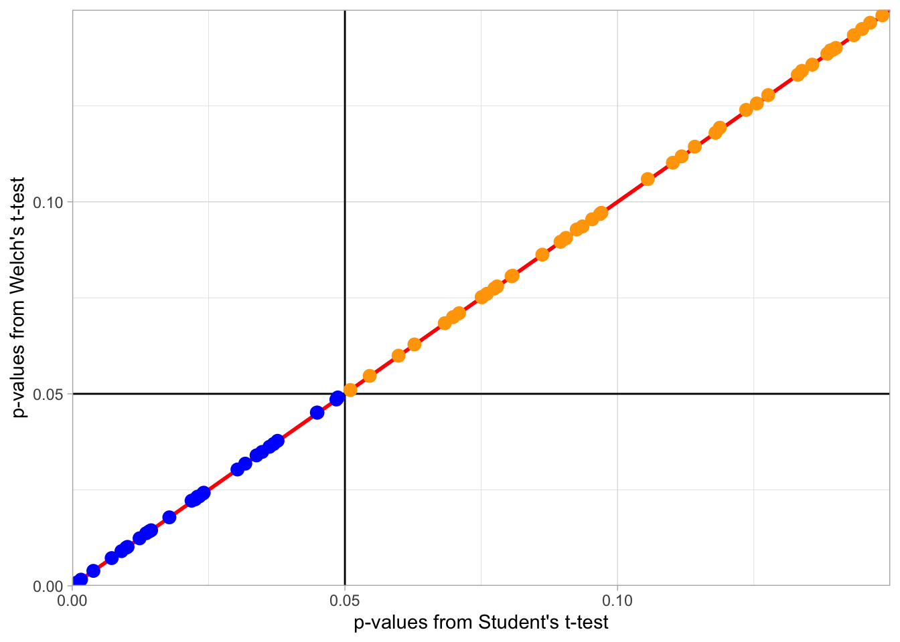

## PreClass Activity

A bit of a change of pace in this PreClass Activity. In order to give you a bit more of an understanding of the assumptions of the between-subjects t-test, and a viable alternative to the standard Student's t-test, we ask that you read the following blog (and even the full paper if you have time) and then try out the couple of tasks below.

### Reading

Read the following blog on using **Welch's t-test** for between-subjects designs. 

**Blog:**

* <a href = "https://daniellakens.blogspot.co.uk/2015/01/always-use-welchs-t-test-instead-of.html" target = "_blank">Always use Welch's t-test instead of Student's t-test</a> by Daniel Lakens.

For further reading you can look at the paper that resulted from this blog:

**Paper:**

* Delacre, M., Lakens, D., & Leys, C. (in press) <a href = "https://osf.io/sbp6k/" target = "_blank">Why Psychologists Should by Default Use Welch's t-test Instead of Student's t-test</a>. International Review of Social Psychology.

### Task

1. Copy the script within the blog into an R script and try running it to see the difference between Welch's t-test (the recommended test in the blog) and Student's t-test (the standard test in the field). 

**Note:** You will need the **`car`** package. This is installed already in the Boyd Orr labs so if doing this in the labs, do not install the package, just call it to the library with library(car). If yuo are using your own machine then you will need to install the **`car`** package.

Don't worry if you don't yet understand all the code. It is highly commented but it is tricky.  The key thing is to try and run it and to look at the figures that come out of it - particularly the third figure that you see in the blog, the one with the red line on it that compares p-values in the two tests. Look at how many tests (dots) are significant on one test and not the other.

2. Now change the values for n1, n2, sd1 and sd2 at the top of the script to see what effect this has on the Type 1 Error rate (alpha = .05). Again look at the figure with the red line, comparing significance on one test versus significance on the other.  This is what should change depending on the n of each sample and whether the variance is equal or not.

3. Think about the overall point of this blog and which test we should use when conducting a t-test. We will look at this more in the lectures and labs.

**Understanding the Blog and the assumption of variance**

What the blog and paper are trying to help us recognise is that if the two groups have equal number of participants and equal variance, then both Student's t-test and Welch's t-test will return the same t-value and therefor p-value. This means that you would reject the null hypothesis an equal number of times regardless of which test you used. This is what this first figure demonstrates. We have used an adapted version of the code from the blog to create this figure - the settings we have used are in the box shown and you can change your code to match them (remember to set the seed to get the same values)


```r
set.seed(1409)

n1 <- 38 
n2 <- 38 
sd1 <- 1.85 
sd2 <- 1.85 

nSims <- 500
```

<div class="figure" style="text-align: center">

<p class="caption">(\#fig:chpt7-match-figure)Figure illustrates that with equal number of participants and equal variance, Welch's t-test and Student's t-test find the same results as significant (Orange Circles) and the same results as non-significant (Purple Circles). The horizontal and vertical black lines represent the alpha = .05 for both tests. Dots following on diagonal red line show same p-value for Welch's and Student's t-tests.</p>
</div>

However, if the two groups have unequal variance and/or unequal number of participants, the two tests start to give different results. This is shown in the below figure where results found to be significant in both tests are shown in orange, results found to be non-significant in both tests are shown in blue, and tests found to be significant in Student's t-test but non-significant in Welch's t-test are shown in purple. If we read the blog, especially about how p-values work when there is no actual difference between two groups, then we can come to the conclusion that Welch's t-test is working better than the Student's t-test in this scenario.


```r
set.seed(1409)

n1 <- 38 
n2 <- 25 
sd1 <- 1.15 
sd2 <- 1.85  

nSims <- 500
```


<div class="figure" style="text-align: center">

<p class="caption">(\#fig:chpt7-miss-match)Figure illustrates that with unequal number of participants and/or unequal variance, Welch's t-test and Student's t-test work differently, returning conflciting findings. Results found to be significant in both tests are shown in orange, results found to be non-significant in both tests are shown in blue, and tests found to be significant in Student's t-test but non-significant in Welch's t-test are shown in purple. The horizontal and vertical black lines represent the alpha = .05 for both tests. Dots following on diagonal red line show same p-value for Welch's and Student's t-tests.</p>
</div>

So what is the difference between the two tests? Essentially the assumption of variance. What is considered the common t-test, Student's t-test, has the assumption of equal variance, whereas Welch's t-test has no assumption of equal variace - it does however have all the other same assumptions as the Student's t-test. What this blog shows is that if the groups have equal variance then both tests return the same finding. However if that assumption is violated then Welch's test produce the more accurate finding, based on the data. This is important as often the final decision on whether assumptions are "held" or "violated" is subjective; i.e. it is down to the researcher to fully decide. Nearly all data will show some level of unequal variance (with perfectly equal variance across multiple conditions actually once revealing fraudulent data) so often people using Student's t-test have to think about whether the data is "equal enough". This blog shows that it is always better to run a Welch's t-test for between-subjects as a) it does not have the assumption of equal variance, b) it gives more accurate results when variance is not equal, and c) performs exactly the same as the Student t-test when variance is equal. 

In short, Welch's t-test takes a level of ambiguity (or what may be called a "researcher degree of freedom") out of the analysis and makes the analysis less open to bias or subjectivity. As such, from now on, unless stated otherwise, you should run a Welch's t-test. 

In practice it is very easy to run the Welch's t-test, and you can switch between the tests as shown: 

* to run a Student's t-test you set `var.equal = TRUE`
* to run a Welch's t-test you set `var.equal = FALSE`

Don't worry if you don't yet fully understand this blog. We will have some practice on it in coming Chapters but in short Welch's t-test is better as it does not require the assumption of equal variance.

Conversely, there is no concern with variance in a within-subjects t-test because, as you will know from lectures, the top half of the equation of the formula (the numerator) is the mean difference between the two conditions, and so it is only one set of values and there is nothing to equate it to. And we are going to explore the assumptions of the within-subjects t-test in the InClass Activities!

<span style="font-size: 22px; font-weight: bold; color: var(--blue);">Job Done - Activity Complete!</span>

That's it for the PreClass Activity! This is a bit of a change to the PreClass activities you have done so far, and you will start to see this approach more in the later Chapters of this book - reading blogs, papers, and chapters from other books.  Don't forget though that it is really important to store the information in your own words, to help you really understand it, so you might want to go back and add any informative points to your Portfolio. And as always, post any questions you have on the available forums or ask a member of staff.
