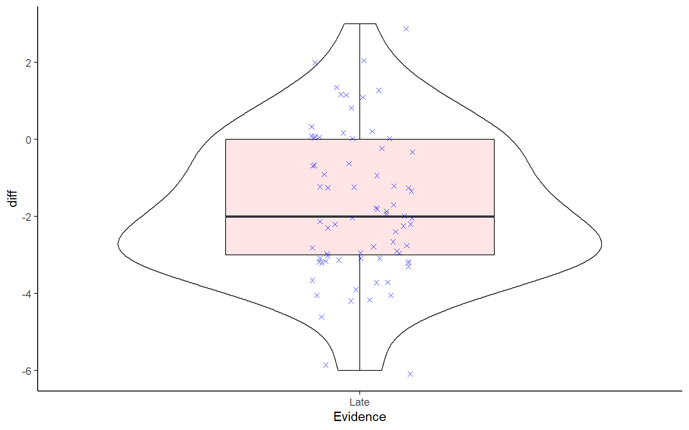

## InClass Activity

**Juror Decision Making: Does the order of information affect juror judgements of guilt or innocence?**

For this activity we will look at a replication of Furnham (1986) that the School of Psychology, University of Glasgow, carried out in 2016 - 2017. It would be worth familiarising yourself with the original study at some point for more information regarding the concepts of the study, but it is not essential in order to complete the assignment: <a href="http://www.tandfonline.com/doi/abs/10.1080/00221309.1986.9711045" target = "_blank">Furnham, A. (1986), The Robustness of the Recency Effect: Studies Using Legal Evidence</a>

The overall aim of the original experiment was to investigate whether the decision a jury member makes about the innocence or guilt of a defendant could be influenced by something as simple as **when crucial evidence is presented during a trial**. During the experiment participants (Level 2 Psychology students) listened to a series of recordings that recreated the 1804 trial of a man known as Joseph Parker who was accused of assuming two identities and marrying two women; i.e. bigamy. Each participant listened to the same recordings of evidence, presented by both prosecution and defence witnesses, and were asked to judge how guilty they thought Mr. Parker was at 14 different points during the experiment on a scale of 1 to 9: 1 being innocent and 9 being guilty. 

The manipulation in the experiment was that the order of evidence was altered so that half the participants received one order and the other half received the second order. Key to the order change was the time at which a **critical** piece of evidence was presented. This critical evidence proved that the defendant was innocent. The **middle** group heard this evidence at Timepoint 9 of the trial whereas the **late** group heard this evidence at Timepoint 13. You will have an opportunity to look at all the data in due course but, for today's exercise, we will only focus on the **late** group.

In this exercise, your task is to analyse the data to examine whether the participants' ratings of guilt significantly changed **before** and **after** the presentation of the critical evidence in the **late** condition. If the critical evidence, which proved the defendant's innocence, had the desired effect then you should see a significant drop in ratings of guilt after hearing this evidence (Timepoint 13) compared to before (Timepoint 12). Or in other words, **we hypothesised that there would be a significant decrease in ratings of guilt, caused by presentation of the critical evidence, from Timepoint 12 to Timepoint 13.**

### Task 1: Load the Data {#Ch7InClassQueT1}

* [Download the data for this experiment from here](data/07-s01/inclass/Level2_Lab7_InclassData.zip).
* Unzip the data and save it into a folder you have access to and set that folder as your working directory. 
* Open a new script.
* Today you will need the `broom` and `tidyverse` libraries. Load these in this order. Remember order matters.
* Using `read_csv()`, load in the data from the experiment contained in `GuiltJudgements.csv` and store it in a tibble called `ratings`. 

### Task 2: Wrangle the Data {#Ch7InClassQueT2}

As above, you are only interested in the **Late** group for this assignment and only for **Timepoints 12 (rating before key evidence) and 13 (rating after key evidence)**. But having had a look at `ratings` you will see that the Timepoints are in `wide` format (columns `1` to `14` - each a different timepoint) and the `Evidence` column contains the `Middle` group as well. ***Hmmmm!***

1. `filter()` only those participants from the `Late` condition.  

2. `select()` only the Timepoints 12 and 13.  

3. `rename()` these Timepoints as Twelve and Thirteen as numerical names are hard to deal with.  

4. `gather()` the data so that you have the below structure. Note that only the first four rows are shown  

5. Do this all as one pipe and store it in a tibble called `lates`.

Check that your table looks like the table below.

<table>
<caption>(\#tab:table)How your table should look from Task 2</caption>
 <thead>
  <tr>
   <th style="text-align:center;"> Participant </th>
   <th style="text-align:center;"> Evidence </th>
   <th style="text-align:center;"> Timepoint </th>
   <th style="text-align:center;"> GuiltRating </th>
  </tr>
 </thead>
<tbody>
  <tr>
   <td style="text-align:center;"> 1 </td>
   <td style="text-align:center;"> Late </td>
   <td style="text-align:center;"> Twelve </td>
   <td style="text-align:center;"> 7 </td>
  </tr>
  <tr>
   <td style="text-align:center;"> 2 </td>
   <td style="text-align:center;"> Late </td>
   <td style="text-align:center;"> Twelve </td>
   <td style="text-align:center;"> 5 </td>
  </tr>
  <tr>
   <td style="text-align:center;"> 3 </td>
   <td style="text-align:center;"> Late </td>
   <td style="text-align:center;"> Twelve </td>
   <td style="text-align:center;"> 5 </td>
  </tr>
  <tr>
   <td style="text-align:center;"> 4 </td>
   <td style="text-align:center;"> Late </td>
   <td style="text-align:center;"> Twelve </td>
   <td style="text-align:center;"> 4 </td>
  </tr>
</tbody>
</table>
  

<div class='solution'><button>Helpful Hint</button>

<div class="info">
<ol style="list-style-type: decimal">
<li><p>You need to specify the column you want to filter from, stating which variable (i.e. <code>Late</code>) that this column is ‘equal to’ (i.e. ‘==’)</p></li>
<li><p>Other than the two columns representing Timepoints 12 and 13, there are two other columns you need to keep in order to identify the participant and group. Use the table as a guide.</p></li>
<li><p>When renaming, first state the new variable name and then designate this to the old variable name. i.e. <code>rename(data, new_column_name = old_column_name)</code>. If the old column is a number, put it in backticks e.g. Five = backtick 5 backtick (but be sure to use `s).</p></li>
<li><p>The structure shown has two new columns: <code>Timepoint</code> and <code>GuiltRating</code>, which are both created from columns Twelve to Thirteen. You should state these new column names when using <code>gather()</code>, as well as the columns you used to create them.</p></li>
</ol>
</div>

</div>

<br>

<span style="font-size: 22px; font-weight: bold; color: var(--green);">Quickfire Questions</span>  

* To check you have completed this Task correctly, enter the appropriate values into the boxes. 
    - This dataset has: <input class='solveme nospaces' size='1' data-answer='["4"]'/> columns by <input class='solveme nospaces' size='3' data-answer='["150"]'/> rows.
    
### Task 3: Look at the Histogram for Normality {#Ch7InClassQueT3}

Before running an inferential analysis we need to check the assumptions. In this task we will do it through creating a **histogram** for each of the two timepoints to see if their individual distributions appear Normal. 

* Use your visualisation skills to plot a histogram for each timepoint. Have the two histograms side-by-side in the one figure and set the histogram binwidth to something reasonable for this experiment.


<div class='solution'><button>Helpful Hint</button>

<div class="info">
<ol style="list-style-type: decimal">
<li><p>ggplot() + geom_?</p></li>
<li><p>A histogram only requires you to state ‘x’ and not ‘y’. We are examining the differences in guilt rating scores across participants. Which column from <code>lates</code> should be ‘x’?</p></li>
<li><p><code>binwidth</code> is an argument you can specify within <code>geom_histogram()</code>. Think about an appropriate binwidth. Your guilt rating scale runs from 1 to 9 in increments of 1.</p></li>
<li><p>You have used something like <code>facet_?()</code> to display a categorical variables (i.e. <code>Timepoint</code>) according to the different levels it contains. You need to specify the variable you want to use, using <code>~</code> before the variable name.</p></li>
<li><p>Beyond this point, you can think about adding appropriate labels and color if you like.</p></li>
</ol>
</div>

</div>


### Task 4: A Boxplot of Outliers {#Ch7InClassQueT4}

We can also check for outliers on the difference scores.

* Create a boxplot for each `Timepoint` by `GuiltRating` and check for outliers. 


<div class='solution'><button>Helpful Hint</button>

<div class="info">
<ol style="list-style-type: decimal">
<li><p>This time when using <code>ggplot()</code> to create a boxplot, you need to specify both ‘x’, which is the discrete/categorical variable, and ‘y’, which is the continuous variable.</p></li>
<li><p>geom_boxplot() - see lab 3 for an example.</p></li>
</ol>
</div>

</div>

<br>

<span style="font-size: 22px; font-weight: bold; color: var(--green);">Quickfire Questions</span>  

* How many outliers do you see? <select class='solveme' data-answer='["0"]'> <option></option> <option>0</option> <option>1</option> <option>2</option> <option>3</option> <option>too many to count</option></select>

Remember that outliers are represented as dots or stars beyond the whiskers of the boxplot. We won't deal with outliers today but it would be worth thinking about how you could deal with them in future.

**We will now run some descriptives to start understanding the relationship between the two levels of interest: Timepoint 12 and Timepoint 13.**

### Task 5: The Violin Plot {#Ch7InClassQueT5}

Boxplots and histograms tell you slightly different information about the same data. But we have already introduced you to a new type of figure that we can combine with a boxplot that will show the same information in one figure. It is called a **violin plot** and can be created using the `geom_violin()` function. 

* Take the code you've written above for the boxplot (Task 4) and add on `geom_violin` as another layer. You may need to rearrange your code (i.e. the boxplot and violin plot functions) so that the violin plots appear underneath the boxplot.


<div class='solution'><button>Helpful Hint</button>

<div class="info">
<ul>
<li><p><code>ggplot()</code> works on layers - the first layer (i.e. the first plot you call) is underneath the second layer. This means that to get a boxplot showing on top of a violin plot, the violin must come first (i.e. you need to call <code>geom_violin()</code> before you call <code>geom_boxplot()</code>)</p></li>
<li><p>We have embellished the figure a little in the solution that you can have a look at once you have the basics sorted. Things like adding a <code>width</code> call to the boxplot, or an <code>alpha</code> call to the violin.</p></li>
</ul>
</div>

</div>

<br>

Do you see how the violin plot relates to the histogram you created earlier? In your head, rotate your histograms so that the bars are pointing to the left and imagine there is a mirror-image of them (making a two-sided histogram). This should look similar to your violin plot. **Do you see it?**

<span style="font-size: 22px; font-weight: bold; color: var(--pink);">WAIT JUST A SECOND!!!!!!</span>

When dealing with a within-subejcts design, and a paired t-test, normality is actually determined based on **the difference** between the two conditions. That is, is the distribution of the scores of the difference between the two conditions normally distributed. We have been looking at it in terms of separate conditions, but we need to look at the normality of the difference.  The code below will create a violin and boxplot visualisation of the difference between the two conditions. You should now be able to understand this code. 

Have a look at the output, and at the code, and think about whether the scores of the difference between the two conditions is normally distributed. 

Note that in the code below outliers will appear as red circles and inidividual data points will appear as blue Xs. Can you see what is controlling this?


```r
lates %>% 
  spread(Timepoint, GuiltRating) %>%
  mutate(diff = Thirteen - Twelve) %>%
  ggplot(aes(x = Evidence, y = diff)) +
  geom_violin() +
  geom_boxplot(fill = "red", width = .5, alpha = .1, outlier.colour = "red") +
  geom_jitter(color = "blue", width = .1, shape = 4) + 
  theme_classic()
```

<div class="figure" style="text-align: center">

<p class="caption">(\#fig:unnamed-chunk-6)**CAPTION THIS FIGURE!!**</p>
</div>


<span style="font-size: 22px; font-weight: bold; color: var(--pink);">Group Discussion Point</span>

We have now checked our assumptions but we sort of still need to make a decision regarding normality. Having had a look at the figures we have created, spend a few minutes thinking about whether the data is normally distributed or not.


<div class='solution'><button>Normal or not - our view!</button>

<div class="info">
<p>Remember that real data will never have the textbook curve that the normal distribution has. It will always be a bit messier than that and to some degree a judgement call is needed or you need to use a test to compare your sample distribution to the normal distribution. Tests such as a permutation bootstrap test that you saw in Lab 5 (convert to z-scores and create a distribution of the difference of permuted means to the normal mean), or tests such as the Kolmogorov-Smirnov and the Shapiro-Wilks tests are sometimes recommended. However, these last two tests are not that reliable depending on sample size.</p>
<p>Overall, the data looks normally distributed - at least visually.</p>
</div>

</div>

<br>

### Task 6: Calculating Descriptives {#Ch7InClassQueT6}

**We will now run some descriptives to start understanding the relationship between the two levels of interest: Timepoint 12 and Timepoint 13.**

* Calculate the mean, standard deviation, and Lower and Upper values of the 95% Confidence Interval for both levels of the Independent Variable (the two timepoints). You will need to also calculate the `n()` and the Standard Error to complete this task. Store all this data in a variable called `descriptives`.


<div class='solution'><button>Helpful Hint</button>

<div class="info">
<ol style="list-style-type: decimal">
<li><code>group_by()</code> the categorical column <code>Timepoint</code>. This is the column you want to compare groups for.</li>
<li><code>summarise()</code></li>
<li>Different calculations can be used within the same <code>summarise()</code> function as long as they are calculated in the order which you require them. For example, you first need to calculate the participant number, <code>n = n()</code>, and the standard deviation, <code>sd = sd(variable)</code>, in order to calculate the standard error, <code>se = sd/sqrt(n)</code>, which is required to calculate your Confidence Intervals.</li>
<li>For the 95% Confidence Interval, you need to calculate an LowerCI and a UpperCI using the appropriate formula.</li>
</ol>
</div>

</div>

<br>

<span style="font-size: 22px; font-weight: bold; color: var(--green);">Quickfire Questions</span>  

* From the options, which equation would use to calculate the LowerCI? <select class='solveme' data-answer='["mean - 1.96 * se"]'> <option></option> <option>mean - 1.96 * sd</option> <option>mean * 1.96 - se</option> <option>mean - 1.96 * se</option> <option>mean * 1.96 - sd</option></select>
* From the options, which equation would use to calculate the UpperCI? <select class='solveme' data-answer='["mean + 1.96 * se"]'> <option></option> <option>mean + 1.96 * sd</option> <option>mean * 1.96 + se</option> <option>mean + 1.96 * se</option> <option>mean * 1.96 + sd</option></select>


<div class='solution'><button>Portfolio Point - What is 1.96?</button>

<div class="info">
<p>For data that is normally distributed, you’re looking to calculate the 95% Confidence Interval. To do this you require a z-score which tells you how many standard deviations you are from the mean. 95% of the area under a normal distribution curve lies within 1.96 standard deviations from the mean.</p>
<p>If you were looking to calculate a 99% Confidence Interval you would instead use a z-score of 2.576. This takes into account a greater area under the normal distribution curve and so you are further away from the mean (i.e. closer to the tail ends of the curve), resulting in a higher z-score.</p>
</div>

</div>
  

### Task 7: Visualising Means and Descriptives {#Ch7InClassQueT7}

* Using the data in `descriptives`, produce a plot that visualises the mean and 95% Confidence Intervals.
    - One way would be a basic barplot, shown in previous labs, with error bars indicating the 95% CI. 
    - To add the error bars you could add a line like below.
    - Feel free to embellish the figure as you see fit.
    

```r
geom_errorbar(aes(ymin = LowerCI, ymax = UpperCI),
              position = "dodge", width = .15)
```


<div class='solution'><button>Helpful Hint</button>

<div class="info">
<ul>
<li>We recommend using <code>geom_col()</code></li>
<li>Remember to add (+) the <code>geom_errorbar()</code> line above to your code! Don’t pipe it.</li>
<li>In the above code for error bars, the aesthetic, <code>aes()</code>, allows you to set the min and max values.</li>
<li><code>position = &quot;dodge&quot;</code> does the same as <code>position = position_dodge()</code> and <code>position = position_dodge(width = .9)</code>. There are a number of ways to use a position call and they all do the same thing.</li>
</ul>
</div>

</div>

<br>

**Important to remember**: as we have mentioned in previous labs, barplots are not that informative in themselves. Going ahead in your research, keep in mind that you should look to use plots that incorporate a good indication of the distribution/spread of the individual data points as well.  

<span style="font-size: 22px; font-weight: bold; color: var(--pink);">Group Discussion Point</span>

Think back to the hypothesis. **We hypothesised that there would be a significant decrease in ratings of guilt, caused by presentation of the critical evidence, from Timepoint 12 to Timepoint 13.** Spend a few minutes talking to your group about whether you think there will be a significant difference between the two timepoints. What evidence do you have? Think about the overlap of confidence intervals! Remember the key thing at this stage is that it is a subjective impression - "It appears that there might be...." or words to that effect.

### Task 8: The t-test {#Ch7InClassQueT8}

Now we have checked our assumptions and ran our dscriptives, the last thing we need to do is to perform the within-subjects t-test to test the differences between the time points. 

To perform the within-subjects t-test you use the same `t.test` function as you did in Lab 6. However, this time you add the argument, `paired = TRUE`, as this is what tells the code "yes, this is a paired t-test".

* Perform a paired-sample t-test between guilt ratings at the crucial time points (Twelve and Thirteen) for the subjects in the late group. Store the data (e.g. `tidy`) in a tibble called `results`. 


<div class='solution'><button>Helpful Hint</button>

<div class="info">
<p>Here’s a reminder on the arguments used in <code>t.test()</code>:</p>
<ul>
<li><code>t.test(x ~ y, data, paired = TRUE/FALSE, alternative =&quot;two.sided&quot;/&quot;greater&quot;/&quot;less&quot;)</code></li>
<li><p><code>y</code> is typically your grouping variable (i.e. your independent variable).</p></li>
<li><p>To pull out the <code>Twelve</code> and <code>Thirteen</code> columns to pass as <code>x</code> and <code>y</code>, you can use: <code>lates %&gt;% pull(Twelve)</code> and <code>lates %&gt;% pull(Thirteen)</code>.</p></li>
<li><p>Once you’ve calculated <code>results</code>, don’t forget to <code>tidy()</code> - you can add this using a pipe!</p></li>
<li><p>If you don’t quite understand the use of <code>tidy()</code> yet, run your <code>t.test()</code> without <code>tidy()</code> and see what happens!</p></li>
<li><p>Note: SEE THE SOLUTION OF THIS TASK FOR AN ALTERNATIVE WAY TO RUN THIS t-test FORCING ONE CONDITION AS THE FIRST CONDITION/VECTOR</p></li>
</ul>
</div>

</div>

<br>

<span style="font-size: 22px; font-weight: bold; color: var(--pink);">Group Discussion Point</span>

Look within the tibble `results`. In groups, break down the results you can see. Was there a significant difference or not? We are about to write it up so best we know for sure. How can you tell? 

### Task 9: The Write-up {#Ch7InClassQueT9}

Fill in the blanks below to complete this paragraph, summarising the results of the study. You will need to refer back to the information within `results` and `descriptives` to get the correct answers and to make sure you understand the output of the t-test. Enter all values to two decimal places and present the absolute t-value.

"A <select class='solveme' data-answer='["paired-samples t-test"]'> <option></option> <option>paired-samples t-test</option> <option>one-sample t-test</option> <option>between-samples t-test</option> <option>matched-pairs t-test</option></select> was ran to compare the change in guilt ratings before (M = <input class='solveme nospaces' size='1' data-answer='["5.80","5.8"]'/>, SD = <input class='solveme nospaces' size='1' data-answer='["1.50","1.5"]'/>) and after (M = <input class='solveme nospaces' size='1' data-answer='["4.04"]'/>, SD = <input class='solveme nospaces' size='1' data-answer='["1.93"]'/>) the crucial evidence was heard. A <select class='solveme' data-answer='["significant"]'> <option></option> <option>significant</option> <option>non-significant</option></select> difference was found (t(<input class='solveme nospaces' size='1' data-answer='["74"]'/>) = <input class='solveme nospaces' size='1' data-answer='["8.23"]'/>, p <select class='solveme' data-answer='["< .001"]'> <option></option> <option>= .05</option> <option>> .05</option> <option>= .001</option> <option>< .001</option></select>) with Timepoint 13 having an average rating <input class='solveme nospaces' size='1' data-answer='["1.76"]'/> units lower than Timepoint 12. This tells us <select class='solveme' data-answer='["that the critical evidence did have an influence on the rating of guilt by jury members"]'> <option></option> <option>that the critical evidence did have an influence on the rating of guilt by jury members</option> <option>that the critical evidence did not have an influence on the rating of guilt by jury members</option> <option>that the critical evidence and the rating of guilt by jury members are unconnected</option> <option>something but I am not quite sure right now, I best ask!</option></select>`


<div class='solution'><button>Helpful Hint</button>

<div class="info">
<ul>
<li>t-tests take the following format: t(df) = t-value, p = p-value</li>
<li>your <code>results</code> states degrees of freedom as <code>parameter</code>, and your t-value as <code>statistic</code>.</li>
<li><code>estimate</code> is your mean difference between ratings at Timepoints Twelve and Thirteen.</li>
</ul>
</div>

</div>

<br>

**Note:** When writing a code for your own report, you can make your write-up reproducible as well by using the output of your tibbles and calling specific columns. For example, t(<code>&#096;r results\$parameter&#096;</code>) = <code>&#096;r results\$statistic %>% abs()&#096;</code>, p < .001, when knitted will become t(74) = 8.23, p < .001. So code can prevent mistakes in write-ups!

<span style="font-size: 22px; font-weight: bold; color: var(--blue);">Job Done - Activity Complete!</span>

Well done, you have completed the activities for this week's lab! You can see how performing the t-test is only a small part of the entire process: wrangling the data, calculating descriptives, and plotting the data to check the distributions and assumptions is a major part of the analysis process. Over the past labs, you have been building all of these skills and so you should be able to see them being put to good use now that we have moved onto more complex data analysis. Running the inferential part is usually just one line of code. 

If you're wanting to practice your skills further, you could perform a t-test for the "middle" group where the crucial evidence was presented on time point 9. Otherwise, you should now be ready to complete the Homework Assignment for this lab. **The assignment for this Lab is summative and should be submitted through the Moodle Level 2 Assignment Submission Page no later than 1 minute before your next lab.** If you have any questions, please post them on the slack forum under the channel #level2_2018. Finally, don't forget to add any useful information to your Portfolio before you leave it too long and forget.

