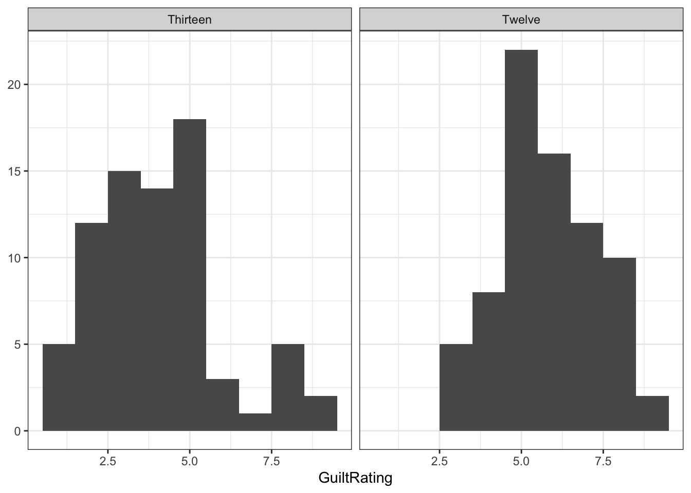
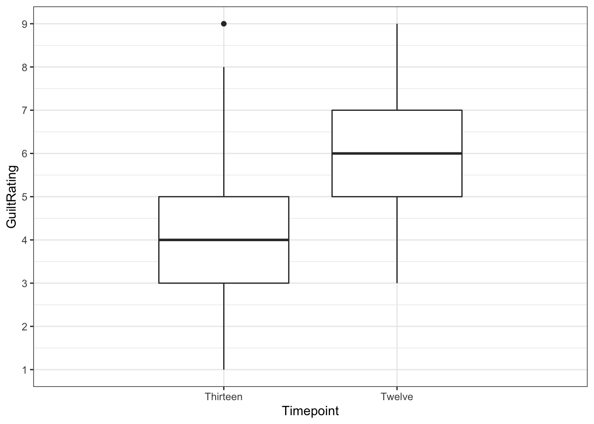
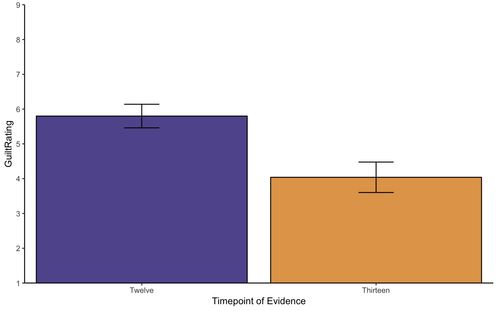
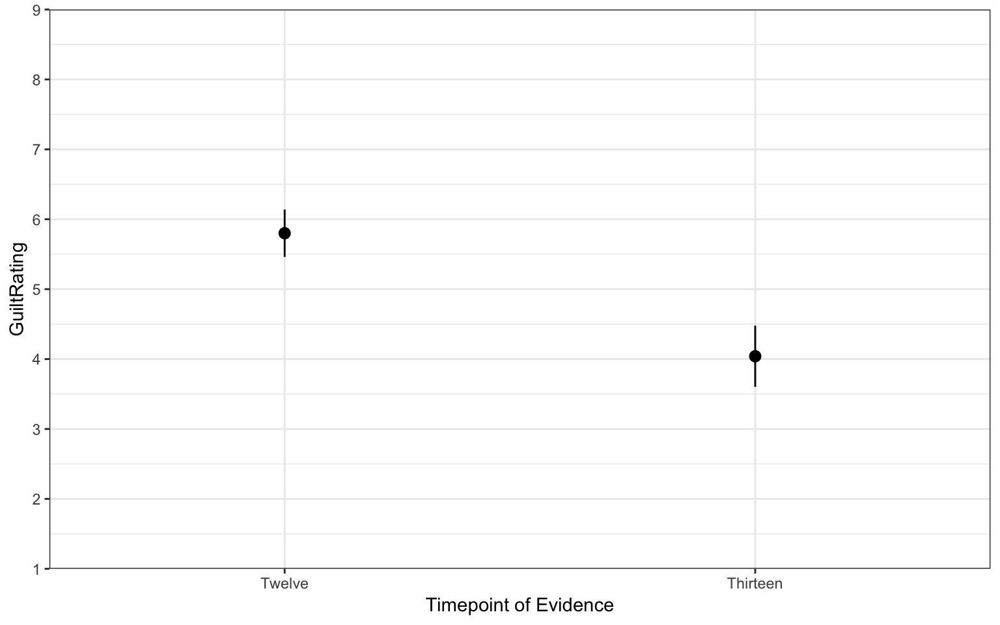

## Solutions to Questions


Below you will find the solutions to the questions for the Activities for this chapter. Only look at them after giving the questions a good try and speaking to the tutor about any issues.

### InClass Activities

#### InClass Task 1


```r
library(broom)
library(tidyverse)
ratings <- read_csv("GuiltJudgements.csv")
```

[Return to Task](#Ch7InClassQueT1)

#### InClass Task 2


```r
lates <- ratings %>% 
  filter(Evidence == "Late") %>%
  select(Participant, Evidence, `12`, `13`) %>%
  rename(Twelve = `12`, Thirteen = `13`) %>%
  mutate(diff = Twelve - Thirteen)
```

[Return to Task](#Ch7InClassQueT2)

#### InClass Task 3


```r
lates %>% 
  ggplot(aes(diff)) +
  geom_histogram(binwidth = 1) +
  labs(x = "Difference in GuiltRating", y = NULL) +
  theme_bw()
```

<div class="figure" style="text-align: center">

<p class="caption">(\#fig:ch7-task3)Potential Solution to Task 3</p>
</div>

[Return to Task](#Ch7InClassQueT3)

#### InClass Task 4

The Task only asks for the boxplot. We have added some additional functions to tidy up the figure a bit that you might want to play with.


```r
lates %>% 
  ggplot(aes(y = diff)) + 
  geom_boxplot() +
  theme_bw()
```

<div class="figure" style="text-align: center">

<p class="caption">(\#fig:ch7-task4)Potential Solution to Task 4</p>
</div>

[Return to Task](#Ch7InClassQueT4)

#### InClass Task 5


```r
descriptives <- lates %>% 
  select(-diff) %>%
  gather(Timepoint, GuiltRating, Twelve, Thirteen) %>%
  group_by(Timepoint) %>%
  summarise(n = n(),
            mean = mean(GuiltRating),
            sd = sd(GuiltRating),
            se = sd/sqrt(n),
            LowerCI = mean - 1.96*se,
            UpperCI = mean + 1.96*se)
```


[Return to Task](#Ch7InClassQueT5)

#### InClass Task 6

* A basic barplot with 95% Confidence Intervals. 
* We have embellished the figure a little but you can mess around with the code to see what each bit does.


```r
ggplot(descriptives, aes(x = Timepoint, y = mean, fill = Timepoint)) + 
  geom_col(colour = "black") +
  scale_fill_manual(values=c("#E2A458", "#61589C")) +
  scale_x_discrete(limits = c("Twelve","Thirteen")) +
  labs(x = "Timepoint of Evidence", y = "GuiltRating") +
  guides(fill="none") +
  geom_errorbar(aes(ymin = LowerCI, ymax = UpperCI),
                position = "dodge", width = .15) +
  scale_y_continuous(breaks = c(1:9), limits = c(0,9)) +
  coord_cartesian(ylim = c(1,9), xlim = c(0.5,2.5), expand = FALSE) +
  theme_classic()
```

<div class="figure" style="text-align: center">

<p class="caption">(\#fig:ch7-task6-1)Possible Solution to Task 7</p>
</div>

* An alternative way to display just the means and errorbars would be to use the pointrange approach. This image shows again the 95% CI


```r
ggplot(descriptives, aes(x = Timepoint, y = mean, fill = Timepoint)) + 
  geom_pointrange(aes(ymin = LowerCI, ymax = UpperCI))+
  scale_x_discrete(limits = c("Twelve","Thirteen")) +
  labs(x = "Timepoint of Evidence", y = "GuiltRating") +
  guides(fill="none")+
  scale_y_continuous(breaks = c(1:9), limits = c(0,9)) +
  coord_cartesian(ylim = c(1,9), xlim = c(0.5,2.5), expand = FALSE) +
  theme_bw()
```

<div class="figure" style="text-align: center">

<p class="caption">(\#fig:ch7-task6-2)Alternative Solution to Task 7</p>
</div>

[Return to Task](#Ch7InClassQueT6)

#### InClass Task 7

* Remember to set `paired = TRUE` to run the within-subjects t-test


```r
results <- t.test(lates %>% pull(Twelve),
                  lates %>% pull(Thirteen), paired = TRUE) %>%
  tidy()
```

[Return to Task](#Ch7InClassQueT7)

#### InClass Task 8

A potential write-up for this study would be as follows:

**A paired-samples t-test was run to compare the change in guilt ratings before (M = 5.8, SD = 1.5) and after (M = 4.04, SD = 1.93) the crucial evidence was heard. A significant difference was found (t(74) = 8.23, p < .001) with Timepoint 13 having an average rating 1.76 units lower than Timepoint 12. This tells us that the critical evidence did have an influence on the rating of guilt by jury members.**

When rounding off p-values that are less than .001, rounding will give you a value of 0 which is a bit silly. Values less than .001 would normally be written as p < .001. To create a reader-friendly p-value, then you could try something like the following in your code:


```r
ifelse(results$p.value < .001, 
       "p < .001", 
       paste0("p = ", round(results$p.value,3))) 
```

[Return to Task](#Ch7InClassQueT8)

<span style="font-size: 22px; font-weight: bold; color: var(--purple);">Chapter Complete!</span>
