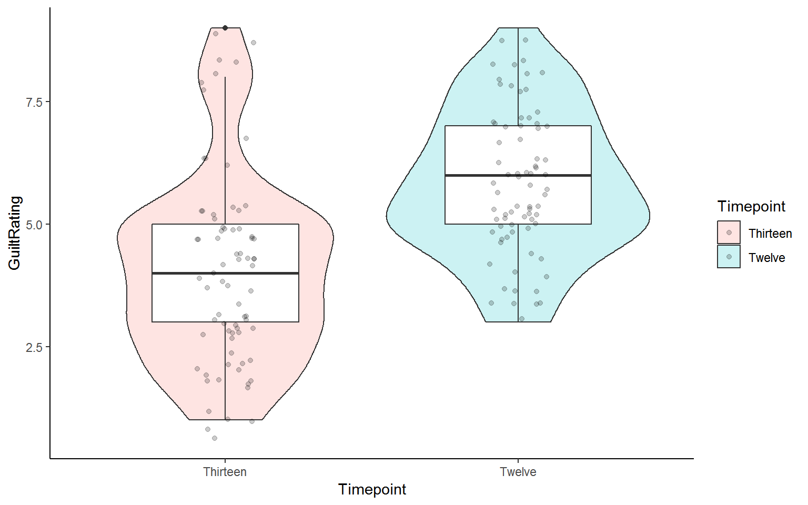
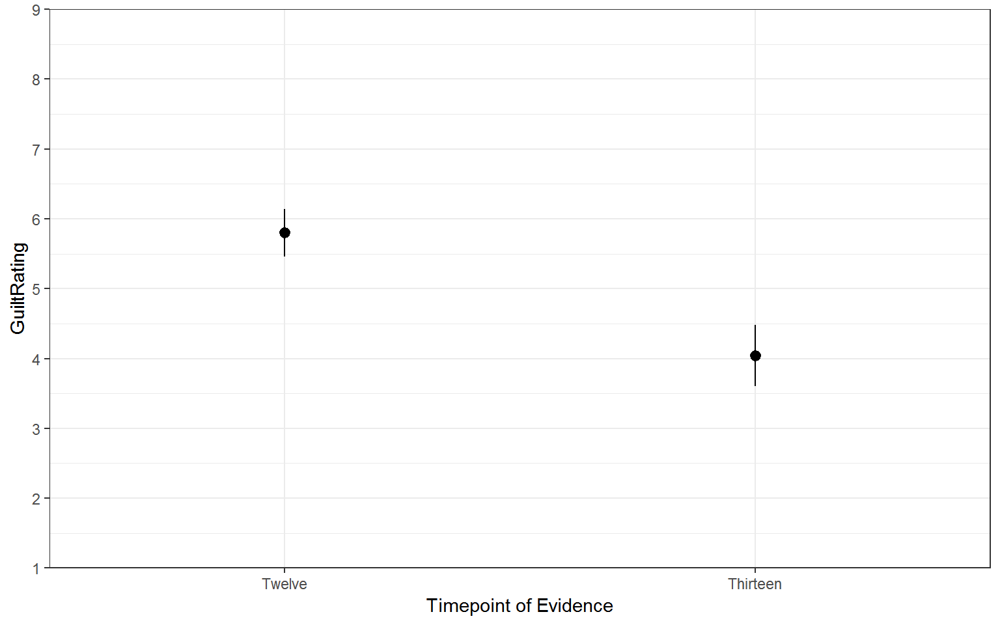

## Solutions to Questions


Below you will find the solutions to the questions for the Activities for this chapter. Only look at them after giving the questions a good try and speaking to the tutor about any issues.

### InClass Activities

#### Task 1


<div class='solution'><button>Solution Task 1</button>


```r
library(broom)
library(tidyverse)

ratings <- read_csv("GuiltJudgements.csv")
```

</div>


**Click the tab to see the solution**

#### Task 2


<div class='solution'><button>Solution Task 2</button>


```r
lates <- filter(ratings, Evidence == "Late") %>% 
  select(Participant, Evidence, `12`, `13`) %>% 
  rename(Twelve = `12`, Thirteen = `13`) %>%
  gather(Timepoint, GuiltRating, Twelve:Thirteen)
```

</div>


**Click the tab to see the solution**

#### Task 3


<div class='solution'><button>Possible Solution Task 3</button>


```r
lates %>% 
  ggplot(aes(GuiltRating)) +
  geom_histogram(binwidth = 1) +
 facet_wrap(~Timepoint) +
  labs(x = "GuiltRating", y = NULL) +
theme_bw()
```

<div class="figure" style="text-align: center">

<p class="caption">(\#fig:unnamed-chunk-4)**CAPTION THIS FIGURE!!**</p>
</div>

</div>


**Click the tab to see the solution**

#### Task 4


<div class='solution'><button>Possible Solution Task 4</button>


```r
# We have added a couple of extra lines to tidy up the plot

lates %>% 
  ggplot(aes(x = Timepoint,
             y = GuiltRating)) + 
  geom_boxplot() +
  coord_cartesian(xlim = c(1,2), ylim = c(1,9), expand = TRUE) +
  theme_bw()
```

<div class="figure" style="text-align: center">

<p class="caption">(\#fig:unnamed-chunk-5)**CAPTION THIS FIGURE!!**</p>
</div>

</div>


**Click the tab to see the solution**

#### Task 5


<div class='solution'><button>Possible Solution Task 5</button>


```r
# We have added color but that was not necessary

lates %>% 
  ggplot(aes(x=Timepoint,y=GuiltRating))+
  geom_violin(aes(fill = Timepoint), alpha = .2) + 
  geom_boxplot(width = 0.5) +
  theme_bw()
```

<div class="figure" style="text-align: center">

<p class="caption">(\#fig:unnamed-chunk-61)**CAPTION THIS FIGURE!!**</p>
</div>

```r
# You could even add the `geom_jitter` to have all the data points

lates %>% 
  ggplot(aes(x=Timepoint,y=GuiltRating))+
  geom_violin(aes(fill = Timepoint), alpha = .2) + 
  geom_boxplot(width = 0.5) +
  geom_jitter(aes(fill = Timepoint), width = .1, alpha = .2) + 
  theme_classic()
```

<div class="figure" style="text-align: center">

<p class="caption">(\#fig:unnamed-chunk-62)**CAPTION THIS FIGURE!!**</p>
</div>

</div>


**Click the tab to see the solution**

#### Task 6


<div class='solution'><button>Solution Task 6</button>


```r
descriptives <- lates %>% 
  group_by(Timepoint) %>%
  summarise(n = n(),
            mean = mean(GuiltRating),
            sd = sd(GuiltRating),
            se = sd/sqrt(n),
            LowerCI = mean - 1.96*se,
            UpperCI = mean + 1.96*se)
```

</div>


**Click the tab to see the solution**

#### Task 7


<div class='solution'><button>Possible Solution Task 7</button>


```r
# Bar plot with 95% Confidence Intervals. We may have embellished the figure a little, but you can mess around with it to see what each bit does.

ggplot(descriptives, aes(x = Timepoint, y = mean, fill = Timepoint)) + 
  geom_col(colour = "black") +
  scale_fill_manual(values=c("#999000", "#000999")) +
  scale_x_discrete(limits = c("Twelve","Thirteen")) +
  labs(x = "Timepoint of Evidence", y = "GuiltRating") +
  guides(fill="none") +
  geom_errorbar(aes(ymin = LowerCI, ymax = UpperCI),
                position = "dodge", width = .15) +
  scale_y_continuous(breaks = c(1:9), limits = c(0,9)) +
  coord_cartesian(ylim = c(1,9), xlim = c(0.5,2.5), expand = FALSE) +
  theme_classic()
```

<div class="figure" style="text-align: center">

<p class="caption">(\#fig:unnamed-chunk-81)**CAPTION THIS FIGURE!!**</p>
</div>

```r
# An alternative way to display just the means and errorbars would be to use the pointrange approach.

# point_range with 95% CI
ggplot(descriptives, aes(x = Timepoint, y = mean, fill = Timepoint)) + 
  geom_pointrange(aes(ymin = LowerCI, ymax = UpperCI))+
  scale_x_discrete(limits = c("Twelve","Thirteen")) +
  labs(x = "Timepoint of Evidence", y = "GuiltRating") +
  guides(fill="none")+
  scale_y_continuous(breaks = c(1:9), limits = c(0,9)) +
  coord_cartesian(ylim = c(1,9), xlim = c(0.5,2.5), expand = FALSE) +
  theme_bw()
```

<div class="figure" style="text-align: center">

<p class="caption">(\#fig:unnamed-chunk-82)**CAPTION THIS FIGURE!!**</p>
</div>

</div>


**Click the tab to see the solution**

#### Task 8


<div class='solution'><button>Solution Task 8</button>


```r
results <- t.test(GuiltRating ~ Timepoint, data = lates, paired = TRUE, alternative = "two.sided") %>% tidy()
```

</div>


**Click the tab to see the solution**

#### Task 9

<div class="solution"><button>Possible Solution Task 9</button>

"A paired-samples t-test was ran to compare the change in guilt ratings before (M = 5.8, SD = 1.5) and after (M = 4.04, SD = 1.93) the crucial evidence was heard. A **significant** difference was found (t(74) = 8.23, p = 4.7113406\times 10^{-12}) with Timepoint 13 having an average rating 1.76 units lower than Timepoint 12. This tells us that the critical evidence did have an influence on the rating of guilt by jury members"."

Actually, the p-value above is a bit silly and would normally be written as p < .001 but we used code to create this paragraph and the code for the p-value is a bit more complicated than just rounding:

`ifelse(round(results$p.value,3) == 0, .001, round(results$p.value,3))` and would return p < 0.001

</div>

**Click the tab to see the solution**
