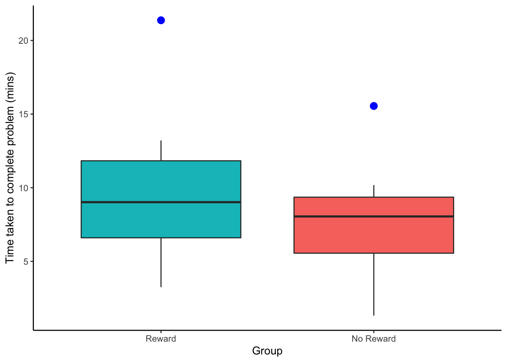

## Additional Material

Below is some additional material that might help you understand the tests in this Chapter a bit more as well as some additional ideas.


### Non-Parametric tests {-}

In this chapter we have really been focussing on between-subjects and within-subjects t-tests which fall under the category of **parametric tests**. One of the main things you will know about these tests is that they have a fair number of assumptions that you need to check first to make sure that your results are valid. We looked at how to do this in the main body of the chapter, and you will get more practice at this as we progress, but one question you might have is, what do you do if the assumptions aren't met (or are "violated"" as it is termed)? So what options are there? Well actually you have already seen one - in Chapter 5. We could use permutation tests and bootstrapping (replication) techniques to compare two conditions. This is a nice approach as it has very few assumptions about the data - merely that the shape of the sample distribution is the shape of the population distribution. However permutation tests are a relatively new approach and require really strong analytical skills to make sure you are doing them correctly, when designs get complicated. Alternatively, there are tests known as **non-parametric** tests that have fewer assumptions than the parametric tests and can be run quote quickly using the same approach as we have seen with the t-tests. The non-parametric "t-tests" generally don't require any assumption of normality and tend to work on either the medians of the data (as opposed to the mean values) or the rank order of the data - i.e. what was the highest value, the second highest, the lowest - as opposed to the actual value.

And just like there is slightly different versions of t-tests there are different non-parametric tests for between-subjects designs and within-subjects designs as such:

* The Mann-Whitney U-test is the non-parametric equivalent of the between-subjects t-test
* The Wilcoxon Signed-Ranks Test is the non-parametric equivalent of the within-subjects t-test.

So for example, if you were concerned that your data was really far from being normally distributed, and weren't quite sure about permutation tests, you might use one of these tests. These tests are still used in Psychology and you will still see them in older papers, however they are a bit antiquated as they were designed to be done by hand when computer processing power was limited. Still it is worth seeing one in action at least. Here we will run through a Mann-Whitney U-test and then you can try out a Wilcoxon Signed-Ranks Test in your own time as it uses the same function - it is again just a matter of saying `paired = TRUE`.

**Our Scenario**

**Aim:** To examine the influence of perceived reward on problem solving.

**Procedure:** 14 Participants in 2 groups (7 per group) are asked to solve a difficult lateral thinking puzzle. One group is offered a monetary reward for completing it as quick as possible. One group is offered nothing; just the internal joy of getting the task completed and correct.

**Task:** The participants are asked to solve the following puzzle. "Man walks into a bar and asks for a glass of water. The barman shoots at him with a gun. The man smiles, says thanks, and leaves. Why?"

**IV:** Reward group vs. No Reward group

**DV:** Time taken to solve puzzle measured in minutes.

**Hypothesis:** We hypothesise that participants who are given a monetary incentive for solving a puzzle will solve the puzzle significantly faster, as measured in minutes to solve the puzzle, than those that are given no incentive. 

Here is our data and a boxplot of the data to try and visualise what is happening in the data.


<table>
<caption>(\#tab:chpt7-additional-table)Table showing the time taken to complete the puzzle for the Reward and No Reward groups</caption>
 <thead>
  <tr>
   <th style="text-align:center;"> Participant </th>
   <th style="text-align:center;"> Group </th>
   <th style="text-align:center;"> Time </th>
  </tr>
 </thead>
<tbody>
  <tr>
   <td style="text-align:center;"> 1 </td>
   <td style="text-align:center;"> Reward </td>
   <td style="text-align:center;"> 3.25 </td>
  </tr>
  <tr>
   <td style="text-align:center;"> 2 </td>
   <td style="text-align:center;"> No Reward </td>
   <td style="text-align:center;"> 1.32 </td>
  </tr>
  <tr>
   <td style="text-align:center;"> 3 </td>
   <td style="text-align:center;"> Reward </td>
   <td style="text-align:center;"> 5.54 </td>
  </tr>
  <tr>
   <td style="text-align:center;"> 4 </td>
   <td style="text-align:center;"> No Reward </td>
   <td style="text-align:center;"> 3.56 </td>
  </tr>
  <tr>
   <td style="text-align:center;"> 5 </td>
   <td style="text-align:center;"> Reward </td>
   <td style="text-align:center;"> 7.66 </td>
  </tr>
  <tr>
   <td style="text-align:center;"> 6 </td>
   <td style="text-align:center;"> No Reward </td>
   <td style="text-align:center;"> 7.55 </td>
  </tr>
  <tr>
   <td style="text-align:center;"> 7 </td>
   <td style="text-align:center;"> Reward </td>
   <td style="text-align:center;"> 9.02 </td>
  </tr>
  <tr>
   <td style="text-align:center;"> 8 </td>
   <td style="text-align:center;"> No Reward </td>
   <td style="text-align:center;"> 8.05 </td>
  </tr>
  <tr>
   <td style="text-align:center;"> 9 </td>
   <td style="text-align:center;"> Reward </td>
   <td style="text-align:center;"> 10.45 </td>
  </tr>
  <tr>
   <td style="text-align:center;"> 10 </td>
   <td style="text-align:center;"> No Reward </td>
   <td style="text-align:center;"> 8.54 </td>
  </tr>
  <tr>
   <td style="text-align:center;"> 11 </td>
   <td style="text-align:center;"> Reward </td>
   <td style="text-align:center;"> 13.21 </td>
  </tr>
  <tr>
   <td style="text-align:center;"> 12 </td>
   <td style="text-align:center;"> No Reward </td>
   <td style="text-align:center;"> 10.18 </td>
  </tr>
  <tr>
   <td style="text-align:center;"> 13 </td>
   <td style="text-align:center;"> Reward </td>
   <td style="text-align:center;"> 21.37 </td>
  </tr>
  <tr>
   <td style="text-align:center;"> 14 </td>
   <td style="text-align:center;"> No Reward </td>
   <td style="text-align:center;"> 15.55 </td>
  </tr>
</tbody>
</table>

<div class="figure" style="text-align: center">

<p class="caption">(\#fig:chpt7-additional-figure)Boxplots showing the time taken to solve the puzzle for the two conditions, Reward vs No Reward. Outliers are represented by solid blue dots.</p>
</div>

Looking at the boxplots there is potentially some issues with skew in the data as well as both conditions having at least one outlier. As such we are not convinced our assumption of normality is held so we will run the Mann-Whitney U-test; the non-parametric equivalent of the between-subjects t-test (i.e. independent groups) as it does not require the assumption of normal data.

Next, as always, we should look at the descriptives as well to make some subjective, descriptive inference about the pattern of the results. Here is a table of descriptives for this dataset an the code we used to create it.


```r
ByGrp <- group_by(scores, Group) %>%
  summarise(n_Pp = n(),
            MedianTime = median(Time))
```

<table>
<caption>(\#tab:chpt7-additional-descriptives)Descriptive (Medians and N) for the two groups (Reward vs No Reward) in time taken to solve the puzzle.</caption>
 <thead>
  <tr>
   <th style="text-align:center;"> Group </th>
   <th style="text-align:center;"> n_Pp </th>
   <th style="text-align:center;"> MedianTime </th>
  </tr>
 </thead>
<tbody>
  <tr>
   <td style="text-align:center;"> No Reward </td>
   <td style="text-align:center;"> 7 </td>
   <td style="text-align:center;"> 8.05 </td>
  </tr>
  <tr>
   <td style="text-align:center;"> Reward </td>
   <td style="text-align:center;"> 7 </td>
   <td style="text-align:center;"> 9.02 </td>
  </tr>
</tbody>
</table>

Based on figure and descriptive data we can suggest that there appears to be no real difference between the two groups in terms of time taken to solve the puzzle. The group that was offered a reward have a slightly higher spread of data than the no reward group. However the medians are very comparable.

We will now run the Mann-Whitney U-test to see if the difference between the two groups is significant or not. To do this, somewhat confusingly, we us the `wilcox.test()` function. The code to do the analysis on the current data (with the tibble `scores`, the DV in the column `Time`, and the IV in the column `Group`) is shown below. It works just like the `t-test()` functio in that you can use either vectors or the fomula approach. There are a couple of additional calls in this function that you can read about using the `?wilcox.test()` approach.


```r
result <- wilcox.test(Time ~ Group, 
                      data = scores, alternative = "two.sided", 
            exact = TRUE, correct = FALSE) %>%
  tidy()
```

And here is the output of the test after is has been tidied into a tibble using `tidy()`


```r
knitr::kable(result, align = "c", caption = "Output of the Mann-Whitney U-test")
```

<table>
<caption>(\#tab:chpt7-additional-code output)Output of the Mann-Whitney U-test</caption>
 <thead>
  <tr>
   <th style="text-align:center;"> statistic </th>
   <th style="text-align:center;"> p.value </th>
   <th style="text-align:center;"> method </th>
   <th style="text-align:center;"> alternative </th>
  </tr>
 </thead>
<tbody>
  <tr>
   <td style="text-align:center;"> 19 </td>
   <td style="text-align:center;"> 0.534965 </td>
   <td style="text-align:center;"> Wilcoxon rank sum test </td>
   <td style="text-align:center;"> two.sided </td>
  </tr>
</tbody>
</table>

The main statistic (the test-value) is called the U-value and is shown in the above table as `statistic`; i.e. U = 19 and you can see from the results that the difference was non-significant as p = 0.535. However, one thing to note about the U is that it is an unstandardised value - meaning that it is dependent on the values sampled and it can't be compared to other U values to look at the magnitude of one effect versus another. The second thing to note about the U-value is that `wilcox.test()` will return a diferent U-value depending on which condition is stated as Group 1 or Group 2. Compare the outputs of these two test:


```r
result_v1 <- wilcox.test(scores %>% filter(Group == "Reward") %>% pull(Time),
                         scores %>% filter(Group == "No Reward") %>% pull(Time),
                         data = scores, alternative = "two.sided",
                         exact = TRUE, correct = FALSE) %>%
  tidy()
```


```r
result_v2 <- wilcox.test(scores %>% filter(Group == "No Reward") %>% pull(Time),
                         scores %>% filter(Group == "Reward") %>% pull(Time),
                         data = scores, alternative = "two.sided",
                         exact = TRUE, correct = FALSE) %>%
  tidy()
```

The U-value for these two tests are, for result_v1, U = 30 and for result_v2, U = 19. Strictly speaking, both those test are correct but the U-value is the smaller of the two-values given by the different outputs. It is to do with how the U-value is calculated. Both groups have a U-value and the one that is checked for significance is the smaller of the two.

For those reasons when we present the Mann-Whitney U-test we usually also give a Z-statistic, which is the standardised version of the U-value. We also present an effect size, commonly r. These can be calculated as follows:

* Z = $\frac{U - \frac{N1 \times N2}{2}}{\sqrt\frac{N1 \times N2 \times (N1 + N2 + 1)}{12}}$

* r = $\frac{Z}{\sqrt(N1 + N2)}$

Putting these formulas into a coded format would look like this:


```r
U <- result$statistic
N1 <- ByGrp %>% filter(Group == "Reward") %>% pull(n_Pp)
N2 <- ByGrp %>% filter(Group == "No Reward") %>% pull(n_Pp)
Z <- (U - ((N1*N2)/2))/ sqrt((N1*N2*(N1+N2+1))/12)
r <- Z/sqrt(N1+N2)
```

And as such the write-up could be written as, the times taken to solve the problem for the Reward group (n = 7, Mdn Time = 9.02) and the no reward group (n = 7, Mdn Time = 8.05) were compared using a Mann-Whitney U-test. No significance difference was found, U = 19, Z = -0.703, p = 0.535, r = -0.188

<span style="font-size: 22px; font-weight: bold; color: var(--purple);">End of Additional Material!</span>
