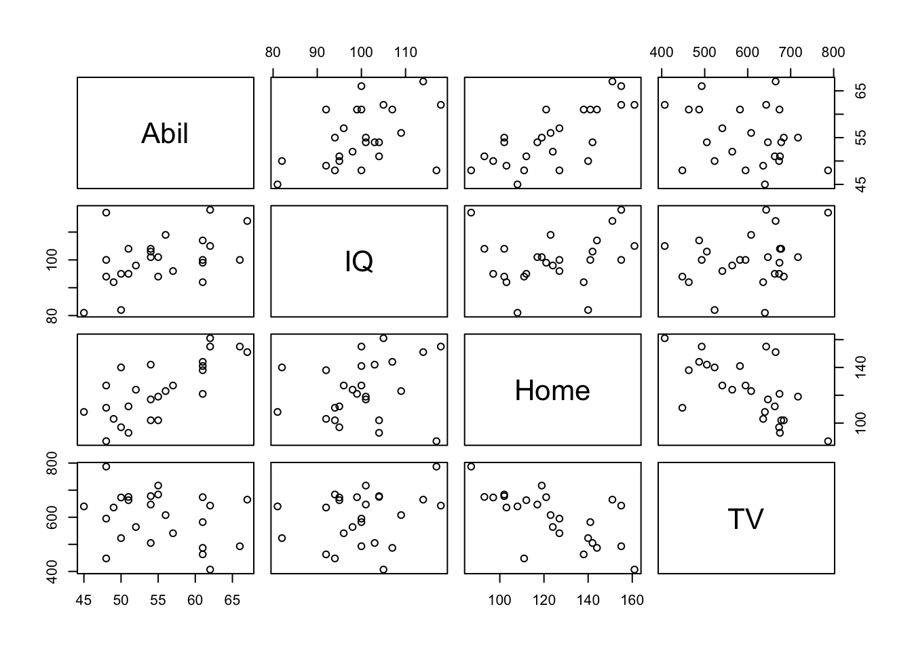

## InClass Activity

We are going to jump straight into this one! To get you used to running a correlation we will use the examples in **Miller and Haden (2013)**, Chapter 11, looking at the **relationship** between four variables: reading ability, intelligence (IQ), the number of minutes per week spent reading at home (Home); and the number of minutes per week spent watching TV at home (TV). You can see in this situation that it would be unethical to manipulate these variables so measuring them as they exist in the environment is most appropriate; hence the use of correlations.

<a href="./data/10-s02/inclass/ch10-inclass-data.zip" target = "_blank">Click here to download the data for today</a> or download it from Moodle.

### Task 1 - The Data {#Ch10InClassQueT1}

After downloading the data folder, unzip the folder, set your working directory appropriately, open a new script, and load in the Miller and Haden data (`MillerHadenData.csv`), storing it in a tibble called `mh`. 

* **Note 1:** Remember that in reality you could store the data under any name you like but to make it easier for a demonstrator to debug with you it is handy if we all use the same names.
* **Note 2:** You will find that the instructions for tasks are sparse this semester as we want you to really push the skills you learnt in Semester 1. Don't worry though, we are always here to help, so if you get stuck, ask!


<div class='solution'><button>Task 1: Hints for loading in Data</button>

<div class="info">
<ul>
<li>Hint 1: We are going to need the following libraries: tidyverse, broom</li>
<li>Hint 2: mh &lt;- read_csv()</li>
<li>Remember that we will always ask you to use read_csv() to load in data.</li>
</ul>
</div>

</div>
  
<br>
Let's look at your data - we showed you a number of ways to do this in Semester 1. As in Miller and Haden, we have 5 columns: 

* the particpant (`Participant`), 
* Reading Ability (`Abil`), 
* Intelligence (`IQ`), 
* number of minutes spent reading at home per week (`Home`), 
* and number of minutes spent watching TV per week (`TV`). 

For the lab we will focus on the relationship between Reading Ability and IQ but for further practice you can look at other relationships in your free time.  
A probable hypothesis for today could be that as Reading Ability increases so does Intelligence (**but do you see the issue with causality and direction**). Or phrasing the hypothesis more formally, we hypothesise that the reading ability of school children, as measured through a standardized test, and intelligence, again measured through a standardized test, are positively correlated. This is the hypothesis we will test today but remember that we could always state the null hypothesis that there is no relationship between reading ability and IQ. First, however, we must check some assumptions of the correlation tests. The main assumptions we need to check are:

* Is the data interval, ratio, or ordinal?
* Is there a data point for each participant on both variables?
* Is the data normally distributed in both variables?
* Does the relationship between variables appear linear?
* Does the spread have homoscedasticity?

We will look at these in turn.

**Assumption 1: Level of Measurement**

### Task 2 - Interval or Ordinal {#Ch10InClassQueT2}

<span style="font-size: 22px; font-weight: bold; color: var(--pink);">Group Discussion Point</span>

If we are going to run a Pearson correlation then we need interval or ratio data; Spearman correlations can run with ordinal, interval or ratio data. What type of data do we have? Discuss with your group for a few minutes and then answer the following question.

* **Check your thinking:** the type of data in this analysis is most probably <select class='solveme' data-answer='["interval","ordinal"]'> <option></option> <option>ratio</option> <option>interval</option> <option>ordinal</option> <option>nominal</option></select> as the data is <select class='solveme' data-answer='["continuous"]'> <option></option> <option>continuous</option> <option>discrete</option></select> and there is unlikely to be a true zero


<div class='solution'><button>Hints on data type</button>

<div class="info">
<ul>
<li>are the variables continuous?</li>
<li>is the difference between 1 and 2 on the scale equal to the difference between 2 and 3?</li>
</ul>
</div>

</div>
  
<br>
**Assumption 2: Pairs of Data**

All correlations must have a data point for each participant in the two variables being correlated. This should make sense as to why - you can't correlate against an empty cell! So now go check that you have a data point in both columns for each participant. After that, try answering the question in Task 3  

### Task 3 - Missing Data {#Ch10InClassQueT3}

It looks like everyone has data in all the columns but let's test our skills a little whilst we are here.  Answer the following questions:

1. How is missing data represented in a tibble? <select class='solveme' data-answer='["NA"]'> <option></option> <option>an empty cell</option> <option>NA</option> <option>a large number</option> <option>don't know</option></select>
2. Which code would leave you with just the participants who were missing Reading Ability data in mh: 
<select class='solveme' data-answer='["filter(mh, is.na(Abil)"]'> <option></option> <option>filter(mh, is.na(Ability)</option> <option>filter(mh, is.na(Abil)</option> <option>filter(mh, !is.na(Ability)</option> <option>filter(mh, !is.na(Abil)</option></select>
3. Which code would leave you with just the participants who were not missing Reading Ability data in mh: <select class='solveme' data-answer='["filter(mh, !is.na(Abil)"]'> <option></option> <option>filter(mh, is.na(Ability)</option> <option>filter(mh, is.na(Abil)</option> <option>filter(mh, !is.na(Ability)</option> <option>filter(mh, !is.na(Abil)</option></select>


<div class='solution'><button>Hints on removing missing data points</button>

<div class="info">
<ul>
<li>filter(dat, is.na(variable)) versus filter(dat, !is.na(variable))</li>
</ul>
</div>

</div>
  
<br>
**Assumption 3: The shape of my data**

The remaining assumptions are all best checked through visualisations. You could use histograms to check that the data (Abil and IQ) are both normally distributed, and you could use a scatterplot (scattergrams) of IQ as a function of Abil to check whether the relationship is linear, with homoscedasticity, and without outliers! You could also use z-scores to check for outliers with the cut-off usually being set at around $\pm2.5SD$, and you can check this in your free time using the mutate function (e.g. `mutate(z = (X - mean(X))/SD(X))`), but today we will just use visual checks.

### Task 4 - Normality {#Ch10InClassQueT4}

Create the following figures and discuss the outputs with your group: 

* A histogram for Ability and a histogram for IQ. 
    - Are they both normally distributed? 
* A scatterplot of IQ (IQ) as a function of Ability (Abil).
    - Do you see any outliers? 
    - Does the relationship appear linear? 
    - Does the spread appear ok in terms of homoscedasticity?


<div class='solution'><button>Hints to create figures</button>

<div class="info">
<ul>
<li>ggplot(mh, aes(x = )) + geom_histogram()</li>
<li>ggplot(mh, aes(x = , y = )) + geom_point()</li>
<li>Normality: something to keep in mind is that there are only 25 participants, so how ‘normal’ do we expect relationships to be</li>
<li>homoscedasticity is that the spread of data points around the (imaginary) line of best fit is even on both sides along the line; as opposed to very narrow at one point and very wide at others.</li>
<li>Remember these are all judgement calls!</li>
</ul>
</div>

</div>
  
<br>
**Descriptives of a correlation**

A key thing to keep in mind is that the scatterplot is actually the descriptive of the correlation. Meaning that in an article, or in a report, you would not only use the scatterplot to determine which type of correlation to use but also to describe the potential relationship in regards to your hypothesis. So you would always expect to see a scatterplot in the write-up of this type of analysis 
 
### Task 5 - Descriptives {#Ch10InClassQueT5}

<span style="font-size: 22px; font-weight: bold; color: var(--pink);">Group Discussion Point</span>

Looking at the scatterplot you created in Task 4, spend a couple of minutes discussing and describing the relationship between Ability and IQ in terms of your hypothesis. Remember this is a descriptive analysis at this stage, so nothing is confirmed. Does the relationship appear to be as we predicted in our hypothesis?


<div class='solution'><button>Hints on discussing descriptives</button>

<div class="info">
<ul>
<li>Hint 1: We hypothesised that reading ability and intelligence were positively correlated. Is that what you see in the scatterplot?</li>
<li>Hint 2: Keep in mind it is subjective at this stage.</li>
<li>Hint 3: Remember to only talk about a relationship and not a prediction. This is correlational work, not regression.</li>
<li>Hint 4: Can you say something about both the strength (weak, medium, strong) and the direction (positive, negative)?</li>
</ul>
</div>

</div>
  
<br>
**The correlation**

Finally we will run the correlation using the `cor.test()` function.  Remember that for help on any function you can type `?cor.test` in the console window.  The `cor.test()` function requires:

* the column name of Variable 1
* the column name of Variable 2
* the type of correlation you want to run: e.g. "pearson", "spearman"
* the type of NHST tail you want to run: e.g. "one.sided", "two.sided"

For example, if your data is stored in `dat` and you are wanting a two-sided pearson correlation of the variables (columns) `X` and `Y`, then you would do:

```
cor.test(dat$X, dat$Y, method = "pearson", alternative = "two.sided")
```

* where `dat$X` means the column `X` in the tibble `dat`.  The dollar sign (`$`) is a way of indexing, or calling out, a specific column. 

### Task 6 - Pearson or Spearman? {#Ch10InClassQueT6}

Based on your answers to Task 5, spend a couple of minutes deciding with your group which correlation method to use (e.g. pearson or spearman) and the type of NHST tail to set (e.g. two.sided or one.sided). Now, run the correlation between IQ and Ability and save it in a tibble called `results` (hint: `broom::tidy()`).


<div class='solution'><button>Hints to correlation</button>

<div class="info">
<ul>
<li>Hint 1: the data looked reasonably normal and linear so method would be?</li>
<li>Hint 2: results &lt;- cor.test(mh$Abil……, method = ….., alternative….) %&gt;% tidy()</li>
</ul>
</div>

</div>
  
<br>
**Interpreting the Correlation**

You should now have a tibble called `results` that gives you the output of the correlation between Reading Ability and IQ for the school children measured in Miller and Haden (2013) Chapter 11. All that is left to do now, is interpret the output of the correlation. 

### Task 7 - Interpretation {#Ch10InClassQueT7}

Look at `results`. Locate your correlation value, e.g. `results %>% pull(estimate)` and then with your group, answer the following questions:

* The direction of the relationship between Ability and IQ is: <select class='solveme' data-answer='["positive"]'> <option></option> <option>positive</option> <option>negative</option> <option>no relationship</option></select>
* The strength of the relationship between Ability and IQ is: <select class='solveme' data-answer='["medium"]'> <option></option> <option>strong</option> <option>medium</option> <option>weak</option></select>
* Based on $\alpha = .05$ the relationship between Ability and IQ is: <select class='solveme' data-answer='["significant"]'> <option></option> <option>significant</option> <option>not significant</option></select>
* Based on the output, given the hypothesis that the reading ability of school children, as measured through a standardized test, and intelligence, again through a standardized test, are positively correlated, we can say that the hypothesis: <select class='solveme' data-answer='["is supported"]'> <option></option> <option>is supported</option> <option>is not supported</option> <option>is proven</option> <option>is not proven</option></select> 


<div class='solution'><button>Hints to interpretation</button>

<div class="info">
<ul>
<li>Hint1: If Y increases as X increases then the relationship is positive. If Y increases as X decreases then the relationship is negative. If there is no change in Y as X changes then there is no relationship</li>
<li>Hint2: Depending on the field most correlation values greater than .5 would be strong; .3 to .5 as medium, and .1 to .3 as small.</li>
<li>Hint3: The field standard says less than .05 is significant.</li>
<li>Hint4: Hypotheses can only be supported or not supported, never proven.</li>
</ul>
</div>

</div>
  
<br>
**Recap so far**

Great, so far we have set a hypothesis for a correlation, checked the assumptions, run the correlation and interpreted it appropriately. So as you can see running the correlation is the easy bit. As in a lot of analyses it is getting your data in order, checking assumptions, and interpreting your output that is the hard part. 

We have now walked you through one analysis but you can always go run more with the Miller and Haden dataset. There are six in total that could be run but watch out for Multiple Comparisons - where your **Type 1** Error rate is inflated and where **the chance of finding a significant effect is inflated by simply running numerous tests.** Alternatively, we have another data set below that we want you to run a correlation on yourself but first we want to show you something that can be very handy when you want to view lots of correlations at once.

### Advanced 1: Matrix of Scatterplots

Above we ran one correlation and if we wanted to do a different correlation then we would have to edit the `cor.test()` line and run it again. However, when you have lots of variables in a dataset, to get a quick overview of patterns, one thing you might want to do is run all the correlations at the same time or create a matrix of scatterplots at the one time. You can do this with functions from the `Hmisc` library - already installed in the Boyd Orr Labs. We will use the Miller and Haden data here again which you should still have in a tibble called `mh`. 

First, we need to get rid of the Participant column as we don't want to correlate that with anything. It won't tell us anything. Copy and run the below line of code


```r
library("Hmisc")
library("tidyverse")
mh <- read_csv("MillerHadenData.csv") %>% select(-Participant)
```

Now run the following line. The `pairs()` function from the `Hmisc` library creates a matrix of scatterplots which you can then use to view all the relationships at the one time.


```r
pairs(mh)
```

<div class="figure" style="text-align: center">

<p class="caption">(\#fig:ch10-advance-pairs)Matrix of Correlation plots of Miller and Haden (2013) data</p>
</div>

And the `rcorr()` function creates a matrix of correlations and p-values. But watch out, it only accepts the data in matrix format. Run the following two lines of code.


```r
mh_mx = as.matrix(mh, type = "pearson")
rcorr(mh_mx)
```

```
##       Abil   IQ  Home    TV
## Abil  1.00 0.45  0.74 -0.29
## IQ    0.45 1.00  0.20  0.25
## Home  0.74 0.20  1.00 -0.65
## TV   -0.29 0.25 -0.65  1.00
## 
## n= 25 
## 
## 
## P
##      Abil   IQ     Home   TV    
## Abil        0.0236 0.0000 0.1624
## IQ   0.0236        0.3337 0.2368
## Home 0.0000 0.3337        0.0005
## TV   0.1624 0.2368 0.0005
```

### Task 8 - The Matrix {#Ch10InClassQueT8}

After running the above lines, spend a few minutes answering the following questions with your group. The solutions are at the end of the chapter. The first table outputted is the correlation values and the second table is the p-values.

1. Why do the tables look symmetrical around a blank diagonal?
2. What is the strongest positive correlation?
3. What is the strongest negative correlation?


<div class='solution'><button>Hints to Matrix of correlations</button>

<div class="info">
<ul>
<li>Hint1: There is no hint, this is just a cheeky test to make sure you have read the correlation chapter in Miller and Haden, like we asked you to! :-) If you are unsure of these answers, the solutions are at the end of the chapter.</li>
</ul>
</div>

</div>
  

### Advanced 2: Attitudes towards Vaping

Great work so far! Now we really want to see what you can do yourself. In the data folder there is another file called `VapingData.csv`. This data comes from a lab we used to run looking at implicit and explicit attitudes towards vaping.  

* **Explicit attitudes** were measured via a questionnaire where higher scores indicated a positive attitude towards vaping. 
* **Implicit attitudes** were measured through an Implicit Association Test (IAT) using images of Vaping and Kitchen utensils and associating them with positive and negative words. 

The IAT works on the principal that associations that go together (that are congruent, e.g. warm and sun) should be quicker to respond to than associations that do not go together (that are incongruent, e.g. warm and ice). You can read up more on the procedure at a later date <a href="https://nobaproject.com/modules/research-methods-in-social-psychology" target = "_blank">here on the Noba Project</a> which has a good description of the procedure under the section "Subtle/Nonsconscious Research Methods".  

For today, you need to know that "Block 3" in the experiment tested reaction times and accuracy towards congruent associations, pairing positive words with Kitchen utensils and negative words with Vaping. "Block 5" in the experiment tested reaction times and accuracy towards incongruent associations, pairing positive words with Vaping and negative words with Kitchen Utensils. As such, if reaction times were longer in Block 5 than in Block 3 then people are considered to hold the view that Vaping is negative (i.e. congruent associations are quicker than incongruent associations). However, if reaction times were shorter in Block 5 than in Block 3 then people are considered to hold the view that Vaping is positive (i.e. incongruent associations were quicker than congruent associations). The difference between reaction times in Block5 and Block3 is called the participants IAT score.

### Task 9 - Attitudes to Vaping {#Ch10InClassQueT9}

Load in the data in `VapingData.csv` and analyse it to test the hypothesis that Implicit and Explicit attitudes towards Vaping are positively related. Here are some pointers, hints and tips.

1. Start of by looking at the data.  You have 8 columns. Reaction times and Accuracy scores for blocks 3 and 5. The Explicit Vaping Questionnaire Scores, Sex and Age.
2. Accuracy is as a proportion and as such can't go above 1. Participants entered their own data so some might have made a mistake. Get rid of everybody who had an accuracy greater than 1 in either block 3 or block 5.
3. We also only want participants that were paying attention so best remove anybody whose average accuracy score across Blocks 3 and 5 was less than 80%. Note - this value is aribtrary and if you wanted, in your own experiment, you could use a more relaxed or strict cut-off based on other studies or guidance. Note that these decisions should be set out at the start of your research. Finally, in this instance, remember, the values are in proportions not percentages (so 80% will be .8).
4. Now create an IAT score for participants by subtracting Block 3 reaction times (RT) away from Block 5 reaction times e.g (B5-B3). Use the paragraph above to understand how the scores relate to attitudes.
5. Create a descriptives summary of the number of people, the mean RT and Vaping Questionnaire Score. Why might these averages be useful? Why are averages not always useful in correlations?
6. Check your assumptions of correlations as we did above and descriptives, thinking about how it compares to the hypothesis.
7. Run the appropriate correlation based on your assumptions and interpret the output.


<div class='solution'><button>Hints for Vaping</button>

<div class="info">
<ul>
<li><p>libraries might include tidyverse and broom</p></li>
<li>Hint Step 1: read_csv()</li>
<li>Hint Step 2: filter(Accuracy &lt; 1 OR Accuracy &lt;= 1 OR Accuracy &gt; 1 OR Accuracy &gt;= 1)</li>
<li>Hint Step 3: average accuracy: mutate(data, name = (1 + 2)/2) %&gt;% filter(name &gt; …)</li>
<li>Hint Step 4: RT: mutate(data, nom = 1 - 2)</li>
<li>Hint Step 5: descriptives &lt;- summarise()</li>
<li>Hint Step 6: assumptions would be type of data, normality, linear relationship, homoscedasicity, data points for everyone!</li>
<li><p>Hint Step 7: results &lt;- cor.test(method = “pearson”)?</p></li>
</ul>
</div>

</div>
  
<br>
<span style="font-size: 22px; font-weight: bold; color: var(--blue);">Job Done - Activity Complete!</span>

Excellent work, who would have thought that about Explicit and Implicit attitudes towards Vaping?! 

You should now be ready to complete the Homework Assignment for this lab. **The assignment for this Lab is summative and should be submitted through the Moodle Level 2 Assignment Submission Page no later than 1 minute before your next lab.** If you have any questions, please post them on the slack forum under the channel #level2_2019. Finally, don't forget to add any useful information to your Portfolio before you leave it too long and forget. We won't incorporate Portfolio points this semester as by now you should know what sort of information you need to make a note of for yourself, and the more independent you are in your learning the better it will be, but please don't think they are no longer relevant!
