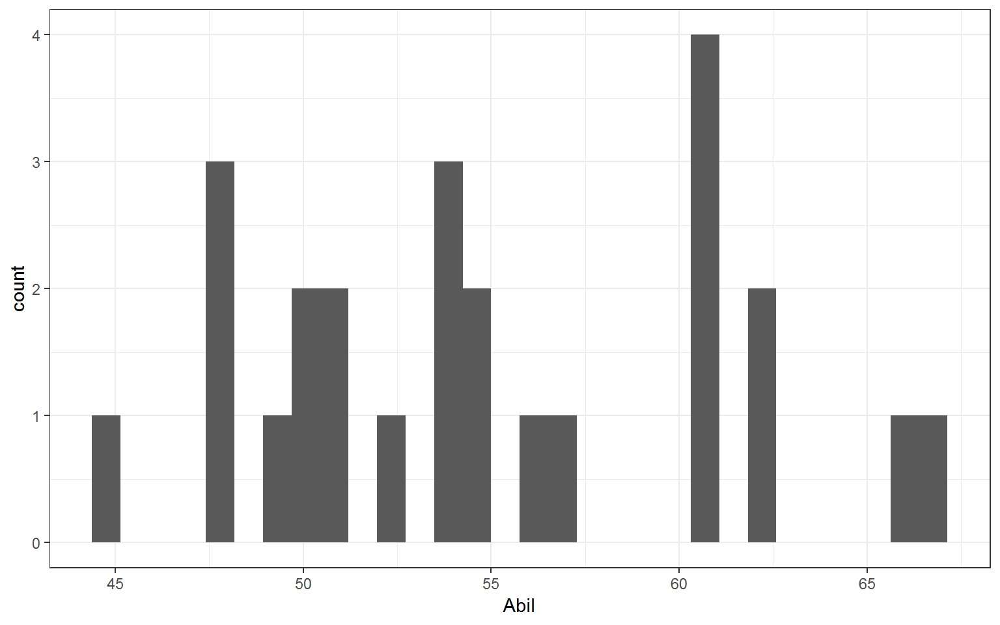
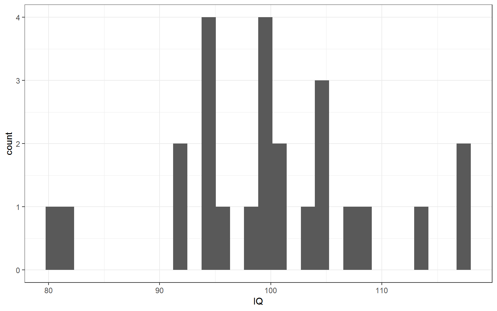
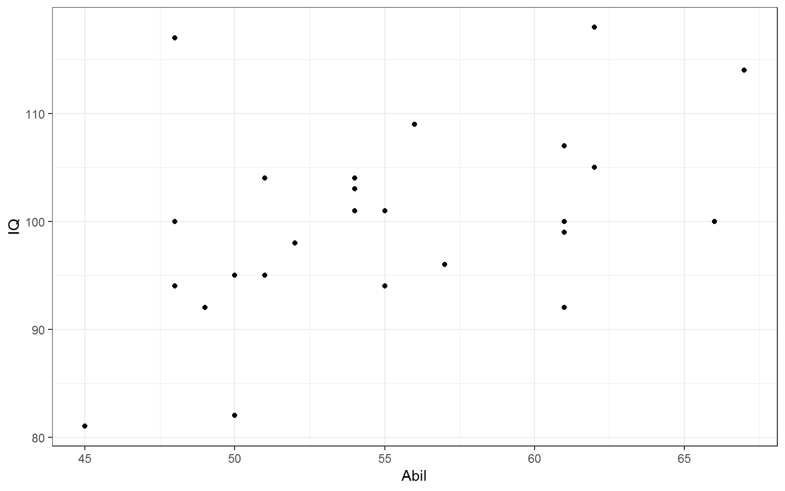
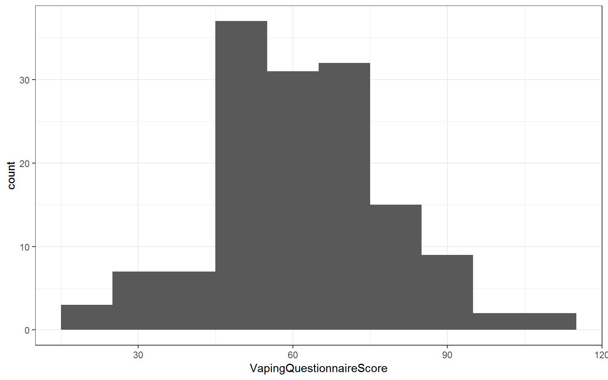
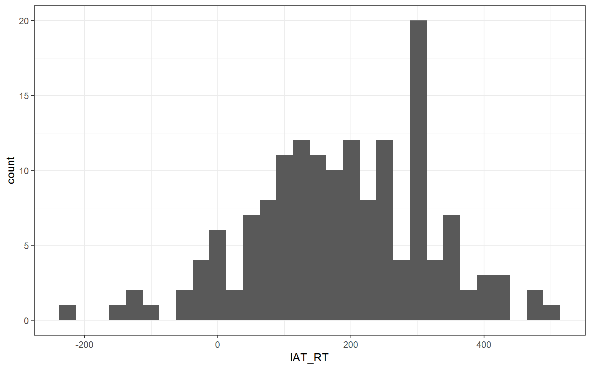
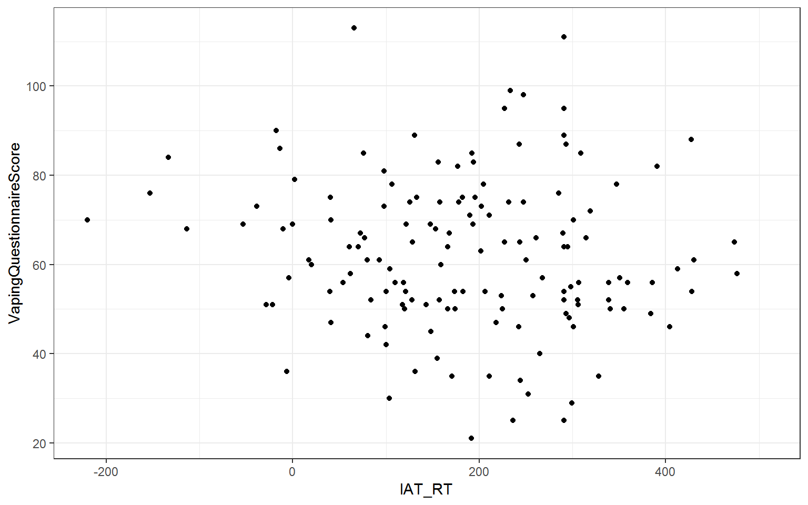

## Solutions to Questions


Below you will find the solutions to the questions for the Activities for this chapter. Only look at them after giving the questions a good try and speaking to the tutor about any issues.

### InClass Activity

#### InClass Task 1

* Loading in the data and the two libraries needed
* Good point to remind you that: 
    * we use `read_csv()` to load in data 
    * the order that libraries are read in is important. If there are any conflicts in terms of libraries then the last library that is loaded will be the functions you are using.
    

```r
library("broom")
library("tidyverse")
mh <- read_csv("MillerHadenData.csv")
```

#### InClass Task 2

* Actually the information within the textbook is unclear as to whether the data is interval or ordinal so we have accepted both as you could make a case for both arguments. A quick google search will show just as many people who think that IQ is interval as think it is oridinal.  In terms of Reading Ability, again we probably don't know enough information about this scale to make a clear judgement but it is at least ordinal and could well be interval.

#### InClass Task 3

<div class="solution"><button>Miller and Haden: Filtering out potential NAs</button>

```r
filter(mh, !is.na(Abil)) # would keep everybody from the whole dataset that has a score for Ability
filter(mh, is.na(Abil)) # would keep everybody from the whole dataset that does not have a score for Ability
```

```
## # A tibble: 25 x 5
##    Participant  Abil    IQ  Home    TV
##          <dbl> <dbl> <dbl> <dbl> <dbl>
##  1           1    61   107   144   487
##  2           2    56   109   123   608
##  3           3    45    81   108   640
##  4           4    66   100   155   493
##  5           5    49    92   103   636
##  6           6    62   105   161   407
##  7           7    61    92   138   463
##  8           8    55   101   119   717
##  9           9    62   118   155   643
## 10          10    61    99   121   674
## # ... with 15 more rows
## # A tibble: 0 x 5
## # ... with 5 variables: Participant <dbl>, Abil <dbl>, IQ <dbl>,
## #   Home <dbl>, TV <dbl>
```
</div>

** Click tab to see solution **

#### InClass Task 4

<div class="solution"><button>Miller and Haden: Figures</button>

```r
# Abil data appears as normal as expected for 25 participants
ggplot(mh, aes(x = Abil)) + geom_histogram()
```

```
## `stat_bin()` using `bins = 30`. Pick better value with `binwidth`.
```

<div class="figure" style="text-align: center">

<p class="caption">(\#fig:unnamed-chunk-41)**CAPTION THIS FIGURE!!**</p>
</div>

```r
# IQ data appears as normal as expected for 25 participants
ggplot(mh, aes(x = IQ)) + geom_histogram()
```

```
## `stat_bin()` using `bins = 30`. Pick better value with `binwidth`.
```

<div class="figure" style="text-align: center">

<p class="caption">(\#fig:unnamed-chunk-42)**CAPTION THIS FIGURE!!**</p>
</div>

```r
# Relationship appears normal, homoscedastitic, and with no clear outliers
ggplot(mh, aes(x = Abil, y = IQ)) + geom_point()
```

<div class="figure" style="text-align: center">

<p class="caption">(\#fig:unnamed-chunk-43)**CAPTION THIS FIGURE!!**</p>
</div>
</div>

** Click tab to see solution **

#### InClass Task 5

<div class="solution"><button>Miller and Haden: discussing descriptives</button>

```r
# As reading ability increases, so does IQ and as such it would appear that our data is inline with our hypothesis that the two variables are positively correlated. This appears to be a medium strength relationship.
```
</div>

** Click tab to see solution **

#### InClass Task 6

<div class="solution"><button>Miller and Haden: correlation</button>

```r
results <- cor.test(mh$Abil, mh$IQ, method = "pearson", alternative = "two.sided") %>% tidy

results
```

```
## # A tibble: 1 x 8
##   estimate statistic p.value parameter conf.low conf.high method
##      <dbl>     <dbl>   <dbl>     <int>    <dbl>     <dbl> <chr> 
## 1    0.451      2.42  0.0236        23   0.0682     0.718 Pears~
## # ... with 1 more variable: alternative <chr>
```
</div>

** Click tab to see solution **

#### InClass Task 7

<div class="solution"><button>Miller and Haden: interpretation</button>

```r
pvalue <- results %>% pull(p.value) %>% round(3)
df <- results %>% pull(parameter)
correlation <- results %>% pull(estimate) %>% round(2)

pvalue
df
correlation

# A pearson correlation found reading ability and intelligence to be positively correlated with a medium to strong relationship, (r(23) = .45, p = .024). As such we can say that our hypothesis is supported and that there appears to be a relationship between reading ability and IQ in that as reading ability increases so does intelligence.
# 
```

```
## [1] 0.024
## [1] 23
## [1] 0.45
```
</div>

** Click tab to see solution **

#### InClass Task 8

<div class="solution"><button>Matrix of Correlations: Answers</button>

```r
# 1. The table looks the same across the diaganol because the correlation of e.g. Abil vs Abil is not shown, and the correlation of Abil vs Home is the same as the correlation of Home vs Abil
# 2. Home vs Abil, r(23) = .74, p < .001 
# 3. Home vs TV, r(23) = -.65, p < .001 
```
</div>

** Click tab to see solution **

#### InClass Task 9

**Step 1**

* Reading in the Vaping Data using `read_csv()`


```r
dat <- read_csv("VapingData.csv")
```

**Steps 2 to 4**

* The main wrangle of parts 2 to 4


```r
dat <- dat %>% 
  filter(IAT_BLOCK3_Acc <= 1) %>%
  filter(IAT_BLOCK5_Acc <= 1) %>%
  mutate(IAT_ACC = (IAT_BLOCK3_Acc + IAT_BLOCK5_Acc)/2) %>%
  filter(IAT_ACC > .8) %>%
  mutate(IAT_RT = IAT_BLOCK5_RT - IAT_BLOCK3_RT)
```

**Step 5**

* It is always worth thinking about which averages are informative and which are not.
    * Knowing the average explicit attitude towards vaping could well be informative.
    * In contrast, if you are using an ordinal scale and people use the whole of the scale then the average may just tell you the middle of the scale you are using - which you already know and really isnt that informative. So it is always worth thinking about what your descriptives are calculating.
    

```r
descriptives <- dat %>% summarise(n = n(),
                          mean_IAT_ACC = mean(IAT_ACC),
                          mean_IAT_RT = mean(IAT_RT),
                          mean_VPQ = mean(VapingQuestionnaireScore, 
                                          na.rm = TRUE))
```

**Step 6**

* A couple of visual checks of normality through histograms


```r
ggplot(dat, aes(x = VapingQuestionnaireScore)) + 
  geom_histogram(binwidth = 10)
```

```
## Warning: Removed 11 rows containing non-finite values (stat_bin).
```

<div class="figure" style="text-align: center">

<p class="caption">(\#fig:unnamed-chunk-11)Distribution of Scores onf Vaping Questionnaire</p>
</div>


```r
ggplot(dat, aes(x = IAT_RT)) + 
  geom_histogram()
```

```
## `stat_bin()` using `bins = 30`. Pick better value with `binwidth`.
```

<div class="figure" style="text-align: center">

<p class="caption">(\#fig:unnamed-chunk-12)Distribution of IAT in Reaction Times</p>
</div>

* A check of the relationship between reaction times on the IAT and scores on the Vaping Questionnaire
* Remember that, often, the scatterplot is considered the descriptive of the correlation, hence why you see them including in journal articles to support the stated relationship.
* The scatterplot can be used to make descriptive claims about the direction of the relationship, the strength of the relationship, whether it is linear or not, and to check for outliers and homeoscedasticity.


```r
ggplot(dat, aes(x = IAT_RT, y = VapingQuestionnaireScore)) + 
  geom_point() + 
  theme_bw()
```

```
## Warning: Removed 11 rows containing missing values (geom_point).
```

<div class="figure" style="text-align: center">

<p class="caption">(\#fig:unnamed-chunk-13)A scatterplot showing the relatoinship between IAT reaction times (x) and Vaping Questionnaire Scores (y)</p>
</div>

* A quick look at the data reveals some people do not have a Vaping Questionnaire score and some don't have an IAT score.  The correlation only works when people have a score on both factors so we remove all those that only have a score on one of the factors.


```r
dat <- dat %>% 
  filter(!is.na(VapingQuestionnaireScore)) %>% 
  filter(!is.na(IAT_RT))
```

**Step 7**

* The analysis and the write-up.


```r
results <- cor.test(dat$VapingQuestionnaireScore, dat$IAT_RT, method = "pearson") %>% tidy()

correlation <- results %>% pull(estimate)
df <- results %>% pull(parameter)
pvalue <- results %>% pull(p.value)
```

Testing the hypothesis that there would be a relaionship beween implicit and explicit attitudes towards vaping, a pearson correlation found no significant relationship between IAT reaction times (implicit attitude) and answers on a Vaping Questionnaire (explicit attitude), r(143) = -.104, p = .212. Overall this suggests that there is no direct relationship between implicit and explicit attitudes when relating to Vaping and as such our hypothesis was not supported.

<span style="font-size: 22px; font-weight: bold; color: var(--purple);">Chapter Complete!</span>

