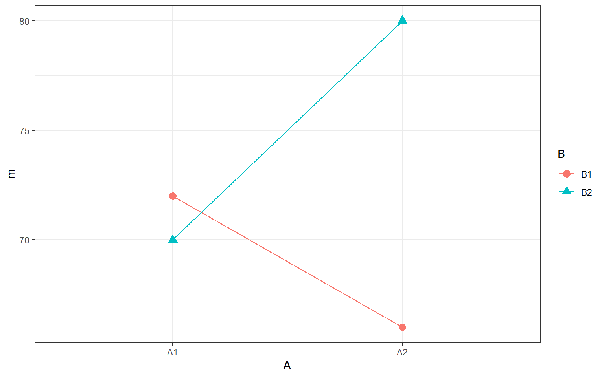

## InClass Activity


### Estimation equations and decomposition matrix

We will start today by working with a decomposition matrix for a two-way between-subjects ANOVA and then finish by using the `ez::ezANOVA()` function to show you how you might practically carry out this analysis.


Consider the data below from a 2x2 design with 3 observations per cell. Keep in mind that each cell is a particular combination of levels of A and B, and each value in a cell, in this instance, is a unique participant.


     B1           B2         
---  -----------  -----------
A1   74, 65, 77   70, 74, 66 
A2   67, 67, 64   78, 78, 84 

The decomposition matrix for these data is shown below; however, rather unfortunately for us, it is missing the columns `AB_ij` ($\hat{A}_{ij}$) and `err` ($\widehat{S(AB)}_{ijk}$) which we will need to calculate to complete our analysis.

Here is a little recap of the columns (plus the two we will add):

* $i$ - the first factor (here with two levels)
* $j$ - the second factor (again here with two levels)
* $k$ - the participant number within that $ij$ combination
* $Y_ijk$ - a participants score on a DV
* $mu$ - the overall grand mean (or baseline effect)
* $A_i$ - the effect of the first factor $i$
* $B_j$ - the effect of the second factor $j$
* $\hat{A}_{ij}$ - the effect of the AB interaction
* $\widehat{S(AB)}_{ijk}$ - the effect of within-group variability or error, `err`


```
## # A tibble: 12 x 7
##        i     j     k Y_ijk    mu   A_i   B_j
##    <int> <int> <int> <dbl> <int> <dbl> <dbl>
##  1     1     1     1    74    72    -1    -3
##  2     1     1     2    65    72    -1    -3
##  3     1     1     3    77    72    -1    -3
##  4     1     2     1    70    72    -1     3
##  5     1     2     2    74    72    -1     3
##  6     1     2     3    66    72    -1     3
##  7     2     1     1    67    72     1    -3
##  8     2     1     2    67    72     1    -3
##  9     2     1     3    64    72     1    -3
## 10     2     2     1    78    72     1     3
## 11     2     2     2    78    72     1     3
## 12     2     2     3    84    72     1     3
```

The code to create the above matrix is in the solutions at the end of this chapter in case you want to create the matrix yourself as practice.  If not, copy and paste this code into a code chunk of an RMarkdown file or into an R script (and make sure you also load tidyverse so that you can use the dplyr functions and pipes.) As Yoda once said, "do or do not, there is no try!"

Run the code and look at `decomp` to confirm to yourself that it worked. Note the use of the `group_by()` function so that the values calculated with in `mutate()` are only calculated for each group. 

### Adding the missing columns

Once you understand the table and code, try writing code to add the two missing columns to our matrix. Store the resulting table in `decomp2`. 

Here are some hints but again the code is in the solutions if you can't quite get it - remember, as Dumbledore once paraphrased, "Help will always be given at Glasgow to those that look for it." 

**Hints:**

* `AB_ij` ($\hat{A}_{ij}$) is what is left of the mean value of all participants in that group once you have removed the effect of the grand mean, the effect of factor one, and the effect of factor two
* `err` ($\widehat{S(AB)}_{ijk}$) is what is left from an individual's score after removing the effect of the grand mean, the effect of factor A, the effect of factor B, and the interaction effect.


### Understanding the two-factor decomposition matrix

If you have performed the above steps correctly, then the decomp matrix should now look like


  i    j    k   Y_ijk   mu   A_i   B_j   AB_ij   err
---  ---  ---  ------  ---  ----  ----  ------  ----
  1    1    1      74   72    -1    -3       4     2
  1    1    2      65   72    -1    -3       4    -7
  1    1    3      77   72    -1    -3       4     5
  1    2    1      70   72    -1     3      -4     0
  1    2    2      74   72    -1     3      -4     4
  1    2    3      66   72    -1     3      -4    -4
  2    1    1      67   72     1    -3      -4     1
  2    1    2      67   72     1    -3      -4     1
  2    1    3      64   72     1    -3      -4    -2
  2    2    1      78   72     1     3       4    -2
  2    2    2      78   72     1     3       4    -2
  2    2    3      84   72     1     3       4     4

So let's now make sure we understand the table that we have and that we can pinpoint different elements of it by answering the following questions:

1. From the options, what was the DV-value of participant $Y_{212}$? <select class='solveme' data-answer='["67"]'> <option></option> <option>64</option> <option>65</option> <option>66</option> <option>67</option></select>

2. Type in the value of $SS_{B}$: <input class='solveme nospaces' size='3' data-answer='["108"]'/>

3. Type in the value of $SS_{error}$ is: <input class='solveme nospaces' size='3' data-answer='["140"]'/> 


4. Type in the value of $MS_{B}$ is: <input class='solveme nospaces' size='3' data-answer='["108"]'/>

5. Type in the value of $MS_{error}$ (to one decimal places) is: <input class='solveme nospaces' size='3' data-answer='["17.5"]'/>

6. The value of $F_{B}$ (the F-ratio for the main effect of B) to 3 decimal places is: <input class='solveme nospaces' size='3' data-answer='["6.171"]'/>

7. The numerator and denominator degrees of freedom associated with this $F$ ratio are <input class='solveme nospaces' size='3' data-answer='["1"]'/> and <input class='solveme nospaces' size='3' data-answer='["8"]'/> respectively


8. The $p$ value associated with this F ratio to three decimal places is (HINT: `?pf`): <input class='solveme nospaces' size='3' data-answer='["0.038",".038"]'/>

### Get your data ready for analysis

It is excellent that you now understand a decomposition matrix and how it relates to an F-ratio. In reality however, we rarely will you ever derive a decomposition matrix by hand; the point was to improve your understanding of the calculations behind an ANOVA.

Let's continue using the simulated data from above and run through the analysis steps we would normally follow.  But first, let's put it in a more useful format.

The first thing we might want to do is to add columns that more clearly indicate the levels of our two factors. Right now the levels of A are represented by `i` and the levels of `B` are represented by `j`. But the data should really look more like this below:


```
## # A tibble: 12 x 4
##       id A     B     Y_ijk
##    <int> <chr> <chr> <dbl>
##  1     1 A1    B1       74
##  2     2 A1    B1       65
##  3     3 A1    B1       77
##  4     4 A1    B2       70
##  5     5 A1    B2       74
##  6     6 A1    B2       66
##  7     7 A2    B1       67
##  8     8 A2    B1       67
##  9     9 A2    B1       64
## 10    10 A2    B2       78
## 11    11 A2    B2       78
## 12    12 A2    B2       84
```

We will need the `id` column (a unique value for each participant) for when we run `ezANOVA()` later.

Again the code to convert `decomp` into this table (named `dat`) is hidden below and you can use it if you like, but if you want to practice your skills first and convert the table yourself, that is also fine.  Don't spend too long on it though as it is more the output we want to look at. So if you are stuck, copy the code and run it in your session. We'll be working with the new table `dat` for the remaining exercises.

### Visualizing 2x2 designs in R: The interaction plot

A critical part of data analysis is visualization. When dealing with factorial data, one of the most important visualizations is the *interaction plot* showing the cell means. You have already seen some of these in the Miller and Haden chapter and in the previous labs.

Remember that before you can make an interaction plot, you need to calculate the cell means. 

* First create a table called `cell_means` with the cell means stored in the column `m`. **HINT** - think group_by and summarise to leave three columns only, each with 4 rows. For example, one row will show A, A, mean-value

* Next, reproduce the plot below. Don't look at the solution below until you've really tried! You will need two geoms: one to draw the points, one to draw the lines. And think about what is your x and y axes and how do you group the lines.

<div class="figure" style="text-align: center">

<p class="caption">(\#fig:unnamed-chunk-10)**CAPTION THIS FIGURE!!**</p>
</div>

### Running a 2x2 between-subjects ANOVA with ezANOVA 

Excellent! So we have a figure now! In reality, you would want to embellish this figure to make it look more professional, add some error bars, make sure the whole of the y-axis is shown, give proper names to the factors and levels, but it will do for now. You also want to look at the figure and think about what it is telling you. Do you think there will be:

a. A main effect of Factor A?
b. A main effect of Factor B?
c. An interaction between Factors A and B?

To some degree these are the three basic hypotheses laid out in any two-way ANOVA. To answer these you can think about:

a. Are the means of $A_1$ and $A_2$ different, disregarding the effect of Factor B?
b. Are the means of $B_1$ and $B_2$ different, disregarding the effect of Factor A?
c. Are the means of $A_1$ and $A_2$ influenced by the effect of Factor B? What do non-parallel (or crossing lines) suggest about an interaction?

Looking at the figure you might suggest, no main effect of A, no main effect of B, but that there is an interaction between A and B.  Let's test this using the `ez:ezANOVA()` function!

* Perform the 2x2 ANOVA on `dat` and store the output in `result`.  
    - Try not to look at the solution until you have tried the `?ezANOVA` to see how to add more than one condition of the same design.
    - a second hint is that both factors are "between", so you want to focus on adding a second "between" condition
    
We have also hidden a short summary of the output of the ANOVA to give you an idea of the outcome.  Think about the outcome for a moment or two before looking at the summary.

### Summarising the output

So it turns out we were sort of right and sort of wrong. There was no main effect of Factor A as we predicted. The means at $A_1$ and $A_2$ are very similar when you disregard the effect of Factor B.  However, there actually was a main effect of Factor B; i.e. there was a significant difference between the means of $B_1$ and $B_2$ when you disregard the effect of Factor A. In fact, you could go on to say that the mean of $B_2$ (M = 75) is significantly larger than the mean of $B_1$ (M = 69). And finally, we predicted that there would be a significant interaction and there was one because the effect of Factor A is modulated by Factor B, and vice versa.

One thing to point out here, when there are only two conditions in a factor and there is a significant main effect of that Factor (in this example Factor B) then to further qualify that effect you simply have to say which of the two conditions was bigger than the other! Group 2 bigger than Group 1 or Group 1 bigger than Group 2. When there is more than two conditions in a facor (e.g. three) or in the interaction, it is not that straightforward and you need to do further comparisons such as pairwise comparisons, t-test, simple main effects, or TUKEY HSDs, to tease those effects a part. We will cover more of that in the lecture series.

### App: Understanding main effects and interactions

If time permits (or on your own time), check out the accompanying shiny app on main effects and interactions. This allows you to move sliders and change the sizes of main effects / interactions and see how it affects cell means and effect decompositions. This will help sharpen your intuitions about these concepts. Download the app from Moodle or <a href="./data/13-s02/inclass/factorial_app.zip", target = "_blank">from this link</a>.

**Job Done!**

You should now be ready to complete the Homework Assignment for this lab. **The assignment for this Lab is FORMATIVE and is NOT to be submitted and will NOT count towards the overall grade for this module.** However you are strongly encouraged to do the assignment as it will continue to boost your skills which you will need in future assignments. If you have any questions, please post them on the slack forum under the channel **#level2_2018**

