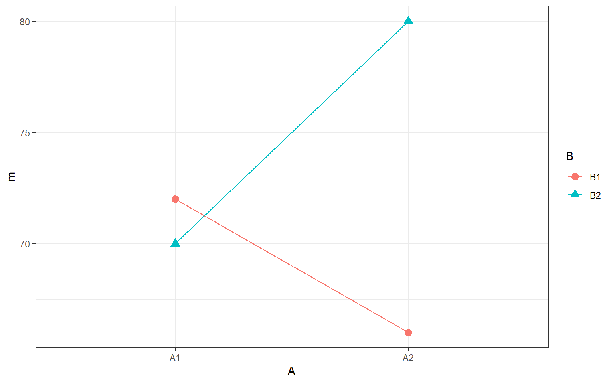
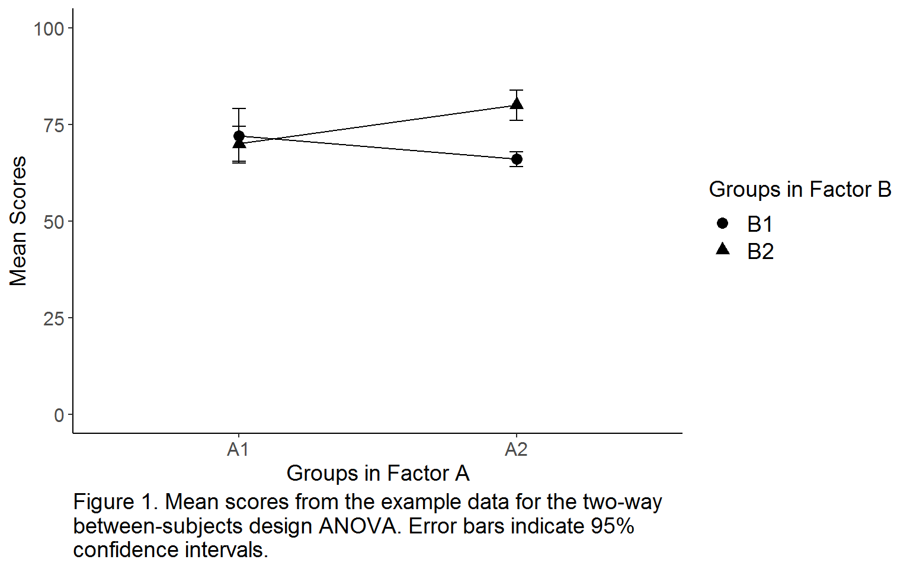

## Solutions to Questions


Below you will find the solutions to the questions for the Activities for this chapter. Only look at them after giving the questions a good try and speaking to the tutor about any issues.

### InClass Activities

#### Decomp Matrix Code

```
decomp <- tibble(i = rep(1:2, each = 6),
                 j = rep(rep(1:2, each = 3), times = 2),
                 k = rep(1:3, times = 4),
                 Y_ijk = c(74, 65, 77, 70, 74, 66, 67, 67, 64, 78, 78, 84)) %>%
    mutate(mu = mean(Y_ijk)) %>% # calculate mu
    group_by(i) %>% 
    mutate(A_i = mean(Y_ijk) - mu) %>% # calculate A_i
    group_by(j) %>% 
    mutate(B_j = mean(Y_ijk) - mu) %>% # calculate B_j
    ungroup()
```

#### To Add the last columns


```r
decomp2 <- decomp %>%
  group_by(i, j) %>%
  mutate(AB_ij = mean(Y_ijk) - mu - A_i - B_j) %>%
  ungroup() %>%
  mutate(err = Y_ijk - mu - A_i - B_j - AB_ij)
```

#### Understanding the two-factor decomposition matrix

##### Q1

The DV value of participant $Y_{212}$ or the 2nd Participant in $I_2$, $J_1$, is 67

##### Q2

The Sums of Squares of Factor B is 108

##### Q3

The Sums of Squares of the Error is 140


##### Q4

The $MS_{B}$ is 108

##### Q5

The $MS_{error}$ (to one decimal places) is 17.5

##### Q6

The F-ratio for the main effect of B to 3 decimal places is 6.171

##### Q7

The numerator and denominator degrees of freedom associated with this $F$ ratio are 1 and 8 respectively


##### Q8

And based on `pf(fratio, 1, `8`, lower.tail = FALSE)` the $p$-value associated with this F ratio to three decimal places is 0.038 or .038


#### Table converter code


```r
dat <- decomp %>%
  mutate(A = paste0("A", i),
         B = paste0("B", j),
         id = row_number()) %>%
  select(id, A, B, Y_ijk)
```

#### Visualizing 2x2 designs in R: The interaction plot

##### Cell means

```r
cell_means <- dat %>%
  group_by(A, B) %>%
  summarise(m = mean(Y_ijk))

cell_means
```

```
## # A tibble: 4 x 3
## # Groups:   A [2]
##   A     B         m
##   <chr> <chr> <dbl>
## 1 A1    B1       72
## 2 A1    B2       70
## 3 A2    B1       66
## 4 A2    B2       80
```

##### The Plot

```r
ggplot(cell_means, aes(A, m, group = B, shape = B, color = B)) +
  geom_point(size = 3) +
  geom_line()
```

<div class="figure" style="text-align: center">

<p class="caption">(\#fig:unnamed-chunk-8)**CAPTION THIS FIGURE!!**</p>
</div>

##### Easter Egg Figure Solution

The plot above is functional but sometimes you want something a bit more communicative.  It is worth working on your figures so here is an example that you can think about for your report. Remember to look back through previous labs and homework as well (Semester 1: Lab 3, Lab 7, Lab 6, Lab 5 & 9 assignments, for instance) to see how figures can be improved.

The code below adds another few dimensions to the above figure. Copy and run the code in your Rmd, knitting it to HTML, and play with the different parts to see what they do. We have changed the legends to be more descriptive and to have more readable text, fixed the scale for the vertical axis, made the figure black and white without a box, we also added 95% confidence intervals and a figure caption. 
There are of course various ways to do these changes, in particular the caption, but this is an option.


```r
# Will only run if you have the tibble dat from earlier in this worksheet
cell_means1 <- dat %>%
group_by(A, B) %>%
summarise(m = mean(Y_ijk),
          n = n(),
          sd_scores = sd(Y_ijk),
          ste_scores = sd_scores/sqrt(n),
          ci = 1.96 * ste_scores)
  
ggplot(cell_means1, aes(A, m, group = B)) +
  geom_point(aes(shape = B), size = 3) +
  geom_line() +
  geom_errorbar(aes(ymin = m - ci, ymax = m + ci), 
                width = 0.05, 
                size = .5) +
  coord_cartesian(ylim = c(0,100)) +
  labs(x = "Groups in Factor A", 
       y = "Mean Scores", 
       caption = "Figure 1. Mean scores from the example data for the two-way \nbetween-subjects design ANOVA. Error bars indicate 95% \nconfidence intervals.") +
  scale_shape_discrete("Groups in Factor B") +
  theme_classic() +
  theme(axis.text.x = element_text(size = 12),
        axis.text.y = element_text(size = 12),
        axis.title = element_text(size = 14),
        legend.title = element_text(size = 14),
        legend.text = element_text(size = 14),
        plot.caption  = element_text(size = 14, hjust = 0))
```

<div class="figure" style="text-align: center">

<p class="caption">(\#fig:easter-figure)**CAPTION THIS FIGURE!!**</p>
</div>

#### ANOVA Using Ez

**The code**


```r
result <- ezANOVA(dat, 
                  dv = Y_ijk, 
                  wid = id, 
                  between = .(A, B),
                  detailed = TRUE) # This gives sum squares information
```

```
## Coefficient covariances computed by hccm()
```

**The output**


```r
result$ANOVA
```

```
##   Effect DFn DFd SSn SSd          F          p p<.05        ges
## 1      A   1   8  12 140  0.6857143 0.43163404       0.07894737
## 2      B   1   8 108 140  6.1714286 0.03786084     * 0.43548387
## 3    A:B   1   8 192 140 10.9714286 0.01066139     * 0.57831325
```

### Homework Activities


#### Task 1A: Libraries

* In today's assignment you will need both the `tidyverse` and `ez` packages. Enter code into the t1A code chunk below to load in both of these libraries.


```r
library(ez)
library(tidyverse)
```

#### Task 1B: Loading in the data

* Use `read_csv()` to replace the `NULL` in the t1B code chunk below to load in the data stored in the datafile `keysar_lin_barr_2003.csv`. Store the data in the variable `dat`. Do not change the filename of the datafile. 


```r
dat <- read_csv("keysar_lin_barr_2003.csv")
```

Take a look at your data (`dat`) in the console using `glimpse()` or `View()`, or just display it by typing in the name. You will see the following columns:

|variable   |description|
|-----------|-----------|
|`subject`  |unique identifier for each subject|
|`sex`      |whether the subject was male or female|
|`condition`|what condition the subject was in|
|`looktime` |egocentric interference|

We have simplified things from the original experiment by collapsing the baseline vs. experimental conditions into a single DV.  Our DV, egocentric interference, is the average difference in looking time for each subject (in milliseconds per trial) for hidden competitors (e.g., small candle) versus hidden noncompetitors (e.g., apple). The larger this number, the more egocentric interference the subject experienced.

#### Task 2: Calculate cell means

Today we are going to focus on just the main analysis and write-up, and not the assumptions, but as always before running any analysis you should check that your assumptions hold.

One of the elements we will need for our write-up is some descriptives. We want to start by creating some summary statistics for the four conditions. Remember, two factors (sex, condition) with 2 levels each (sex: female vs male; condition: false belief vs ignorance) will give four conditions, and as such in our summary table, four cells created by factorially combining sex and condition. 

* Replace the NULL in the `t2` code chunk below to create the four cells created by factorially combining sex and condition, summarising the mean and standard deviation for each cell.
    - Store the descriptives in the tibble `cell_means`
    - Call the column for the mean `m` and the column for the standard deviation `sd`.
    - Your table should have four rows and four columns as shown below but with your values replacing the XXs
    - Follow the case and spelling *exactly*.


```r
cell_means <- dat %>%
  group_by(sex, condition) %>%
  summarise(m = mean(looktime), sd = sd(looktime))
```


sex      condition              m         sd
-------  -------------  ---------  ---------
female   false belief    594.5833   899.1660
female   ignorance       944.6970   932.6990
male     false belief    504.5833   676.7338
male     ignorance       611.1111   778.0212

#### Task 3: Marginal means for sex

We will also need to have some descriptives where we just look at the means of a given factor; the marginal means - the means of the levels of one factor regardless of the other factor.

* Replace the NULL in the `t3` code chunk below to calculate the marginal means and standard deviations for the factor, sex. 
    - Store these descriptives in the tibble `marg_sex`
    - Call the column for the mean `m` and the column for the standard deviation `sd`. 
    - Your table should have two rows and three columns as shown below but with your values replacing the XXs
    - Follow the case and spelling *exactly*.


```r
marg_sex <- dat %>%
  group_by(sex) %>%
  summarise(m = mean(looktime), sd = sd(looktime))
```


sex              m         sd
-------  ---------  ---------
female    777.9762   911.5331
male      555.0439   707.8138

#### Task 4: Marginal means for condition

And now do the same for condition. 

* Replace the NULL in the `t4` code chunk below to calculate the marginal means and standard deviations for the factor, condition 
    - Store these descriptives in the tibble `marg_cond`
    - Call the column for the mean `m` and the column for the standard deviation `sd`. 
    - Your table should have two rows and three columns as shown below but with your values replacing the XXs
    - Follow the case and spelling *exactly*.


```r
marg_cond <- dat %>%
  group_by(condition) %>%
  summarise(m = mean(looktime), sd = sd(looktime))
```


condition              m         sd
-------------  ---------  ---------
false belief    549.5833   775.9108
ignorance       794.5833   861.2306

#### Task 5: Interaction plot

And finally we are going to need a plot.  When you have two factors, you want to show both factors on the plot to give the reader as much information as possible and save on figure space.  The best way to do this is through some sort of interaction plot as shown in the lab.  It is really a lot easier than it looks and just requires you to think about setting the aes by the different conditions.

* Insert code into the `t5` code chunk below to replicate the figure shown to you 
    - Pay particular attention to labels, axes dimensions, color and background. 
    - Note that the figure must appear when your code is knitted.
    
* **Note:** The figure below is a nice figure but should really have error bars on it if I was including it in an actual paper. Including the error bars may help in clarifying the descriptive statistics as you would see as although the means are different, there is huge overlap in terms of error bars.


```r
# to do: something with ggplot to replicate the figure
ggplot(cell_means, aes(condition, m, shape = sex, group = sex, color = sex)) +
  geom_line() +
  geom_point(size = 3) +
  labs(y = "mean looking time (msecs)") +
  scale_y_continuous(limits = c(0, 1000)) + 
  theme_bw()
```

<div class="figure" style="text-align: center">

<p class="caption">(\#fig:t5)**CAPTION THIS FIGURE!!**</p>
</div>

#### Task 6: Recap Question 1

Thinking about the above information, one of the below statements would be an acceptable hypothesis for the interaction effect of sex and condition, but which one:

* In the `t6` code chunk below, replace the `NULL` with the number of the statement below that best summarises this analysis. Store this single value in `answer_t6`

1. We hypothesised that there will be a significant difference between males and females in egocentric interference (mean looking time (msecs)) regardless of condition.
2. We hypothesised that there will be a significant difference between participants in the false belief condition and those in the ignorance condition in terms of egocentric interference (mean looking time (msecs)) regardless of sex of participant.
3. We hypothesised that there would be a significant interaction between condition and sex of participant on egocentric interference (mean looking time (msecs))
4. We hypothesised that there will be no significant difference between males and females in egocentric interference (mean looking time (msecs)) regardless of condition but that there would be a significant difference between participants in the false belief condition and those in the ignorance condition in terms of egocentric interference (mean looking time (msecs)) regardless of sex of participant.


```r
answer_t6 <- 3
```

#### Task 7: Recap Question 2

Thinking about the above information, one of the below statements is a good description of the marginal means for sex, but which one:

* In the `t7` code chunk below, replace the `NULL` with the number of the statement below that best summarises this analysis. Store this single value in `answer_t7`

1. The female participants have an average longer looking time (M = 777.98, SD = 911.53) than the male participants (M = 555.04, SD = 707.81) which may suggest a significant main effect of sex
2. The female participants have an average shorter looking time (M = 777.98, SD = 911.53) than the male participants (M = 555.04, SD = 707.81) which may suggest a significant main effect of condition
3. The female participants have an average shorter looking time (M = 777.98, SD = 911.53) than the male participants (M = 555.04, SD = 707.81) which may suggest a significant main effect of sex
4. The female participants have an average longer looking time (M = 777.98, SD = 911.53) than the male participants (M = 555.04, SD = 707.81) which may suggest a significant main effect of condition


```r
answer_t7 <- 1
```

#### Task 8: Recap Question 3

Thinking about the above information, one of the below statements is a good description of the marginal means for condition, but which one:

* In the `t8` code chunk below, replace the `NULL` with the number of the statement below that best summarises this analysis. Store this single value in `answer_t8`

1. The participants in the false belief group had an average longer looking time (M = 549.58, SD = 775.91) than the participants in the ignorance group (M = 749.58, SD = 861.23) which may suggest a significant main effect of condition.
2. The participants in the false belief group had an average shorter looking time (M = 549.58, SD = 775.91) than the participants in the ignorance group (M = 749.58, SD = 861.23) which may suggest a significant main effect of condition.
1. The participants in the false belief group had an average longer looking time (M = 549.58, SD = 775.91) than the participants in the ignorance group (M = 749.58, SD = 861.23) which may suggest a significant main effect of sex.
2. The participants in the false belief group had an average shorter looking time (M = 549.58, SD = 775.91) than the participants in the ignorance group (M = 749.58, SD = 861.23) which may suggest a significant main effect of sex.


```r
answer_t8 <- 2
```

#### Task 9: Running the factorial ANOVA

Great, so we have looked at our descriptives and thought about what effects there might be.  What we need to do now is run the ANOVA using the `ezANOVA()` function. The ANOVA we are going to run is a two-way between-subjects ANOVA because both conditions are between-subjects variables. You may need to refer back to the lab or to have a look at the help on `ezANOVA()` to see how to add a second variable/factor. 

* Replace the NULL in the `t9` code chunk below to run this two-way between-subjects ANOVA. 
    - Look at the inclass for guidance. You need the data, the dv, the two between condition, and the participant id.
    - Do not `tidy()` the output. Do nothing to the output other than store it in the variable named `mod` (note: technically it will store as a list).
    - The code will convert the condition and participant ids to factors automatically. This is fine.


```r
mod <- ezANOVA(dat, dv = looktime, wid = subject,
               between = .(condition, sex))

mod$ANOVA
```

```
##          Effect DFn DFd         F         p p<.05         ges
## 1     condition   1  36 0.7913759 0.3795907       0.021509820
## 2           sex   1  36 0.6405277 0.4287699       0.017481399
## 3 condition:sex   1  36 0.2130405 0.6471716       0.005882978
```

#### Task 10: Interpreting the ANOVA output Question

Thinking about the above information, one of the below statements is a good summary of the outcome ANOVA, but which one:

* In the `t10` code chunk below, replace the `NULL` with the number of the statement below that best summarises this analysis. Store this single value in `answer_t10`

1. There is a significant main effect of sex, but no main effect of condition and no interaction betwen condition and sex.
2. There is a significant main effect of condition, but no main effect of sex and no interaction betwen condition and sex.
3. There is no significant main effect of sex or condition and there is no significant interaction between condition and sex.
4. There is a significant main effect of sex, a significant main effect of condition, and a significant interaction between condition and sex


```r
answer_t10 <- 3
```

#### Task 11: Report your results

Write a paragraph reporting your findings.  *NOTE:* You can use inline code to report the $F$ values, but note that you cannot use `broom::tidy()` for objects created by `ezANOVA()`. Here is a hint: `mod$ANOVA` gives you a table of your results (`ezANOVA()` returns a list with two elements; `mod$ANOVA` returns the element of the list called `ANOVA` that has the results). You can `pull()` and `pluck()` whatever you need from this table.

<!-- start of results: don't delete this line -->

There is no definitive way to write this paragraph but essentially your findings should report both main effects and the interaction, giving appropriate F outputs, e.g. F(1, 36) = .79, p = .38, and give some interpretation/qualification of the results using the means and standard deviations above, e.g. looking time was not significantly different between the false belief task (M = X, SD = XX) or the Ignorance task (M = XX, SD = XX). Something along the following would be appropriate:

**A two-way between-subjects factorial ANOVA was conducted testing the main effects and interaction between sex(Male vs Female) and condition (false belief vs ignorance) on the average looking time (msecs) on a matching task.  Results revealed no significant interaction (F(1, 36) = .21, p = .647) suggesting that there is no modulation of condition by sex of participant in this looking task. Furthermore there was no significant main effect of sex (F(1, 36) = .64, p = .429) suggesting that male (M = 555.04, SD = 707.81) and female participants (M = 777.98, SD = 911.53) perform similarly in this task. Finally, there was no significant main effect of condition (F(1, 36) = .79, p = .38) suggesting that whether participants were given a false belief scenario (M = 594.58, SD = 775.91) or an ignorance scenario (M = 794.58, SD = 861.23) had no overall impact on their performance.**

<!-- end of results: don't delete this line -->

**Finished**

Well done, you are finshed! Now you should go check your answers against the solution file which can be found on Moodle. You are looking to check that the resulting output from the answers that you have submitted are exactly the same as the output in the solution - for example, remember that a single value is not the same as a coded answer. Where there are alternative answers it means that you could have submitted any one of the options as they should all return the same answer. If you have any questions please post them on the moodle forum or on the <a href = "https://rguppies.slack.com", target = "_blank">rguppies.slack.com</a> forum **#level2_2018**.

See you in the next lab!

