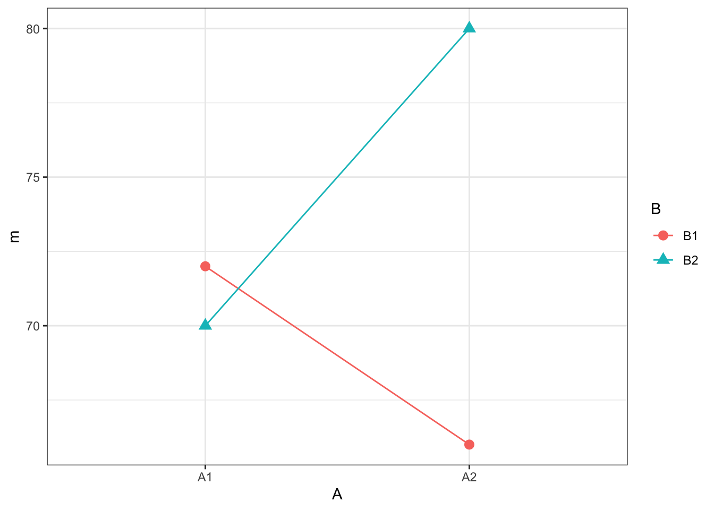
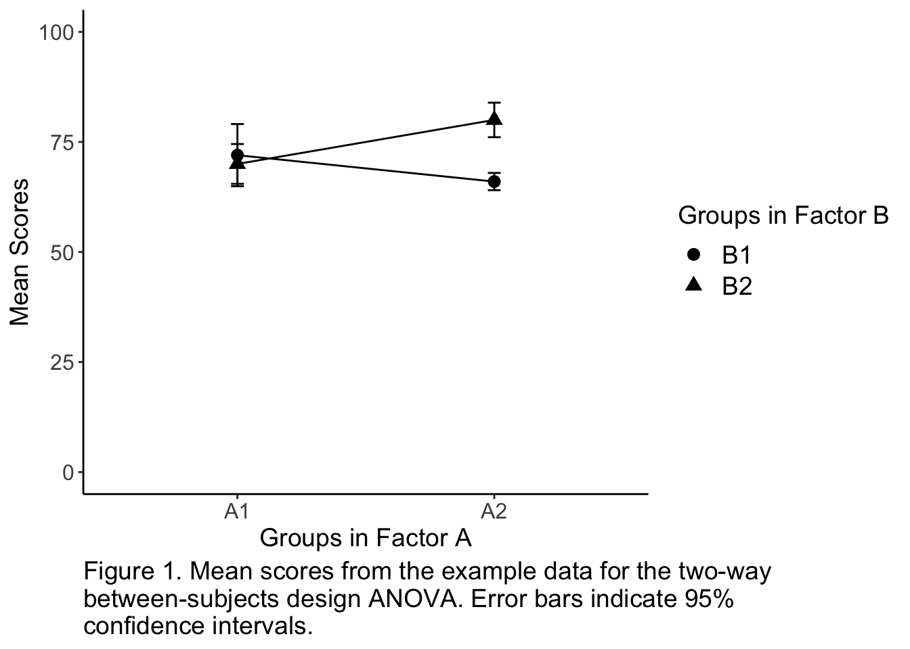
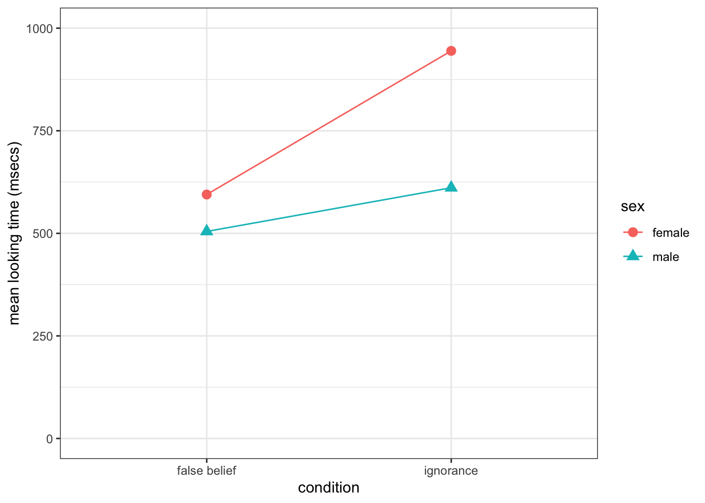

## Solutions to Questions


Below you will find the solutions to the questions for the Activities for this chapter. Only look at them after giving the questions a good try and speaking to the tutor about any issues.

### InClass Activities

#### Estimation equations and decomposition matrix

**Creating the Decomposition Matrix**

```
decomp <- tibble(i = rep(1:2, each = 6),
                 j = rep(rep(1:2, each = 3), times = 2),
                 k = rep(1:3, times = 4),
                 Y_ijk = c(74, 65, 77, 70, 74, 66, 67, 67, 64, 78, 78, 84)) %>%
    mutate(mu = mean(Y_ijk)) %>% # calculate mu
    group_by(i) %>% 
    mutate(A_i = mean(Y_ijk) - mu) %>% # calculate A_i
    group_by(j) %>% 
    mutate(B_j = mean(Y_ijk) - mu) %>% # calculate B_j
    ungroup()
```

[Return to Task](#Ch13InClassQueT1)

#### Adding the missing columns


```r
decomp2 <- decomp %>%
  group_by(i, j) %>%
  mutate(AB_ij = mean(Y_ijk) - mu - A_i - B_j) %>%
  ungroup() %>%
  mutate(err = Y_ijk - mu - A_i - B_j - AB_ij)
```

[Return to Task](#Ch13InClassQueT2)

#### Understanding the two-factor decomposition matrix

**Q1**

The DV value of participant $Y_{212}$ or the 2nd Participant in $I_2$, $J_1$, is 67

**Q2**

The Sums of Squares of Factor B is 108

**Q3**

The Sums of Squares of the Error is 140


**Q4**

The $MS_{B}$ is 108

**Q5**

The $MS_{error}$ (to one decimal places) is 17.5

**Q6**

The F-ratio for the main effect of B to 3 decimal places is 6.171

**Q7**

The numerator and denominator degrees of freedom associated with this $F$ ratio are 1 and 8 respectively


**Q8**

And based on `pf(fratio, 1, `8`, lower.tail = FALSE)` the $p$-value associated with this F ratio to three decimal places is 0.038 or .038

[Return to Task](#Ch13InClassQueT3)

#### Get your data ready for analysis


```r
dat <- decomp %>%
  mutate(A = paste0("A", i),
         B = paste0("B", j),
         id = row_number()) %>%
  select(id, A, B, Y_ijk)
```

[Return to Task](#Ch13InClassQueT4)

#### Visualizing 2x2 designs: The interaction plot

**Creating the Cell means**


```r
cell_means <- dat %>%
  group_by(A, B) %>%
  summarise(m = mean(Y_ijk))
```

**Reproducing the Plot**


```r
ggplot(cell_means, aes(A, m, group = B, shape = B, color = B)) +
  geom_point(size = 3) +
  geom_line()
```

<div class="figure" style="text-align: center">

<p class="caption">(\#fig:ch13-inclass-t5-sol-2)The plot that the code gives</p>
</div>

**Easter Egg Figure Solution**

The plot above is functional but sometimes you want something a bit more communicative. It is worth working on your figures so, here is an example of what you can think about for your report. Remember to look back through previous labs and homework as well (Semester 1: Lab 3, Lab 7, Lab 6, Lab 5 & 9 assignments, for instance) to see how figures can be improved.

The code below adds another few dimensions to the above figure. Copy and run the code in your Rmd, knitting it to HTML, and play with the different parts to see what they do. We have changed the legends to be more descriptive and to have more readable text, fixed the scale for the vertical axis, made the figure black and white without a box, we also added 95% confidence intervals and a figure caption. 

There are of course various ways to do these changes, in particular the caption, but this is an option.

**Note:** This will only run if you have the tibble dat from earlier in this worksheet


```r
cell_means1 <- dat %>%
group_by(A, B) %>%
summarise(m = mean(Y_ijk),
          n = n(),
          sd_scores = sd(Y_ijk),
          ste_scores = sd_scores/sqrt(n),
          ci = 1.96 * ste_scores)
  
ggplot(cell_means1, aes(A, m, group = B)) +
  geom_point(aes(shape = B), size = 3) +
  geom_line() +
  geom_errorbar(aes(ymin = m - ci, ymax = m + ci), 
                width = 0.05, 
                size = .5) +
  coord_cartesian(ylim = c(0,100)) +
  labs(x = "Groups in Factor A", 
       y = "Mean Scores", 
       caption = "Figure 1. Mean scores from the example data for the two-way \nbetween-subjects design ANOVA. Error bars indicate 95% \nconfidence intervals.") +
  scale_shape_discrete("Groups in Factor B") +
  theme_classic() +
  theme(axis.text.x = element_text(size = 12),
        axis.text.y = element_text(size = 12),
        axis.title = element_text(size = 14),
        legend.title = element_text(size = 14),
        legend.text = element_text(size = 14),
        plot.caption  = element_text(size = 14, hjust = 0))
```

<div class="figure" style="text-align: center">

<p class="caption">(\#fig:ch13-inclass-t5-sol-3)A nice figure example</p>
</div>

[Return to Task](#Ch13InClassQueT5)

#### ANOVA Using Ez

**The code**


```r
result <- ezANOVA(dat, 
                  dv = Y_ijk, 
                  wid = id, 
                  between = .(A, B),
                  detailed = TRUE) %>%
                  print()
```

```
## Coefficient covariances computed by hccm()
```

```
## $ANOVA
##   Effect DFn DFd SSn SSd          F          p p<.05        ges
## 1      A   1   8  12 140  0.6857143 0.43163404       0.07894737
## 2      B   1   8 108 140  6.1714286 0.03786084     * 0.43548387
## 3    A:B   1   8 192 140 10.9714286 0.01066139     * 0.57831325
## 
## $`Levene's Test for Homogeneity of Variance`
##   DFn DFd   SSn      SSd         F        p p<.05
## 1   3   8 14.25 82.66667 0.4596774 0.718037
```

* Including the `detailed = TRUE` will give us the sums of squares information

**The output**

<div style="border: 0px;overflow-x: scroll; width:100%; "><table class="table" style="margin-left: auto; margin-right: auto;">
<caption>(\#tab:ch13-inclass-t6-sol-2)The ANOVA output</caption>
 <thead>
  <tr>
   <th style="text-align:left;"> Effect </th>
   <th style="text-align:right;"> DFn </th>
   <th style="text-align:right;"> DFd </th>
   <th style="text-align:right;"> SSn </th>
   <th style="text-align:right;"> SSd </th>
   <th style="text-align:right;"> F </th>
   <th style="text-align:right;"> p </th>
   <th style="text-align:left;"> p&lt;.05 </th>
   <th style="text-align:right;"> ges </th>
  </tr>
 </thead>
<tbody>
  <tr>
   <td style="text-align:left;"> A </td>
   <td style="text-align:right;"> 1 </td>
   <td style="text-align:right;"> 8 </td>
   <td style="text-align:right;"> 12 </td>
   <td style="text-align:right;"> 140 </td>
   <td style="text-align:right;"> 0.686 </td>
   <td style="text-align:right;"> 0.432 </td>
   <td style="text-align:left;">  </td>
   <td style="text-align:right;"> 0.079 </td>
  </tr>
  <tr>
   <td style="text-align:left;"> B </td>
   <td style="text-align:right;"> 1 </td>
   <td style="text-align:right;"> 8 </td>
   <td style="text-align:right;"> 108 </td>
   <td style="text-align:right;"> 140 </td>
   <td style="text-align:right;"> 6.171 </td>
   <td style="text-align:right;"> 0.038 </td>
   <td style="text-align:left;"> * </td>
   <td style="text-align:right;"> 0.435 </td>
  </tr>
  <tr>
   <td style="text-align:left;"> A:B </td>
   <td style="text-align:right;"> 1 </td>
   <td style="text-align:right;"> 8 </td>
   <td style="text-align:right;"> 192 </td>
   <td style="text-align:right;"> 140 </td>
   <td style="text-align:right;"> 10.971 </td>
   <td style="text-align:right;"> 0.011 </td>
   <td style="text-align:left;"> * </td>
   <td style="text-align:right;"> 0.578 </td>
  </tr>
</tbody>
</table></div>

[Return to Task](#Ch13InClassQueT6)

### Homework Activities


#### Task 1A: Libraries

* In today's assignment you will need both the **`tidyverse`** and **`ez`** packages. 


```r
library(ez)
library(tidyverse)
```

[Return to Task](#Ch13AssignQueT1A)

#### Task 1B: Loading in the data

* Remember to use `read_csv()` to load in the data.


```r
dat <- read_csv("keysar_lin_barr_2003.csv")
```

[Return to Task](#Ch13AssignQueT1B)

#### Task 2: Calculate cell means for the cell means.

* The code below will give the table shown.


```r
cell_means <- dat %>%
  group_by(sex, condition) %>%
  summarise(m = mean(looktime), sd = sd(looktime))
```

<table>
 <thead>
  <tr>
   <th style="text-align:left;"> sex </th>
   <th style="text-align:left;"> condition </th>
   <th style="text-align:right;"> m </th>
   <th style="text-align:right;"> sd </th>
  </tr>
 </thead>
<tbody>
  <tr>
   <td style="text-align:left;"> female </td>
   <td style="text-align:left;"> false belief </td>
   <td style="text-align:right;"> 594.5833 </td>
   <td style="text-align:right;"> 899.1660 </td>
  </tr>
  <tr>
   <td style="text-align:left;"> female </td>
   <td style="text-align:left;"> ignorance </td>
   <td style="text-align:right;"> 944.6970 </td>
   <td style="text-align:right;"> 932.6990 </td>
  </tr>
  <tr>
   <td style="text-align:left;"> male </td>
   <td style="text-align:left;"> false belief </td>
   <td style="text-align:right;"> 504.5833 </td>
   <td style="text-align:right;"> 676.7338 </td>
  </tr>
  <tr>
   <td style="text-align:left;"> male </td>
   <td style="text-align:left;"> ignorance </td>
   <td style="text-align:right;"> 611.1111 </td>
   <td style="text-align:right;"> 778.0212 </td>
  </tr>
</tbody>
</table>

[Return to Task](#Ch13AssignQueT2)

#### Task 3: Marginal means for sex

* The code below will give the table shown for the marginal means of sex.


```r
marg_sex <- dat %>%
  group_by(sex) %>%
  summarise(m = mean(looktime), sd = sd(looktime))
```

<table>
 <thead>
  <tr>
   <th style="text-align:left;"> sex </th>
   <th style="text-align:right;"> m </th>
   <th style="text-align:right;"> sd </th>
  </tr>
 </thead>
<tbody>
  <tr>
   <td style="text-align:left;"> female </td>
   <td style="text-align:right;"> 777.9762 </td>
   <td style="text-align:right;"> 911.5331 </td>
  </tr>
  <tr>
   <td style="text-align:left;"> male </td>
   <td style="text-align:right;"> 555.0439 </td>
   <td style="text-align:right;"> 707.8138 </td>
  </tr>
</tbody>
</table>

[Return to Task](#Ch13AssignQueT3)

#### Task 4: Marginal means for condition

* The code below will give the table shown for the marginal means of condition.


```r
marg_cond <- dat %>%
  group_by(condition) %>%
  summarise(m = mean(looktime), sd = sd(looktime))
```

<table>
 <thead>
  <tr>
   <th style="text-align:left;"> condition </th>
   <th style="text-align:right;"> m </th>
   <th style="text-align:right;"> sd </th>
  </tr>
 </thead>
<tbody>
  <tr>
   <td style="text-align:left;"> false belief </td>
   <td style="text-align:right;"> 549.5833 </td>
   <td style="text-align:right;"> 775.9108 </td>
  </tr>
  <tr>
   <td style="text-align:left;"> ignorance </td>
   <td style="text-align:right;"> 794.5833 </td>
   <td style="text-align:right;"> 861.2306 </td>
  </tr>
</tbody>
</table>

[Return to Task](#Ch13AssignQueT4)

#### Task 5: Interaction plot

* The code below will produce the shown figure.


```r
ggplot(cell_means, aes(condition, m, shape = sex, group = sex, color = sex)) +
  geom_line() +
  geom_point(size = 3) +
  labs(y = "mean looking time (msecs)") +
  scale_y_continuous(limits = c(0, 1000)) + 
  theme_bw()
```

<div class="figure" style="text-align: center">

<p class="caption">(\#fig:t5)You should have produced a similar figure</p>
</div>

[Return to Task](#Ch13AssignQueT5)

#### Task 6: Recap Question 1

We want the alternative, not the null hypothesis here. So, an acceptable hypothesis for the interaction effect of sex and condition would be:

**We hypothesised that there would be a significant interaction between condition and sex of participant on egocentric interference (mean looking time (msecs)).**

As such the correct answer is:


```r
answer_t6 <- 3
```

[Return to Task](#Ch13AssignQueT6)

#### Task 7: Recap Question 2

A good description of the marginal means for sex would be:

**The female participants have an average longer looking time (M = 777.98, SD = 911.53) than the male participants (M = 555.04, SD = 707.81) which may suggest a significant main effect of sex.**

As such the correct answer is:


```r
answer_t7 <- 1
```

[Return to Task](#Ch13AssignQueT7)

#### Task 8: Recap Question 3

A good description of the marginal means for condition would be:

**The participants in the false belief group had an average shorter looking time (M = 549.58, SD = 775.91) than the participants in the ignorance group (M = 749.58, SD = 861.23), which may suggest a significant main effect of condition.**

As such the correct answer is:


```r
answer_t8 <- 2
```

[Return to Task](#Ch13AssignQueT8)

#### Task 9: Running the factorial ANOVA

* The code below will produce the shown ANOVA output


```r
mod <- ezANOVA(dat, dv = looktime, wid = subject,
               between = .(condition, sex))
```


```r
knitr::kable(mod$ANOVA)
```

<table>
 <thead>
  <tr>
   <th style="text-align:left;"> Effect </th>
   <th style="text-align:right;"> DFn </th>
   <th style="text-align:right;"> DFd </th>
   <th style="text-align:right;"> F </th>
   <th style="text-align:right;"> p </th>
   <th style="text-align:left;"> p&lt;.05 </th>
   <th style="text-align:right;"> ges </th>
  </tr>
 </thead>
<tbody>
  <tr>
   <td style="text-align:left;"> condition </td>
   <td style="text-align:right;"> 1 </td>
   <td style="text-align:right;"> 36 </td>
   <td style="text-align:right;"> 0.7913759 </td>
   <td style="text-align:right;"> 0.3795907 </td>
   <td style="text-align:left;">  </td>
   <td style="text-align:right;"> 0.0215098 </td>
  </tr>
  <tr>
   <td style="text-align:left;"> sex </td>
   <td style="text-align:right;"> 1 </td>
   <td style="text-align:right;"> 36 </td>
   <td style="text-align:right;"> 0.6405277 </td>
   <td style="text-align:right;"> 0.4287699 </td>
   <td style="text-align:left;">  </td>
   <td style="text-align:right;"> 0.0174814 </td>
  </tr>
  <tr>
   <td style="text-align:left;"> condition:sex </td>
   <td style="text-align:right;"> 1 </td>
   <td style="text-align:right;"> 36 </td>
   <td style="text-align:right;"> 0.2130405 </td>
   <td style="text-align:right;"> 0.6471716 </td>
   <td style="text-align:left;">  </td>
   <td style="text-align:right;"> 0.0058830 </td>
  </tr>
</tbody>
</table>

[Return to Task](#Ch13AssignQueT9)

#### Task 10: Interpreting the ANOVA output Question

A good summary of the outcome ANOVA would be:

**There is no significant main effect of sex or condition and there is no significant interaction between condition and sex.**

As such the correct answer is:


```r
answer_t10 <- 3
```

[Return to Task](#Ch13AssignQueT10)

#### Task 11: Report your results

There is no definitive way to write this paragraph but essentially your findings should report both main effects and the interaction, giving appropriate F outputs, e.g. F(1, 36) = .79, p = .38, and give some interpretation/qualification of the results using the means and standard deviations above, e.g. looking time was not significantly different between the false belief task (M = X, SD = XX) or the Ignorance task (M = XX, SD = XX). Something along the following would be appropriate:

**A two-way between-subjects factorial ANOVA was conducted testing the main effects and interaction between sex (male vs. female) and condition (false belief vs. ignorance) on the average looking time (msecs) on a matching task. Results revealed no significant interaction (F(1, 36) = .21, p = .647) suggesting that there is no modulation of condition by sex of participant in this looking task. Furthermore, there was no significant main effect of sex (F(1, 36) = .64, p = .429) suggesting that male (M = 555.04, SD = 707.81) and female participants (M = 777.98, SD = 911.53) perform similarly in this task. Finally, there was no significant main effect of condition (F(1, 36) = .79, p = .38) suggesting that whether participants were given a false belief scenario (M = 594.58, SD = 775.91) or an ignorance scenario (M = 794.58, SD = 861.23) had no overall impact on their performance.**

[Return to Task](#Ch13AssignQueT11)

<span style="font-size: 22px; font-weight: bold; color: var(--purple);">Chapter Complete!</span>
