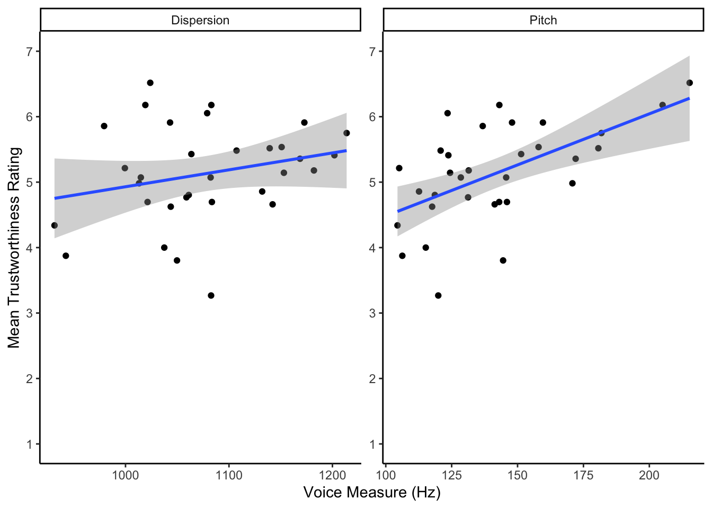

## InClass Activity


So we have been reading about regression in the Miller and Haden (2013) book and we have been looking at it in the lectures. As such, in this activity, you will be working with real data and using regression to explore the question of whether there is a relationship between voice acoustics and ratings of perceived trustworthiness. 

### The Voice

The prominent theory of voice production is the **source-filter theory** (Fant, 1960) which suggests that vocalisaion is a two step process: air is pushed through the larynx (vocal chords) creating a vibration, i.e. the source, and this is then shaped and moulded into words and utterances as it passes through the neck, mouth and noise, and depending on the shape of those structures at any given time you produce different sounds, i.e. the filter.  One common measure of the source is pitch (otherwise called Fundamental Frequency or F0 (F-zero)) (Titze, 1994) which is a measure of the vibration of the vocal chords, in Hertz (Hz); males have on average a lower pitch than females for example.  Likewise one measure of the filter is called formant dispersion (measured again in Hz), and is effectively a measure of the length of someone's vocal tract (or neck). Height and neck length are suggested to be negatively correlated with formant dispersion, so tall people tend to have smaller formant dispersion. So all in, the sound of your voice is thought to give some indication of what you look like.  

More recently, work has focussed on what the sound of your voice suggests about your personality. Work by McAleer, Todorov and Belin (2014) suggested that vocal acoustics give a perception of your trustworthiness and dominance to others, regardless of whether or not it is accurate. One extension of this is that trust is driven by malleable aspects of your voice (e.g. your pitch) but not so much by static aspects of your voice (e.g. your formant dispersion). Pitch is considered malleable because you can control the air being pushed through your vocal chords (though you have no conscious control of your vocal chords), whereas dispersion is controlled by the structure of your throat which is much more rigid due to muscle, bone, and other things that keep your head attached. This idea of certain traits being driven by malleable features and others by static features was previously suggested by Oosterhof and Todorov (2008) and has been tested with some validation by Rezlescu, Penton, Walsh, Tsujimura, Scott and Banissy (2015).

So the research question today is can vocal acoustics, namely pitch and formant dispersion, predict perceived trustworthiness from a person's voice. We will only look at male voices today, but you have the data for female voices as well should you wish to practice (note that in the field, tendency is to analyse male and female voices separately as they are effectively sexually dimorphic). As such, we hypothesise that a linear combination of pitch and dispersion will predict perceived vocal trustworthiness in male voices.  This is what we will analyse.

**Let's begin.**

First to run this analysis you will need to download the data from Moodle or <a href = "https://www.psy.gla.ac.uk/~phil/L2Labs_201819/semester_two/lab_05/inclass/Level2Semester2Lab5Datafiles.zip"">from here</a>. You will see in this folder that there are two datafiles:

* voice_acoustics.csv - shows the VoiceID, the sex of voice, and the pitch and dispersion values.
* voice_ratings.csv - shows the VoiceID and the ratings of each voice by 28 participants on a scale of 1 to 9 where 9 was extremely trustworthy and 1 was extremely untrustworthy.

Have a look at the layout of the data and orientate yourself with it.  The ratings data is rather messy and in a different layout to the acoustics but can you tell what is what:

* Looking at the layout of the acoustics data it appears to be in <select class='solveme' data-answer='["tidy"]'>
    <option></option>
    <option>long</option>
    <option>wide</option>
    <option>tidy</option>
</select>

* Looking at the layout of the ratings data it appears to be in <select class='solveme' data-answer='["wide"]'>
    <option></option>
    <option>long</option>
    <option>wide</option>
</select>


We are going to need to do some data-wrangling before we do any analysis!!!!!!

### Task 1: Setup

Open a new script or Rmd (depending on how you like to work) and load in the tidyverse, broom, and the two CSV datasets into variables called `ratings` and `acoustics`.  Probably best if the ratings are in `ratings` and the acoustics in `acoustics`

### Task 2: Restructuring the ratings

The next thing we need to do is to calculate a mean rating score for each voice. We are analysing the voices and not specifically what each participant rated each voice as (that is for another year) so we need to average all participants ratings for each individual voice and get a mean rating for each voice. You will see in your data that the voices are identified in the VoiceID column.

Recall the difference between **wide** and **long** data. In wide data, each row represents an individual case, with observations for that case in separate columns; in long data, each row represents a single observation, and the observations are grouped together into cases based on the value of a variable (for these data, the `VoiceID` variable). Before we calculate means, what you need to do is to restructure the ratings data into the appropriate "tidy" format; i.e., so that it looks like the table below.


 VoiceID    participant    rating 
---------  -------------  --------
    1           P1          7.0   
    2           P1          8.0   
    3           P1          7.5   
    4           P1          6.0   
    5           P1          4.0   
    6           P1          5.0   

* Write code to restructure the ratings data as above and store the resulting table as `ratings_tidy`.  Only the first six rows are shown. In the table above you see the first 6 voices all rated by Participant 1.

#### Hint

* gather(data, new_column_name, new_column_name, P1:P28)


### Task 3: Calculate mean trustworthiness rating for each voice 

Now that you've gotten your ratings data into a more tidy format we now have to calculate the mean rating (`mean_rating`) for each voice. Remember that each voice is identified by the `VoiceID` variable. Store the resulting table in a variable named `ratings_mean`. 

#### Hint

 * a group_by and summarise would do the trick
 * remember if there are any NAs then na.rm = TRUE would help


### Task 4: Joining the Data together

Great! We are so hot at wrangling now we are like hot wrangling irons! Ok but,  before we get ahead of ourselves, in order to perform the regression analysis, we need to combine the data from `ratings_mean` (the mean ratings) with `acoustics` (the pitch and dispersion ratings). Also, as we said, we only want to analyse Male voices today so filter out the Female voices and keep in the Male voices only. Call the resulting tibble `joined`. The first few rows should look like this:


 VoiceID   mean_rating  sex   measures          value
--------  ------------  ----  -----------  ----------
       1      4.803571  M     Pitch          118.6140
       1      4.803571  M     Dispersion    1061.1148
       2      6.517857  M     Pitch          215.2936
       2      6.517857  M     Dispersion    1023.9048
       3      5.910714  M     Pitch          147.9080
       3      5.910714  M     Dispersion    1043.0630

#### Hint

* inner join by the common column in both datasets
* filter to keep just Male voices


### Task 5: Scatterplot

As always, where possible, it is a good idea to visualise your data.  Now that we have all of the variables in one place, reproduce the scatterplot shown below and then try to answer the following questions.

* According to the scatterplot, there appears to be a <select class='solveme' data-answer='["positive relationship"]'>
    <option></option>
    <option>negative relationship</option>
    <option>positive relationship</option>
</select>
 between both pitch and trustworthines and dispersion and trustworthiness though the relationship with <select class='solveme' data-answer='["pitch"]'>
    <option></option>
    <option>dispersion</option>
    <option>pitch</option>
</select>
 seems stronger.

<div class="figure" style="text-align: center">

<p class="caption">(\#fig:scatter)**CAPTION THIS FIGURE!!**</p>
</div>

#### Hint

* ggplot()
* geom_smooth(method = "lm")
* coord_cartesian or scale_y_continuous
* facet_wrap(scales = "free")
* did you know also that you can control the number of columns and rows in a facet_wrap by adding nrow and ncol

<div class="figure" style="text-align: center">

<p class="caption">(\#fig:scatter_sol)**CAPTION THIS FIGURE!!**</p>
</div>

### Task 6: Spreading the data

Ok so we are starting to get an understanding of our data and we want to start thinking about the regressoin, however the regression would be easier to work with if Pitch and Dispersion were in separate columns.  Spread out the Pitch and Dispersion data into two columns, `Pitch` and `Dispersion`.

#### Hint

* spread() needs the data, name of the categorical column to spread, and the name of the data to spread


### Task 7: The Regressions

Excellent, we are now in a position to regress away.  Oh hang on, we should probably check the correlation between Pitch and Dispersion as remember the issue of collinearity.  The correlation between Pitch and Dispersion is <select class='solveme' data-answer='["rho = .239"]'>
    <option></option>
    <option>rho = .239</option>
    <option>rho = -.239</option>
    <option>rho = .186</option>
    <option>rho = -.186</option>
</select>
 which would suggest that we have no issues with collinearity as our two predictors are only slightly correlated and the correlation here is not significant.

Ok, let's do some regression. The `lm()` function in R is the main function to estimate a **L**inear **M**odel (hence the function name `lm`). Use the `lm()` function to run the following three regression models.  

* Run the simple linear regression of predicting trustworthiness mean ratings from Pitch, and store the model in `mod_pitch`
* Run the simple linear regression of predicting trustworthiness mean ratings from Dispersion, and store the model in `mod_disp`
* Run the multiple linear regression of predicting trustworthiness mean ratings from Pitch and Dispersion, and store the model in `mod_pitchdisp`

Now look at the results of each one in turn, and try to interpret them, using the function `summary()`, e.g. `summary(mod_pitch)`.

#### Hint

* Use spearman for the correlation between Pitch and Dispersion because as the scales are very different although measured both in (Hz)
* lm(dv ~ iv, data = my_data) for simple linear regression
* lm(dv ~ iv1 + iv2, data = my_data) for multiple linear regression


### Task 8: Making interpretations

If we take the model of pitch predicting trustworthiness then we see that this model, when relating to the population, would predict approximately 30.8% of the variance in trustworthiness ratings (Adjusted-R^2 = .3086). We could also say that a linear regression model revealed that pitch significantly predicted perceived trustworthiness scores in male voices in that as pitch increased so does perceived trustworthiness (b = .0156, t(30) = 3.852, p < .001). Remember that these are unstandardised coefficients so the "Estimate" would mean that a one unit change in pitch would result in a .0156 unit change in perceived trust, a rather small change. So we have a model of small to medium prediction but it is better than nothing, as shown by the F-test being significant. Worth also pointing out here that in a simple linear regression the F-test and the t-value for the predictor are the same based on, as seen in Semester 2 Lab 3, t^2 = F.

Ok, based on that knowledge, answer the following questions about the two remaining models.

- The dispersion as a predictor by itself model would explain approximately <select class='solveme' data-answer='["3%"]'>
    <option></option>
    <option>3%</option>
    <option>13%</option>
    <option>31%</option>
    <option>33%</option>
</select>

- In fact, the dispersion by itself model is <select class='solveme' data-answer='["not significant"]'>
    <option></option>
    <option>not significant</option>
    <option>significant</option>
</select>
 and therefor <select class='solveme' data-answer='["no use"]'>
    <option></option>
    <option>no use</option>
    <option>very useful</option>
</select>
 as a model
- Looking at the multiple linear regression model, the explained variance is <select class='solveme' data-answer='["30.5%"]'>
    <option></option>
    <option>3.05%</option>
    <option>13.5%</option>
    <option>30.5%</option>
    <option>33.5%</option>
</select>
 and as such explains <select class='solveme' data-answer='["less"]'>
    <option></option>
    <option>less</option>
    <option>more</option>
</select>
 variance than the pitch only model.

### Task 9: Making predictions {.tabset .tabset-fade .tabset-pills}

Congratulations! You have successfully constructed a linear model relating trustworthiness to pitch and dispersion and you can think about applying this knowledge to other challlenges - perhaps go look at female voices? However, one last thing you might want to do that we will quickly show you is how to make a prediction using the `predict()` function.  One way you use this, though see solutions, is:

```
predict(mod, newdata)
```

where `newdata` is a tibble with new observations on X (e.g. `pitch` or `dispersion`) for which you want to predict the corresponding Y values (`mean_rating`).

* Make a tibble with two columns, one called `Pitch` and one called `Dispersion` - exactly as spelt in the model.  Give `Pitch` a value of 150 Hz (quite a high voice) and give `Dispersion` a value of 1100 Hz - somewhere in the middle.  Now put that tibble, `newdata` into the `predict()` function to run it on the `mod_pitchdisp`

* To one decimal place, what is the predicted trustworthiness rating of a person with 150 Hz Pitch and 1100 Hz Dispersion - <input class='solveme nospaces' size='4' data-answer='["5.3"]'/>

#### Hint

* tibble(Pitch = Value, Dispersion = Value)

**Job Done!**

Great! Now you know predictions and how to work them, why not try a few more.  Choose some pitch values and some dispersion values and see what you get!  You should find that pitch has much more influence than dispersion!

You should now be ready to complete the Homework Assignment for this lab. **The assignment for this Lab is summative and should be submitted through the Moodle Level 2 Assignment Submission Page no later than 1 minute before your next lab.** If you have any questions, please post them on the slack forum under the channel **#level2_2018**. Finally, don't forget to add any useful information to your Portfolio before you leave it too long and forget.
