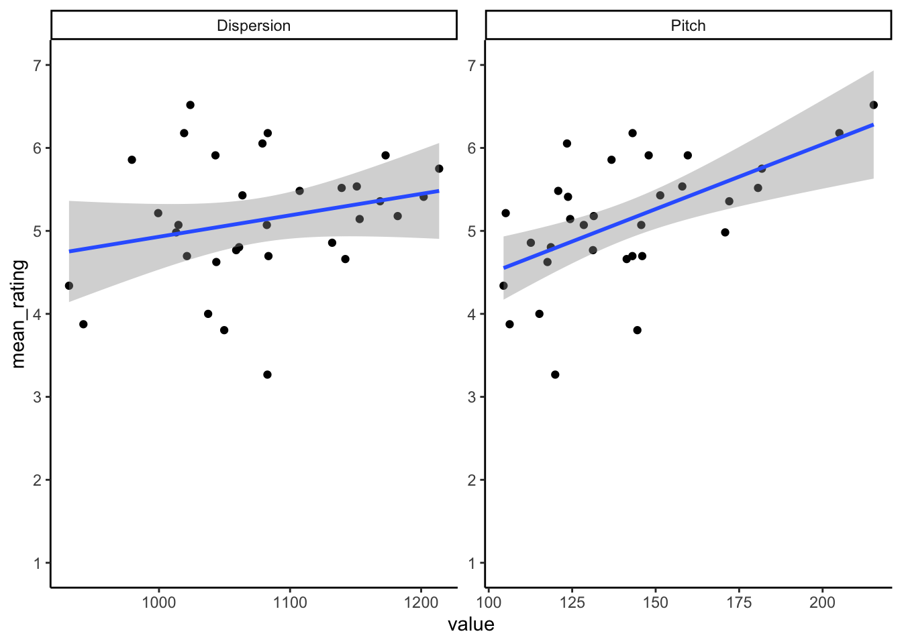

## Solutions to Questions


Below you will find the solutions to the questions for the Activities in this chapter. Only look at them after giving the questions a good try and speaking to the tutor about any issues.

### InClass Ativities

#### Task 1


```r
library("broom")
library("tidyverse")

ratings <- read_csv("voice_ratings.csv")
acoustics <- read_csv("voice_acoustics.csv")
```

[Return to Task](#Ch14InClassQueT1)

#### Task 2

* We are calling the new tibble `ratings_tidy`. We did not state what to call it as by now you can make that decision yourself. Just remember that when debugging your analysis paths from now on, the tibble names might not match up so, you may need to do a little bit of backtracking to see where tibbles were created.


```r
ratings_tidy <- gather(ratings, participant, rating, P1:P28)
```

[Return to Task](#Ch14InClassQueT2)

### Task 3


```r
ratings_mean <- ratings_tidy %>% 
  group_by(VoiceID) %>% 
  summarise(mean_rating = mean(rating))
```

[Return to Task](#Ch14InClassQueT3)

### Task 4


```r
joined <- inner_join(ratings_mean, acoustics, "VoiceID") %>% filter(sex == "M")
```

[Return to Task](#Ch14InClassQueT4)

### Task 5

<div class="figure" style="text-align: center">

<p class="caption">(\#fig:ch14-t5-scatter-sol)Scatterplot showing the relationship between the voice measures of Dispersion (left) and Pitch (right) and Mean Trustworthiness Rating</p>
</div>

[Return to Task](#Ch14InClassQueT5)

### Task 6

* `spread()` often catches people out.  It is a bit like the reverse of `gather()`
* It takes in the data and you tell it which values you want spread and by which column - though in the order of data, column, value. Makes sense huh!


```r
joined_wide <- joined %>% spread(measures, value)
```

[Return to Task](#Ch14InClassQueT6)

### Task 7

**Simple Linear Regression - Pitch**

The pitch model would be written as such:


```r
mod_pitch <- lm(mean_rating ~ Pitch, joined_wide)
```

And give the following output:


```r
summary(mod_pitch)
```

```
## 
## Call:
## lm(formula = mean_rating ~ Pitch, data = joined_wide)
## 
## Residuals:
##      Min       1Q   Median       3Q      Max 
## -1.52562 -0.30181  0.04361  0.33398  1.20492 
## 
## Coefficients:
##             Estimate Std. Error t value Pr(>|t|)    
## (Intercept) 2.921932   0.583801   5.005  2.3e-05 ***
## Pitch       0.015607   0.004052   3.852 0.000573 ***
## ---
## Signif. codes:  0 '***' 0.001 '**' 0.01 '*' 0.05 '.' 0.1 ' ' 1
## 
## Residual standard error: 0.6279 on 30 degrees of freedom
## Multiple R-squared:  0.3309,	Adjusted R-squared:  0.3086 
## F-statistic: 14.83 on 1 and 30 DF,  p-value: 0.0005732
```

**Simple Linear Regression - Dispersion**

The Dispersion model would be written as such:


```r
mod_disp <- lm(mean_rating ~ Dispersion, joined_wide)
```

And give the following output:


```r
summary(mod_disp)
```

```
## 
## Call:
## lm(formula = mean_rating ~ Dispersion, data = joined_wide)
## 
## Residuals:
##      Min       1Q   Median       3Q      Max 
## -1.87532 -0.41300 -0.02435  0.29850  1.52664 
## 
## Coefficients:
##             Estimate Std. Error t value Pr(>|t|)
## (Intercept) 2.345300   1.982971   1.183    0.246
## Dispersion  0.002584   0.001836   1.407    0.170
## 
## Residual standard error: 0.7434 on 30 degrees of freedom
## Multiple R-squared:  0.06191,	Adjusted R-squared:  0.03064 
## F-statistic:  1.98 on 1 and 30 DF,  p-value: 0.1697
```

**Multiple Linear Regression - Pitch + Dispersion**

The model with both Pitch and Dispersion as predictors would be written as such:


```r
mod_pitchdisp <- lm(mean_rating ~ Pitch + Dispersion, joined_wide)
```

And give the following output:


```r
summary(mod_pitchdisp)
```

```
## 
## Call:
## lm(formula = mean_rating ~ Pitch + Dispersion, data = joined_wide)
## 
## Residuals:
##      Min       1Q   Median       3Q      Max 
## -1.54962 -0.36428  0.04033  0.36327  1.18915 
## 
## Coefficients:
##             Estimate Std. Error t value Pr(>|t|)   
## (Intercept) 1.444290   1.697362   0.851  0.40179   
## Pitch       0.014855   0.004142   3.586  0.00121 **
## Dispersion  0.001470   0.001585   0.927  0.36137   
## ---
## Signif. codes:  0 '***' 0.001 '**' 0.01 '*' 0.05 '.' 0.1 ' ' 1
## 
## Residual standard error: 0.6293 on 29 degrees of freedom
## Multiple R-squared:  0.3501,	Adjusted R-squared:  0.3053 
## F-statistic: 7.813 on 2 and 29 DF,  p-value: 0.001931
```

[Return to Task](#Ch14InClassQueT7)

### Task 8

**A brief explanation:**

From the models you can see that the Dispersion only model is not actually significant (F(1,30) = 1.98, p = .17) meaning that it is not actually any use as a model. This is backed up by it only explaining 3% of the variance.  Looking at the multiple linear regression model which contains both pitch and dispersion we can see that it is a useful model ((F(2,29) - 7.81, P = .002) explaining 30.5% of the variance). However only pitch is a significant predictor in this model and actually the multiple regression model has smaller predictive ability than the pitch alone model. There is an arguement to be made that the pitch alone model is the best model in the current analysis.

[Return to Task](#Ch14InClassQueT8)

#### Task 9

**Solution Version 1**


```r
newdata <- tibble(Pitch = 150, Dispersion = 1100)
```


```r
predict(mod_pitchdisp, newdata)
```

```
##        1 
## 5.289819
```

**Solution Version 2**


```r
predict(mod_pitchdisp, tibble(Pitch = 150, 
                              Dispersion = 1100))
```

```
##        1 
## 5.289819
```

**Solution Version 3**

* And if you want to bring it out as a single value, say for a write-up, you could do the following
* This does pop out a warning about a `deprecated` function meaning that this won't work in future updates but for now it is ok to use.


```r
predict(mod_pitchdisp, tibble(Pitch = 150, 
                              Dispersion = 1100)) %>% tidy() %>% pull() %>% round(1)
```

```
## Warning: 'tidy.numeric' is deprecated.
## See help("Deprecated")
```

```
## [1] 5.3
```

[Return to Task](#Ch14InClassQueT9)

<span style="font-size: 22px; font-weight: bold; color: var(--purple);">Chapter Complete!</span>
