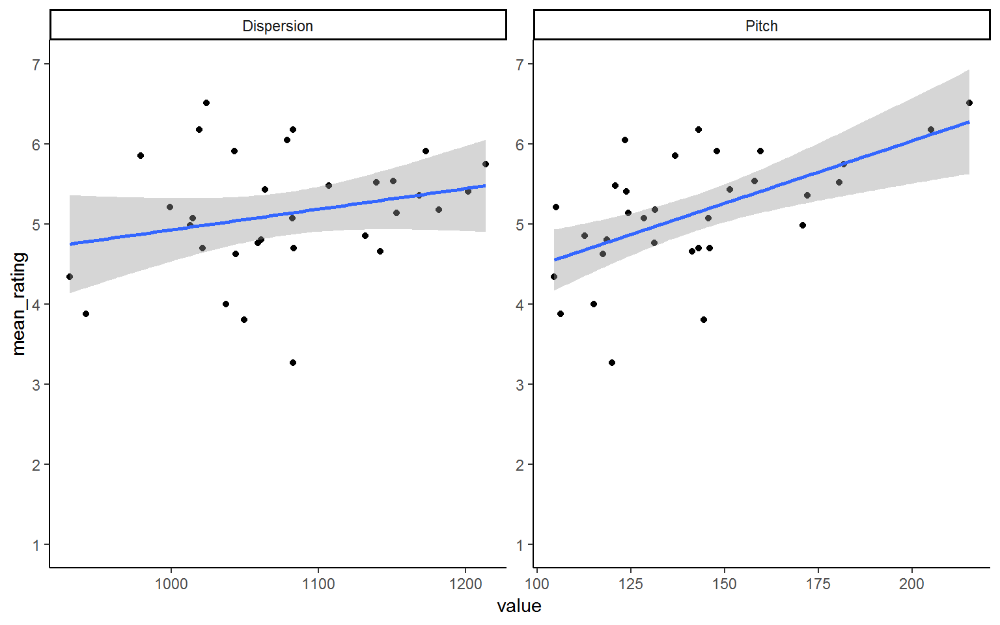

## Solutions to Questions


Below you will find the solutions to the questions for the Activities for this chapter. Only look at them after giving the questions a good try and speaking to the tutor about any issues.

### InClass Ativities

#### Task 1


```r
library("broom")
library("tidyverse")

ratings <- read_csv("voice_ratings.csv")
acoustics <- read_csv("voice_acoustics.csv")
```


#### Task 2


```r
ratings_tidy <- gather(ratings, participant, rating, P1:P28)
```

### Task 3


```r
ratings_mean <- ratings_tidy %>% 
  group_by(VoiceID) %>% 
  summarise(mean_rating = mean(rating))
```

### Task 4


```r
joined <- inner_join(ratings_mean, acoustics, "VoiceID") %>% filter(sex == "M")
```

### Task 5


```r
ggplot(joined, aes(value, mean_rating)) +
  geom_point() +
  geom_smooth(method = "lm") +
  scale_y_continuous(breaks = c(1:7), limits = c(1,7)) +
  facet_wrap(~measures, nrow = 1, ncol = 2, scales = "free") +
  theme_classic()
```

<div class="figure" style="text-align: center">

<p class="caption">(\#fig:scatter_sol)**CAPTION THIS FIGURE!!**</p>
</div>

### Task 6


```r
joined_wide <- joined %>% spread(measures, value)
```

### Task 7

**Pitch**


```r
mod_pitch <- lm(mean_rating ~ Pitch, joined_wide)

summary(mod_pitch)
```

```
## 
## Call:
## lm(formula = mean_rating ~ Pitch, data = joined_wide)
## 
## Residuals:
##      Min       1Q   Median       3Q      Max 
## -1.52562 -0.30181  0.04361  0.33398  1.20492 
## 
## Coefficients:
##             Estimate Std. Error t value Pr(>|t|)    
## (Intercept) 2.921932   0.583801   5.005  2.3e-05 ***
## Pitch       0.015607   0.004052   3.852 0.000573 ***
## ---
## Signif. codes:  0 '***' 0.001 '**' 0.01 '*' 0.05 '.' 0.1 ' ' 1
## 
## Residual standard error: 0.6279 on 30 degrees of freedom
## Multiple R-squared:  0.3309,	Adjusted R-squared:  0.3086 
## F-statistic: 14.83 on 1 and 30 DF,  p-value: 0.0005732
```

**Dispersion**


```r
mod_disp <- lm(mean_rating ~ Dispersion, joined_wide)

summary(mod_disp)
```

```
## 
## Call:
## lm(formula = mean_rating ~ Dispersion, data = joined_wide)
## 
## Residuals:
##      Min       1Q   Median       3Q      Max 
## -1.87532 -0.41300 -0.02435  0.29850  1.52664 
## 
## Coefficients:
##             Estimate Std. Error t value Pr(>|t|)
## (Intercept) 2.345300   1.982971   1.183    0.246
## Dispersion  0.002584   0.001836   1.407    0.170
## 
## Residual standard error: 0.7434 on 30 degrees of freedom
## Multiple R-squared:  0.06191,	Adjusted R-squared:  0.03064 
## F-statistic:  1.98 on 1 and 30 DF,  p-value: 0.1697
```

**Pitch + Dispersion**


```r
mod_pitchdisp <- lm(mean_rating ~ Pitch + Dispersion, joined_wide)

summary(mod_pitchdisp)
```

```
## 
## Call:
## lm(formula = mean_rating ~ Pitch + Dispersion, data = joined_wide)
## 
## Residuals:
##      Min       1Q   Median       3Q      Max 
## -1.54962 -0.36428  0.04033  0.36327  1.18915 
## 
## Coefficients:
##             Estimate Std. Error t value Pr(>|t|)   
## (Intercept) 1.444290   1.697362   0.851  0.40179   
## Pitch       0.014855   0.004142   3.586  0.00121 **
## Dispersion  0.001470   0.001585   0.927  0.36137   
## ---
## Signif. codes:  0 '***' 0.001 '**' 0.01 '*' 0.05 '.' 0.1 ' ' 1
## 
## Residual standard error: 0.6293 on 29 degrees of freedom
## Multiple R-squared:  0.3501,	Adjusted R-squared:  0.3053 
## F-statistic: 7.813 on 2 and 29 DF,  p-value: 0.001931
```

### Task 8

**A brief explanation:**

From the models you can see that the Dispersion only model is not actually significant (F(1,30) = 1.98, p = .17) meaning that it is not actually any use as a model. This is backed up by it only explaining 3% of the variance.  Looking at the model which contains both pitch and dispersion we can see that it is a useful model ((F(2,29) - 7.81, P = .002) explaining 30.5% of the variance). However only pitch is a significant predictor in the multiple regression model and actually the multiple regression model has smaller predictive ability than the pitch alone model. There is an arguement to be made that the pitch alone model is the best model in the current analysis.

#### Task 9

**Solution Version 1**


```r
newdata <- tibble(Pitch = 150, Dispersion = 1100)

predict(mod_pitchdisp, newdata)
```

```
##        1 
## 5.289819
```

**Solution Version 2**


```r
predict(mod_pitchdisp, tibble(Pitch = 150, 
                              Dispersion = 1100))
```

```
##        1 
## 5.289819
```

**Solution Version 3**

* And if you want to bring it out as a single value, say for a write-up, you could do the following
* This does pop out a warning about a `deprecated` function meaning that this wont work in future updates but for now it is ok to use.


```r
predict(mod_pitchdisp, tibble(Pitch = 150, 
                              Dispersion = 1100)) %>% tidy() %>% pull() %>% round(1)
```

```
## Warning: 'tidy.numeric' is deprecated.
## See help("Deprecated")
```

```
## [1] 5.3
```

