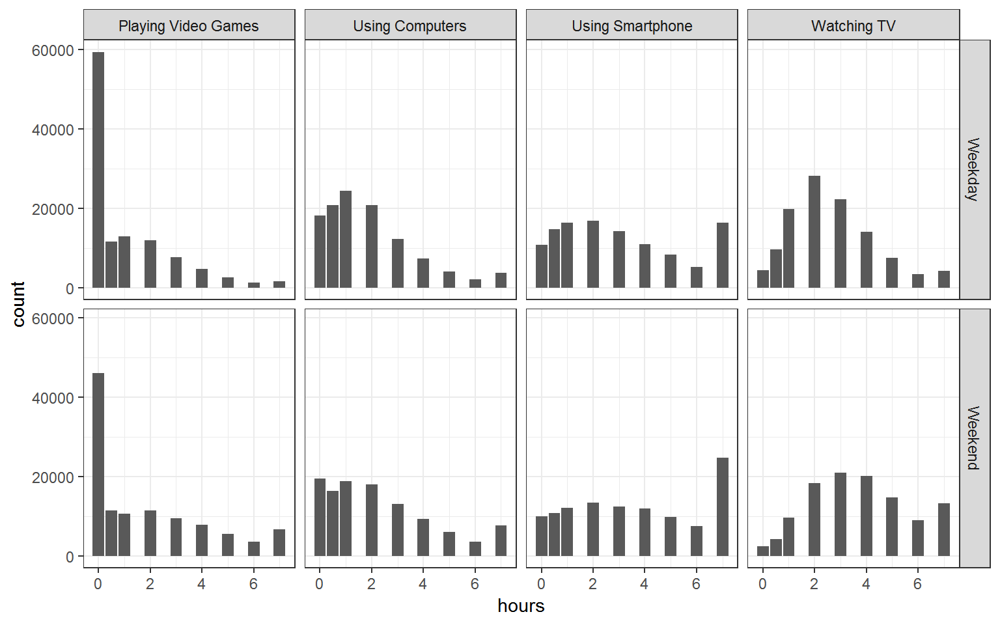
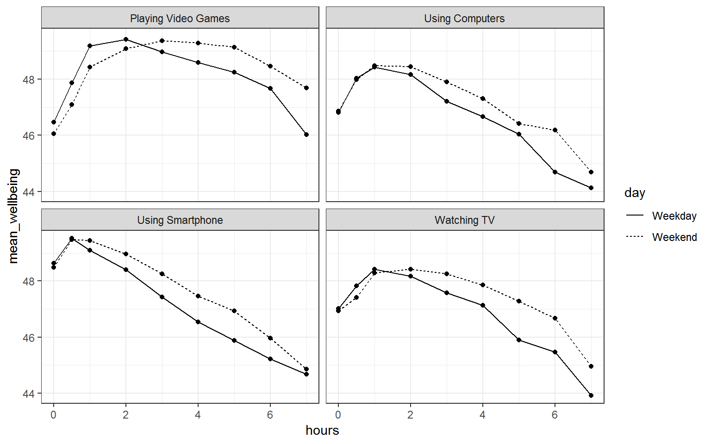
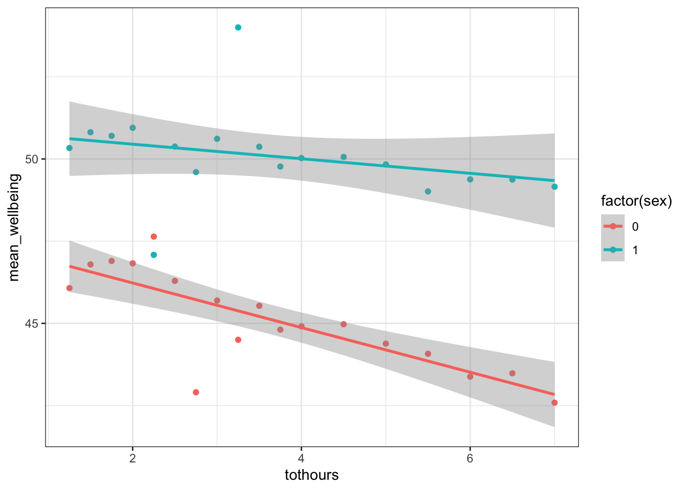

## InClass Activity

<<Future PHIL - this lab is huge. Put the blog in the overview and split the inclass into preclass and inclass>>


**Background: Smartphone screen time and wellbeing**

There is currently much debate (and hype) surrounding smartphones and their effects on well-being, especially with regard to children and teenagers.  We'll be looking at data from this recent study of English adolescents:

> Przybylski, A. & Weinstein, N. (2017). A Large-Scale Test of the Goldilocks Hypothesis. *Psychological Science*, *28*, 204--215.

This was a large-scale study that found support for the "Goldilocks" hypothesis among adolescents: that there is a "just right" amount of screen time, such that any amount more or less than this amount is associated with lower well-being that that duration.  Much like the work you have been doing, this was a *huge* survey study with data containing responses from *over 120,000* participants! Fortunately, the authors made the data from this study openly available, which allows us to dig deeper into their results. And the question we want to expand on in this exercise is whether the relationship between screen time and well-being is modulated by partcipants' (self-reported) sex. In other words, does screen time have a bigger impact on males or females, or is it the same for both.

The dependent measure used in the study was the [Warwick-Edinburgh Mental Well-Being Scale (WEMWBS)](https://warwick.ac.uk/fac/med/research/platform/wemwbs/). This is a 14-item scale with 5 response categories, summed together to form a single score ranging from 14-70.

At [Przybylski & Weinstein's page for this study on the Open Science Framework](https://osf.io/82ybd/), you can find the [participant survey](https://osf.io/82ybd/) which asks a large number of additional questions (see page 14 for the WEMWBS questions and pages 4-5 for the questions about screen time). Within the same page you can also find the [raw data](https://osf.io/82ybd/); however, for the purpose of this exercise, you will be using local pre-processed copies of the data found in the accompanying zip file on Moodle or <a href = "https://www.psy.gla.ac.uk/~phil/L2Labs_201819/semester_two/lab_06/inclass/Level2_Semester2_Lab6_InClass_Data.zip", target = "_blank">download from here</a>

Przybylski and Weinstein looked at multiple measures of screen time, but again for the interests of this exercise we will be focusing on smartphone use, but do feel free to expand your skills after by looking at different definitoins of screen time.  Overall, Przybylski and Weinstein suggested that decrements in wellbeing started to appear when respondents reported more than one hour of weekly smartphone use.  So, bringing it back to our additional variable of sex, our question is now, does the negative association between hours of use and wellbeing (beyond the one-hour point) differ for boys and girls?

Let's think about this in terms of the variables. We have:

- a continuous$^*$ DV, well-being;

- a continuous$^*$ predictor, screen time;

- a categorical predictor, sex.

**Note:** these variables ($^*$) are technically only quasi-continuous inasmuch as that only discrete values are possible. However, there are a sufficient number of discrete categories in our data that we can treat the data as effectively continuous.

Now, in terms of analysis, what we are effectively trying to do is to estimate **two slopes** relating screen time to well-being, one for girls and one for boys, and then statistically compare these slopes. Sort of like running a correlation for boys, a correlation for girls, and comparing the two. Or alternatively, where you would run a regression (to estimate the slopes) but also one where you would need a t-test (to compare two groups). But the expressive power of regression allows us to do this all within a single model. Again, as we have seen building up to this lab, **an independent groups t-test is just a special case of ordinary regression with a single categorical predictor; ANOVA is just a special case of regression where all predictors are categorical.** But remember, although we can express any ANOVA design using regression, the converse is not true: we cannot express every regression design in ANOVA. As such people like regression, and the general linear model, as it allows us to have any combination of continuous and categorical predictors in the model. The only inconvenience with running ANOVA models as regression models is that you have to take care in how you numerically code the categorical predictors. We will use an approach called **deviation coding** which we will look at today later in this lab.

**Let's Begin**

### Loading in the data

As always we will need to load in the tidyverse package and load in the data from the accompanying CSV (Comma-Separated Values) files, `wellbeing.csv`, `participant_info.csv`, and `screen_time.csv`.  

* Create a new RMarkdown file and put the csv files in the same directory with the Rmd file you just created.  Then load them in as follows (the solution is below):

* **pinfo** stores participant_info.csv
* **wellbeing** stores wellbeing.csv
* **screen** stores screen_time.csv


```r
library("tidyverse")

pinfo <- read_csv("participant_info.csv")
wellbeing <- read_csv("wellbeing.csv")
screen <- read_csv("screen_time.csv")
```

### The Data

Take a look at the resulting tibbles `pinfo`, `wellbeing`, and `screen`.  The `wellbeing` tibble has information from the **WEMWBS** questionnaire; `screen` has information about screen time use on weekends (variables ending with `we`) and weekdays (variables ending with `wk`) for four types of activities: using a computer (variables starting with `Comph`; Q10 on the survey), playing video games (variables starting with `Comp`; Q9 on the survey), using a smartphone (variables starting with `Smart`; Q11 on the survey) and watching TV (variables starting with `Watch`; Q8 on the survey).  If you want more information about these variables, look at the items 8-11 on pages 4-5 of the the [PDF version of the survey on the OSF website](https://osf.io/82ybd/).

* note that sex is coded as male = 1, female = 0.
* also, Serial is common across all datasets and is the participant ID.

### Compute the well-being score for each participant

Ok, our data is in and we need to create a well-being score for each participant on each item of the WEMWBS. To do this, and to calculate the well-being score for each participant, we simply **sum** all the items together for that participant. 

* Write code to create a new tibble, called `wemwbs`, with two variables: `Serial`, and `tot_wellbeing`, which is the the total WEMWBS score for each participant.

#### Hints

- Step 1: reshape table from wide to long
- Step 2: `group_by()`; `summarise(tot_wellbeing = ...)`
- Alternatively, mutate on the sum of all columns, then select the two needed.


### Visualising Screen time on all technologies

Great, so we have the well-being scores sorted out, we now need to think about the screen time usage and whether it is being used on a weekday or a weekend. As always, to get an idea of the data, it is often very useful to visualize the distributions of variables before proceeding.

* Try recreating this figure based on the data in `screen`. Note that this will require some tidying of the data in `screen`:

1. You'll first need to gather the `screen` tibble into long format and then break apart the column names into two separate columns, one for the name of the variable (`Watch`, `Comp`, `Comph`, and `Smart`) and the other for part of the week (`wk` and `we`). This is going to take using the `separate()` function which we haven't used yet but we think you can manage.

2. Next, you'll need to alter the values of the variables to reflect the more descriptive text that appears in the plot (e.g., `"Watch"` becomes `"Watching TV"`; `"wk"` becomes `"Weekday"`). This is a `recode()` issue which you have done a number of times.

This is quite a tricky bit of wrangling which we think you are capable of but do not be put off if you can't quite get it yet.  The code is below for you to use once you have had a shot at it.

<div class="figure" style="text-align: center">

<p class="caption">(\#fig:st_plot)**CAPTION THIS FIGURE!!**</p>
</div>

#### Hint Step 1

- `gather()` the data in `screen` into three columns: Serial, var, hours
- `?separate()` in the console
- seperate(data, column_name_containing_variables_to_split, c("column_1_to_create","column_2_to_create"), "character_to_split_by")
- each variable (category) has an underscore in its name. Use that to split it. I.e. Comph_we will get split into Comph and we
    
#### Hint Step 2

data %>% 
mutate(new_variable_name = recode(old_variable_name, "wk" = "Weekday", "we" = "Weekend")) 

### Visualising the Screen time and Well-being relationship

Brilliant, that is truly excellent work and you should be really pleased with yourself. Looking at the figures, it would appear that there is not much difference between screen time use of smartphones in weekend and weekdays so we could maybe collapse that variable together later when we come to analyse it.Overall, people tend to be using all the different technologies for a peak around 3 hours, and then each distribution tails off as you get longer exposure suggesting that there are some that stay online a long time.  Video games is the exception where there is a huge peak in the first hour and then a tailing off after that.

But first, another visualisation.  We should have a look at the relationship between screen time (for the four different technologies) and measures of well-being. This relationship looks like this shown below and the code to recreate this figure is underneath:

<div class="figure" style="text-align: center">

<p class="caption">(\#fig:combined-hide)**CAPTION THIS FIGURE!!**</p>
</div>

At the start we said we were only going to focus on smartphones. So looking at the bottom left of the figure we could suggest that smartphone use of more than 1 hour per day is associated with increasingly negative well-being the longer screen time people have. This looks to be a similar effect for Weekdays and Weekends, though perhaps overall well-being in Weekdays is marginally lower than in Weekends (the line for Weekday is lower on the y-axis than Weekends). This makes some sense as people tend to be happier on Weekends! Sort of makes you wish we had more of them right?

### Smartphone and well-being for boys and girls

So far we are matching what the original authors suggested we would find in the data, this drop off in self-reported well-being for longer exposures of smart-phone use after 1 hour. However we said we wanted to look at this in terms of males and females, or boys and girls really, so we need to do a bit more wrangling. Also, as above we said there looked to be only limited difference between Weekday and Weekends so we will collapse weekday and weekend usage in smartphones.

1. Create a new table, `smarttot`, that takes the information in `screen2` and keeps only the smarthpone usage.
2. Now create an average smartphone usage for each participant, called `tothours`, using a group_by and summarise, regardless of whether or not it is the weekend or weekday, i.e. the mean number of hours per day of smartphone use (averaged over weekends/weekdays) for that participant.
3. Now, create a new tibble `smart_wb` that only includes participants from `smarttot` who used a smartphone for more than one hour per day each week, and then combine this tibble with the information in the `wemwbs` tibble and the `pinfo` tibble.

The finished table should look something like this (where we are only showing the first 5 rows):


 Serial     tothours    tot_wellbeing    sex    minority    deprived 
---------  ----------  ---------------  -----  ----------  ----------
 1000003      2.0            41           0        0           1     
 1000004      2.5            47           0        0           1     
 1000005      3.5            32           0        0           1     
 1000006      2.0            29           0        0           1     
 1000008      1.5            42           0        0           1     

#### Hint Step 1

- `filter("Using Smartphone)` to keep only smartphone use

#### Hint Step 2

- group_by(Participant) %>% summarise(tothours = mean())

#### Hint Step 3

- `filter()`, `inner_join()`
- hours great than 1
- what is the common column to join each time by? Participant?


### Visualise and Interpreting the relationship of smartphone use and wellbeing by sex 

Excellent. Lots of visualisation and wrangling today but that is what we have been working on and building our skills on to this point so we are coping fine! Just a couple more visualisation and wrangles to go before we run the analysis (the easy part!)

* Using the data in `smart_wb` create the following figure.  You will need to first calculate the mean wellbeing scores for each combination of `sex` and `tothours`, and then create a plot that includes separate regression lines for each sex.
* Next, or if you just want to look at the figure and not create it, make a brief interpretation of the figure. Think about it in terms of who has the overall lower mean wellbeing score and also are both the slopes the same or is one more negative, one more positive, etc.

<div class="figure" style="text-align: center">

<p class="caption">(\#fig:last-fig-hide)**CAPTION THIS FIGURE!!**</p>
</div>

### A side point on mean centering and deviation coding

Last bit of wrangling, I promise, before the analysis. Here we will introduce something that is worth doing to help with our interpretation. You can read up more on this later, and we will cover it in later years more, but when you have continuous variables in a regression, it is often sensible to transform them by **mean centering** them which has two very useful outcomes:

1. the intercept of the model now shows the predicted value of $Y$ for the mean value of the predictor variable rather than the predicted value of $Y$ at the zero value of the unscaled variable as it normally would;

2. if there are interactions in the model, any lower-order effects (e.g. main effects) can be interpreted as they would have been had it of been simply an ANOVA.

These steps seem rather worthwhile in terms of interpretation and the process is really straightforward.  To **mean center a continuos predictor**, for example `X`, simply by subtracting the mean from each value of the predictor: i.e.`X_centered = X - mean(X)`.

A second very useful thing to do that aids the interpretation if to convert your categorical variables into what is called **deviation coding**. Again, weally we are going to focus more on this in L3 but it is good to hear the term in advance as you will see it from time to time.  Again, all this does is allow you to interpret the categorical predictors as though it were an ANOVA.

We are going to do both these steps, **mean centering of our continuous variable** and **deviation coding of our categorical variable**. Here is the code to do it. Copy it and run it but be sure that you understand what it is doing.  

* totothours_c is the mean centered values of tothours
* sex_c is the deviation coding of the sex column (sex) where male, which was coded as 1, is now coded as .5, and female is now coded as -.5 instead of 0. The `ifelse()` basically says, if that column you want me to look at says this (e.g. sex == 1), then I will put a .5, otherwise (or else) I will put a -.5.


```r
smart_wb <- smart_wb %>%
  mutate(tothours_c = tothours - mean(tothours),
         sex_c = ifelse(sex == 1, .5, -.5)) %>%
  select(-tothours, -sex)
```

### Estimating model parameters

Superb! And now finally, after all that wrangling and visualisation, the models. Finally, we are going to see if there is statistical support for our above interpretation of the Figure that overall girls have lower well-being and that they are affected more by prolonged smartphone usage than boys.  Just to recap, the previous authors have already looked at smartphone usage and wellbeing but we want to look at whether it has more of an impact in girls than boys, or boys than girls, or about the same.

The multiple regression model, from the general linear model, for this analysis would be written as:

$Y_i = \beta_0 + \beta_1 X_{1i}  + \beta_2 X_{2i}  + \beta_3 X_{3i} + e_i$

where

- $Y_i$ is the wellbeing score for participant $i$;
- $X_{1i}$ is the mean-centered smartphone use variable for participant $i$;
- $X_{2i}$ is gender (-.5 = female, .5 = male);
- $X_{3i}$ is the interaction between smartphone use and gender ($= X_{1i} \times X_{2i}$)

You have seen multiple regression models before in R and they usually take a format something like, `y ~ a + b`. The one for this analysis is very similar but with one difference, we need to add the interaction.  To do that, instead of saying `a + b` we do `a * b`. This will return us the effects of a and b by themselves as well as the interaction of a and b. Just like you would in an ANOVA but here one of the variables is continuous and one is categorical. 

* With that in mind, using the data in `smart_wb`, use the `lm()` function to estimate the model for this analysis where we predict `tot_wellbeing` from mean centered smartphone usage (tothours_c) and the deviation coded sex (sex_c)
* Next, use the `summary()` function on your model to view the results.

#### Hint

- R formulas look like this: `y ~ a + b + a:b` where `a:b` means interaction
- This can be written in short form of `y ~ a * b`


```
## 
## Call:
## lm(formula = tot_wellbeing ~ tothours_c * sex_c, data = smart_wb)
## 
## Residuals:
##     Min      1Q  Median      3Q     Max 
## -36.881  -5.721   0.408   6.237  27.264 
## 
## Coefficients:
##                  Estimate Std. Error t value Pr(>|t|)    
## (Intercept)      47.43724    0.03557 1333.74   <2e-16 ***
## tothours_c       -0.54518    0.01847  -29.52   <2e-16 ***
## sex_c             5.13968    0.07113   72.25   <2e-16 ***
## tothours_c:sex_c  0.45205    0.03693   12.24   <2e-16 ***
## ---
## Signif. codes:  0 '***' 0.001 '**' 0.01 '*' 0.05 '.' 0.1 ' ' 1
## 
## Residual standard error: 9.135 on 71029 degrees of freedom
## Multiple R-squared:  0.09381,	Adjusted R-squared:  0.09377 
## F-statistic:  2451 on 3 and 71029 DF,  p-value: < 2.2e-16
```

### Final Interpretations

Finally just some quick interpretation questions to round off all our work! To help you, here is some info:


* The intercept for the male regression line can be calculated by: the Intercept + (the beta of sex_c * .5)
* The slope of the male regression line can be calculated by: the beta of the tothours_c + (the beta of interaction * .5)
* The intercept for the female regression line can be calculated by: the Intercept + (the beta of sex_c * -.5)
* The slope of the female regression line can be calculated by: the beta of the tothours_c + (the beta of interaction * -.5)

Look at your model output in the `summary()` and try to answer the following questions. The solutions are below.

* The interaction between smartphone use and gender is shown by the variable <select class='solveme' data-answer='["tothours_c:sex_c"]'> <option></option> <option>tothours_c</option> <option>sex_c</option> <option>tothours_c:sex_c</option></select>, and this interaction was <select class='solveme' data-answer='["significant"]'> <option></option> <option>significant</option> <option>nonsignificant</option></select> at the $\alpha = .05$ level.

* To two decimal places, the intercept for male participants is: <input class='solveme nospaces' size='5' data-answer='["50.01"]'/>

* To two decimal places, the slope for male participants is: <input class='solveme nospaces' size='5' data-answer='["-0.32","-.32"]'/>

* To two decimal places, the intercept for female participants is: <input class='solveme nospaces' size='5' data-answer='["44.87"]'/>

* To two decimal places, the slope for female participants is: <input class='solveme nospaces' size='5' data-answer='["-0.77","-.77"]'/>

As such, given the model of `Y = intercept + (slope * X)`  where Y is wellbeing and X is total hours on smartphone, what would be the predicted wellbeing score for a male and a female who use their smartphones for 8 hours. Give your answer to two decimal places:

* Male: <input class='solveme nospaces' size='5' data-answer='["47.45"]'/>
* Female: <input class='solveme nospaces' size='5' data-answer='["38.71"]'/>

And finally, what is the most reasonable interpretation of these results? <select class='solveme' data-answer='["smartphone use was more negatively associated with wellbeing for girls than for boys"]'> <option></option> <option>smartphone use harms girls more than boys</option> <option>smartphone use harms boys more than girls</option> <option>there is no evidence for gender differences in the relationship between smartphone use and well-being</option> <option>smartphone use was more negatively associated with wellbeing for girls than for boys</option></select>
  
**Job Done!**

You should now be ready to complete any future Homework Assignment related to ANCOVAs. We will hold off from a formula assignment on this approach just now and we will look at it again later in the semester, but for now, if you have any questions, please post them on the slack forum under the channel **#level2_2018**. Finally, don't forget to add any useful information to your Portfolio before you leave it too long and forget.
