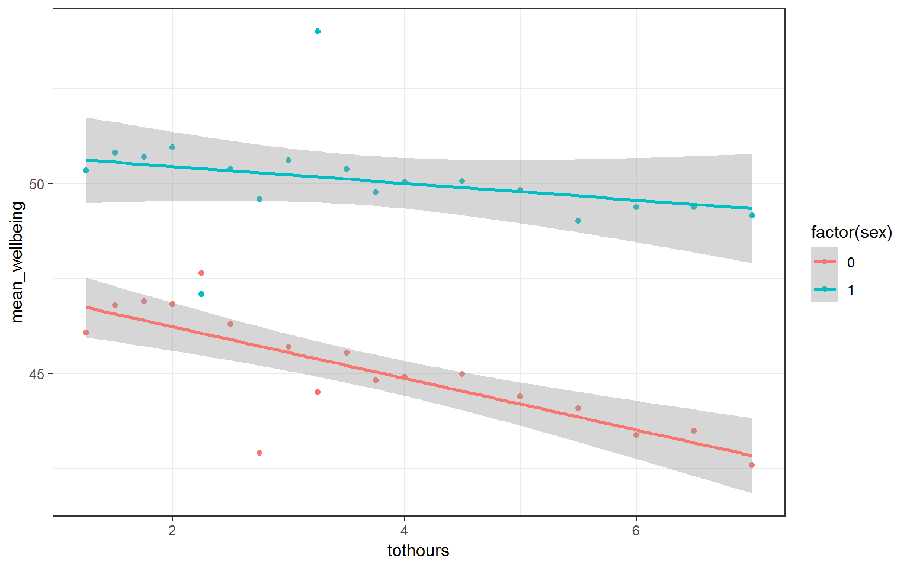

## Solutions to Questions


Below you will find the solutions to the questions for the Activities for this chapter. Only look at them after giving the questions a good try and speaking to the tutor about any issues.

### InClass Activities

#### Loading the Data


```r
library("tidyverse")

pinfo <- read_csv("participant_info.csv")
wellbeing <- read_csv("wellbeing.csv")
screen <- read_csv("screen_time.csv")
```

#### Compute the well-being score for each participant

**Version 1**


```r
wemwbs <- wellbeing %>%
  gather("var", "score", -Serial) %>%
  group_by(Serial) %>%
  summarise(tot_wellbeing = sum(score))
```

**Version 2**

* this one is a bit slower.


```r
wemwbs <- wellbeing %>%
  mutate(tot_wellbeing = WBOptimf +	WBUseful + 
           WBRelax + WBIntp +	WBEnergy + WBDealpr + 
           WBThkclr + WBGoodme + WBClsep + WBConfid + 
           WBMkmind + WBLoved + WBIntthg + WBCheer) %>%
  select(Serial, tot_wellbeing) %>%
  arrange(Serial)
```

#### Visualising Screen time on all technologies


```r
## screen time
screen_long <- screen %>%
  gather("var", "hours", -Serial) %>%
  separate(var, c("variable", "day"), "_")

screen2 <- screen_long %>%
  mutate(variable = recode(variable,
			   "Watch" = "Watching TV",
			   "Comp" = "Playing Video Games",
			   "Comph" = "Using Computers",
			   "Smart" = "Using Smartphone"),
	 day = recode(day,
		      "wk" = "Weekday",
		      "we" = "Weekend"))

ggplot(screen2, aes(hours)) +
  geom_bar() +
  facet_grid(day ~ variable)
```

<div class="figure" style="text-align: center">

<p class="caption">(\#fig:st_plot_sol)**CAPTION THIS FIGURE!!**</p>
</div>

#### Visualising the Screen time and Well-being relationship


```r
dat_means <- inner_join(wemwbs, screen2, "Serial") %>%
  group_by(variable, day, hours) %>%
  summarise(mean_wellbeing = mean(tot_wellbeing))

ggplot(dat_means, aes(hours, mean_wellbeing, linetype = day)) +
  geom_line() +
  geom_point() +
  facet_wrap(~variable, nrow = 2)
```

<div class="figure" style="text-align: center">

<p class="caption">(\#fig:combined)**CAPTION THIS FIGURE!!**</p>
</div>

#### Smartphone and well-being for boys and girls

**Solution Steps 1 to 2**


```r
## get rid of people who used smartphone less than or equal to 1 hour total per week
smarttot <- screen2 %>%
  filter(variable == "Using Smartphone") %>%
  group_by(Serial) %>%
  summarise(tothours = mean(hours))
```

**Solution Step 3**


```r
smart_wb <- smarttot %>%
  filter(tothours > 1) %>%
  inner_join(wemwbs, "Serial") %>%
  inner_join(pinfo, "Serial") 
```

#### Visualise and Interpreting the relationship of smartphone use and wellbeing by sex 

**The Figure**


```r
smart_wb_gen <- smart_wb %>%
  group_by(tothours, sex) %>%
  summarise(mean_wellbeing = mean(tot_wellbeing))

ggplot(smart_wb_gen, aes(tothours, mean_wellbeing, color = factor(sex))) +
  geom_point() +
  geom_smooth(method = "lm")
```

<div class="figure" style="text-align: center">

<p class="caption">(\#fig:unnamed-chunk-2)**CAPTION THIS FIGURE!!**</p>
</div>

**A brief Interpretation**

Girls show lower overall well-being compared to boys.  In addition, the slope for girls appears more negative than that for boys; the one for boys appears relatively flat.  This suggests that the negative association between well-being and smartphone use is stronger for girls.

#### Estimating model parameters


```r
mod <- lm(tot_wellbeing ~ tothours_c * sex_c, smart_wb)

# alternatively: 
# mod <- lm(tot_wellbeing ~ tothours_c + sex_c + tothours_c:sex_c, smart_wb)

summary(mod)
```

```
## 
## Call:
## lm(formula = tot_wellbeing ~ tothours_c * sex_c, data = smart_wb)
## 
## Residuals:
##     Min      1Q  Median      3Q     Max 
## -36.881  -5.721   0.408   6.237  27.264 
## 
## Coefficients:
##                  Estimate Std. Error t value Pr(>|t|)    
## (Intercept)      47.43724    0.03557 1333.74   <2e-16 ***
## tothours_c       -0.54518    0.01847  -29.52   <2e-16 ***
## sex_c             5.13968    0.07113   72.25   <2e-16 ***
## tothours_c:sex_c  0.45205    0.03693   12.24   <2e-16 ***
## ---
## Signif. codes:  0 '***' 0.001 '**' 0.01 '*' 0.05 '.' 0.1 ' ' 1
## 
## Residual standard error: 9.135 on 71029 degrees of freedom
## Multiple R-squared:  0.09381,	Adjusted R-squared:  0.09377 
## F-statistic:  2451 on 3 and 71029 DF,  p-value: < 2.2e-16
```

#### Final Interpretations


* The interaction between smartphone use and gender is shown by the variable tothours_c:sex_c, and this interaction was significant at the $\alpha = .05$ level, meaning that there is an significant interaction between sex and hours of smartphone usage on wellbeing

* To two decimal places, the intercept for male participants is: 50.01
* To two decimal places, the slope for male participants is: -0.32
* To two decimal places, the intercept for female participants is: 44.87
* To two decimal places, the slope for female participants is: -0.77

As such, given the model of `Y = intercept + (slope * X)`  where Y is wellbeing and X is total hours on smartphone, what would be the predicted wellbeing score for a male and a female who use their smartphones for 8 hours. Give your answer to two decimal places:

* Male: 47.45
* Female: 38.71

And finally, the most reasonable interpretation of these results is that smartphone use was more negatively associated with wellbeing for girls than for boys.
