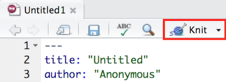

## PreClass Activiy

###  Welcome to the Level 2 Lab Series 

Welcome to Level 2 Psychology! Over the course of this year's practical lab sessions we will help you learn a whole host of skills and methods based around being a Psychologist, starting right now!

A key goal of any researcher is to carry out an experiment and to tell others about it. One of the main ways we as Psychologists do this is through publication of a journal article. There are numerous ways that people combine different software to create a journal article, but a more recent innovation in the field that we want you to know about is creating reports and articles through RMarkdown. If you like, you can see an example from a research team in our school in this <a href ="http://journals.plos.org/plosone/article?id=10.1371/journal.pone.0185093", target = "_blank">recent PLOS article</a>. A link within the article methods section (this one - <a href="https://osf.io/eb9dq/", target = "_blank">https://osf.io/eb9dq/</a>) allows you to see the one file that creates the whole manuscript. Obviously you wont be writing full journal articles just yet but you will use RMarkdown throughout this lab series to do assignments and you could even also use it in other subjects to write reports, or to even make yourself a portfolio of hints, tips, and study aids. We will start by showing you some of skills in using RMarkdown efficiently.

**In this lab you will learn\:**

1. What is RMarkdown?
2. How to create an RMarkdown file and knit it.
3. How to add code and edit rules in your RMarkdown file.
4. How to format your text.

#### Before you begin: Review!

Before working through the rest of this document you may want to watch the 20 minute video on the Lab 1 Moodle page by Dr Dale Barr reminding you about R, RStudio, and various file formats you will be working with. 

#### What is RMarkdown?

RMarkdown (abbreviated as Rmd) is a great way to create dynamic documents through embedded chunks of code. These documents are self-contained and fully reproducible which makes it very easy to share. For more information about RMarkdown feel free to have a look at their main webpage sometime: <a href="http://rmarkdown.rstudio.com", targer = "_blank">The R Markdown Webpage</a>. The key advantage of RMarkdown is that it allows you to write code into a document, along with regular text, and then **'knit'** it using the package `knitr` to create your document as either a webpage (HTML), a PDF, or Word document (.docx). 

<button>Explain This - We Knit what?</button>

Throughout the labs you will see little tabs that give more information, answers to quick questoins, helpful hints, solutions to tasks, or suggestions for information you want to note down somewhere. You do not have to read them all and you will find they get less as the course progresses, but they might help you if you are stuck on something.    
    
Knit is what we say when we want to turn our RMarkdown file into either a webpage, PDF, or a Word document. Often in the labs you will hear someone say, "Have you tried knitting it?" or "What happens when you knit it?". This simply means what happens when you try turning your file into a pdf or webpage.

  

#### Advantages of using RMarkdown

1. The output is one file that includes figures, text and citations. No additional files are needed so it's easy to keep all your work in one place. 

2. R code can be put directly into a RMarkdown report so it is not necessary to keep your writing (e.g. a Word document) and your analysis (e.g. your R script) separate.  

3. Including the R code directly lets others see how you did your analysis - this is a good thing for science! It is both Reproducible and Open!  

4. You write your report in normal text so it's not necessary that you learn any new coding such as HTML.  

#### Creating an RMarkdown (.Rmd) File

In this lab you're going to create your own RMarkdown document. Knowing how to do this will:

a. help you with submitting homework assignments, and
b. help you be able to create your own reports using it.

If at any point you are unsure about how to do something remember to think about where you can get help. There is an **RMarkdown Cheatsheet** on the top menu under `Help >> Cheatsheets` or do what we do, Google it. For example, if I forget how to put words in bold, I could simply go to Google and type "**rmarkdown bold**" and no doubt get a lot of useful hints.

#####  Quickfire Question
We have put questions throughout to help you test your knowledge. When you type in or choose the correct answer, the dashed box will change color and become solid.

- From the following options, why are we creating an RMarkdown document instead of simply using an R script? <select class='solveme' data-answer='["RMarkdown can combine report writing and analysis","Reproducible Science!"]'> <option></option> <option>RMarkdown can combine report writing and analysis</option> <option>R Scripts can't run code</option> <option>Reproducible Science!</option></select>  

<button>Explain This Answer!</button>

So there's more than one answer to this question! RMarkdown can combine report writing and analysis, providing open access for others to examine data, and create more Reproducible Science. But what about the incorrect answer? R Scripts do in fact run R code as you may remember from Level 1 labs. The key difference is that R Scripts cannot really be used for documentation and creating reports - this is where RMarkdown is used to ensure your code can be added to all the other information of your research and can be reproduced by others.

  

### So let's begin...

If you have a laptop it is best to install R and Rstudio on that for you to use, but you can use the machines in our labs just as easily. Dale Barr's video gives a reminder of how to install R and Rstudio.  If you don't have it installed yet you can just read along today and try it out when you can get access to a machine in the labs.

Create a new R Markdown file (`.Rmd`) by opening Rstudio, and then on the top menu, selecting `File >> New File >> R Markdown...`. You should now see the following dialog box:

 

Click `Document` on the left-hand panel and then give your document a **Title**. This is your file so call it what you want but make sure it is informative to you and your reader. Put your name or your student ID in the **Author** field as you are the author. For now we will focus on making an **HTML** output, so make sure that is selected as shown and then hit `OK` when you have done so. You should now have an .Rmd file open in Rstudio.

The first thing you will see in your RMarkdown file is a header section enclosed at the top and bottom by `---`, that lists the title, author, date and output format (html here). Like this:  

 
By default the file header includes the above info shown but there are many other options available for different functions and formatting that you can look at later if you like: <http://rmarkdown.rstudio.com/html_document_format.html> for **.html** options or <http://rmarkdown.rstudio.com/pdf_document_format.html>  for **.pdf** options.

**BUT WAIT**, what if you spelt your name wrong? How would you change this?

<button>Explain This - I spelt my name wrong!</button>

The long way would be to close the file and start again. The shorter way would be to just correct the info in the header - just remember to keep between the quotes. E.g. "Si Cologe" instead of "Untitled"

  

#### Code Chunks

Immediately below the header information you will see the standard default **code chunk**. 

  

 
In RMarkdown you can type any text you want directly in the document just as you would in a word document. However, if you want to include code you need to include it in something called a **code chunk**. Code chunks start with a line that contains three backwards apostrophes (these are called grave accents - often in the top-left of keyboards) and then includes a set of curly brackets with the letter r inside: 

\`\`\`{r}

\`\`\`

You will **always** need both of these parts to create a code chunk:  

* The three back ticks are the part of the Rmd file that says this is code being inserted into my document. 
* The \`{r}\` part says that you are specifically including R code. 
    
The standard default code chunk provides some basic setup options for your RMarkdown file for when it `knits` your work. For now, it is best to leave this particular code chunk alone. Instead we will show you how to use RMarkdown by editing the code chunks that come after this default chunk. 

The next code chunk in your file will look like this below.

  
 
You can see on the first line of the example chunk above (line 18) that the word `cars` is included after the letter `r` within the curly brackets. This is simply the **name** or the **label** for the code chunk and it really could have been called anything. For example, you could have called this code chunk `cars1` and a later chunk `cars2` to show it was the first and second chunk relating to cars. You don't need to include a label, you can just start your code chunk with `{r}` and it will work fine. However, if you do put in names for the chunks **do not use the same name twice** as this will cause your script to crash when you knit it, e.g. Do not use `data` and `data`; instead maybe use `personality_data` and `participant_info` or whatever makes sense to what you are doing in the chunk.

<button>Explain This - You can crash whilst knitting?</button>

Remember knitting just means converting or rendering your file as a pdf, webpage, etc. Crashing means that you had an error in your code that stopped your knitting from working or finishing. You can usually find the problem line of code from the error message you'll see.

 
The second line (line 19) in the above **code chunk** is the Rcode we have written: `summary(cars)`. In this case, we are just asking for a `summary()` of the inbuilt dataset `cars`. Rstudio has a lot of inbuilt datasets for you to practice on, `cars` is one of these.

The third line (line 20) closes off the code chunk, again with the three backwards apostrophes. This means that whatever is contained between the first and third lines will be code that will run.  

#####  Quickfire Question

- From the following options what was the name or label of the **standard default code chunk** (i.e. the first code chunk on RMarkdown)? <select class='solveme' data-answer='["setup"]'> <option></option> <option>include</option> <option>r</option> <option>setup</option> <option>FALSE</option></select> 

<button>Explain This Answer</button>

If you look at line 8 of the image above showing the default code chunk you can see the code chunk has the name "setup". "include=FALSE" is a rule which we will explain in a little bit.

  

#### Knitting Code

Now would be a good time to try knitting your file to see what the code chunks do. You can do this using the **Knit button** at the top of the Rstudio screen:

 
When you click `Knit` it will ask you to save the file as an .Rmd file. Call the file `L2Psych_Lab1_Preclass.Rmd` and save it in a folder where you will keep all the information for this lab. When working in the Psychology labs or the University Library you need to save in a location or drive space that you have full access to and can save files to. The best one on campus is your `M:` drive. If using your own device then anywhere you can save the file should work.

<button>Helpful Hint - One folder for all your work</button>

It would be very beneficial to create a folder in your `M:` drive that will contain all your practical lab work for the rest of Level 2. Maybe something like `Psychology Level 2 Lab Work` and then have folders within that for each lab, e.g `Lab1`. The clearer the structure of these folders the easier it will be to find and use your files again! This is important as one thing we will keep telling you to do is **Look Back** at what you previously did. 
    
A good way to think about this is if you have an exam, it isn't helpful to be told the location of your exam is 'Glasgow Uni' (i.e. a large folder of many locations). Instead you would need to be told the specific building (a folder within your larger folder), but more specifically the room number in the building where your exam is taking place (the folder which you are working from).
    
    

  
 
After saving the file a webpage should appear. The first thing to notice is that some lines in the code chunks have disappeared: the \`\`\`{r} and the closing \`\`\` in your code chunk have gone.

Whenever you knit an RMarkdown file these lines will disappear leaving only the code within. You'll also notice that the output of the code is also now showing in your webpage. In the next section we will show you how to control showing the data or not through adding rules.

#### Adding Rules to Code Chunks

It can often be a good idea or even necessary to show the data or the outcome of a test in your report, for example if you were writing a report and wanted to include a table of results. But what if your code displayed a table that was 10,000 lines long? In that case we might want to not show the output and only show the code. You can do this by including a rule within the first line of your code chunk - your \`\`\`{r name, rule = option} line. You have already seen a rule before in the standard default chunk, the `include` rule, but there are a number of others.  

**To hide the output but show the code** we use the `results = "hide"` rule:

  

 
**Add this rule into your example code chunk, as shown above, and knit the file again. What happens?** Note that there is a comma separating the name of the chunk and the rule. You should now see the code only and not the data.
 
Alternatively, we can **Hide the code, but show the ouput** by using the `echo = FALSE` rule:   
  

In your template Rmd file the rule echo is set to `FALSE` meaning to show the figure and not the code. **Change the rule in your code to `echo` and set it as `TRUE`, then knit the file again**. What happens?  

<button>Explain This - Why would I hide my code?</button>
  
Remember from Level 1 where we called in libraries to our environment. The "echo = FALSE" option is useful for commands like `library()` when you are just calling a package into the library but don't necessarily want to display that in your final report or in your final HTML file. Another example might be if you wanted to make a plot but didn't want to include the code, you just want to show the plot in your report.

  

 
You might want to **hide both the code AND the output** by using the `include` rule:

 
**Change the rule to your example code chunk, as shown above, to `include = FALSE` and then knit the file again**. What happens? Note that here the code still runs. It just does not show you anything. 

Finally, you can use the `eval` rule which specifies whether or not you want the code chunk you have written to be evaluated when you knit the RMarkdown file. Evaluated means to run or carry out the code. Here, the `eval = FALSE` rule will stop the code from being evaluated. The code will be shown because there is no rule stopping it but there will be no output because it won't get evaluated because of the `eval` rule being `FALSE`. 

 
This might be useful in cases where you want to show the code relating to how you programmed your stimuli for an experiment, but you don't necessarily want it to run as part of the RMarkdown file. 

##### Quickfire Questions

You've got a large dataset of thousands of participant's personality and happiness scores that you want to analyse and present in RMarkdown.

* You want to show the code you are running in your analysis but not show the output as this would be too much to display. Note that you want the code to run. Type in the box (e.g. `rule = set`) how you would set the `results` rule to do this? <input class='solveme nospaces' size='20' data-answer='["results = \"hide\""]'/>

* You create a plot of happiness versus neuroticism scores but you want to hide the code and only show the output. How can you do this? <select class='solveme' data-answer='["echo = FALSE"]'> <option></option> <option>echo = TRUE</option> <option>include = FALSE</option> <option>code = HIDE</option> <option>echo = FALSE</option></select>

<button>Explain This - I don't understand these answers</button>

The first answer should be results = "hide" as you want to show the code and run the code but not necessarily show the output of the code.
    
In the second question, "include = FALSE" technically would hide the code, but this also hides the output! "echo = FALSE" allows you to still see your plot while hiding the code you want hidden. "code = HIDE" - if only it were that simple! The aim of these questions aren't to help you memorise these codes (no one can do that!), they're to help you gain a better understanding of how to apply these codes when you come across them in the future.

  
   

* True or False, writing `echo = TRUE` has the same effect on the output of a code as if you had no echo rule at all: <select class='solveme' data-answer='["TRUE"]'> <option></option> <option>TRUE</option> <option>FALSE</option></select>

<button>Explain This - Echo True or Not at all</button>

All of the rules have a default mode. For example, `echo`, `include`, and `eval` are usually by default set to `TRUE`. As a result, if you don't declare any `echo` rule, i.e. you don't declare `echo = FALSE`, then it is the same as declaring `echo = TRUE`. So no rule means that you are wanting that rule set as `TRUE`.

  
   

* True or False, there is no difference between the rules `results = "hide"` and `eval = FALSE` as they both hide the output: <select class='solveme' data-answer='["FALSE"]'> <option></option> <option>TRUE</option> <option>FALSE</option></select>

<button>Explain This - What's the difference?</button>

In the first rule, `results = "hide"`, the code is evaluated and results are produced but the output is hidden. In the second rule, `eval = FALSE`, the code is not evaluated and therfore no results or output has been produced. If you need your output for a later part of the code then you would use the `results` rule. If you don't need the output and just want to show the code as an example then you would use the `eval` rule.

  

#### Adding Inline Code

An alternative way to add code to a report is through what is called **inline coding**. Inline coding is slightly different to code chunks, you dont use a code chunk in fact. Inline coding can be inserted using a back-tick then the letter `r`, followed by a space, the code you want to include, then another back-tick. For example, writing 

would return the answer **4** when you knit the file instead of showing the code. Note that you do not do this inside a code chunk, you do this in line with your text, e.g.:

which when knitted becomes:

So inline coding is really useful if you want to do calculations **within your text** or insert values into text, say from a dataframe, to make an informative sentence. 

#####  Quickfire Questions

- You need <select class='solveme' data-answer='["Three"]'> <option></option> <option>Two</option> <option>One</option> <option>Three</option></select> back tick(s) to insert **code chunks**

- Why is this inline code, `{r} 6*8` , not going to show the calculated answer when you knit the file? Try editing the code line in Rmarkdown and knitting it to get it to work. <select class='solveme' data-answer='["Curly brackets are only needed for code chunks"]'> <option></option> <option>You need a space between each back tick and the code</option> <option>Inline code cannot complete calcuations</option> <option>Curly brackets are only needed for code chunks</option></select>

<button>Explain This - Why are these answers correct?</button>

All code chunks start and end with three back-ticks.

Inline coding does not use the curly brackets around the `r`. All you need is a back-tick, r, space, code, and a final back-tick.
    

#### Formatting the R Markdown File

The last thing we want to show you in this preclass activity is how to format your text. When you're not writing in code chunks you can format your document in lots of different ways just like you would in a Word document. The [RMarkdown cheatsheet](https://www.rstudio.com/wp-content/uploads/2015/02/rmarkdown-cheatsheet.pdf) provides lots of information about how to do this but we will show you a couple of things that you might want to try out. 

For example, we can make some text **bold** by including two \*\* (two asterisks) at the start and end of the text we want to present in bold font. 

  
  
 
**Now write some text in your Rmd file and put it in bold.** Knit the file to check it worked.   

You could also try use italics by putting a single \* (asterisk) at the start and end of the word or sentence. **Try this now**

Finally, you might want to add headings and sub-headings to your file. For example, maybe you are writing a Psychology journal article and want to put in a header for the Introduction, Methods, Results, or Discussion sections. We do this using the # (hashtag) symbol.

  
 
**Now, type the four main headings found in a Psychology journal article in your RMarkdown file, typing each one in a separate line**. These are mentioned above. Knit the file. What do these look like? 

**Now add a different number of #'s before each heading**, with a space between the heading and the hashtag (e.g. # Introduction) and knit the file again. What do you notice about the different number of hashtags?  

#####  Quickfire Questions

* If \* puts words into italics, and \*\* puts words into bold, type in the box what might you put before (and technically after) a word to put it into italics with bold? <input class='solveme nospaces' size='3' data-answer='["***"]'/>

* True or False: The **more** '#'s you include, the **smaller** the header is: <select class='solveme' data-answer='["TRUE"]'> <option></option> <option>TRUE</option> <option>FALSE</option></select>  

* From the options, the most common order of headings found in a Psychology Journal are: <select class='solveme' data-answer='["Introduction, Methods, Results, Discussion"]'> <option></option> <option>Discussion, Introduction, Methods, Results</option> <option>Discussion, Results, Methods, Introduction</option> <option>Introduction, Methods, Results, Discussion</option> <option>Introduction, Results, Methods, Discussion</option></select>

<button>Explain This - I don't get these answers</button>

If * at the start and end of the word puts it in italics (e.g. *italics*) and ** puts it in bold (e.g. **bold**), then putting three *** at the start and end will put it in italics with bold (e.g. ***italics-bold***).
    
It is true that the more #'s you use, the smaller the heading is. Word and other document writers use different headings as well. Here, # gives the biggest heading, and it gets smaller and smaller with every extra #.

Finally, in Psychology, the vast majority of journal articles are written in the format of: Introduction, Methods, Results, Discussion. In Semester 1 of Level 2 Psychology, you will write a report based on just the Introduction and the Methods. In Semester 2 you will write a report including all four sections. More on that to follow.

    

  

##### Well done on completing this first Preclass Activity! See you in the lab!  

