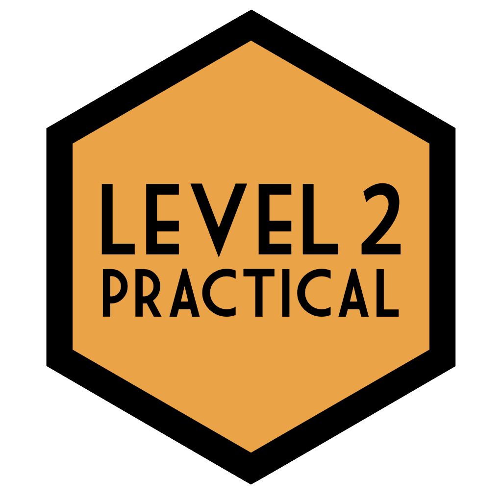

--- 
title: "Level 2 Practical"
date: "`r Sys.Date()`"
site: bookdown::bookdown_site
documentclass: book
bibliography: [book.bib, packages.bib]
biblio-style: apalike
link-citations: yes
description: ug2-practical-materials
---

```{r cite-packages, include = FALSE}
# automatically create a bib database for R packages
# add any packages you want to cite here
knitr::write_bib(c(
  .packages(), 'bookdown', 'tidyverse', 'broom', 'pwr', 'rtweet',
  'meme', 'gganimate', 'webex', 'ggforce', 'knitr', 'faux'
), 'packages.bib')

```

# Overview {-}



Materials for the University of Glasgow School of Psychology Year 2 Research Methods and Statistics Practical Course. 

This course covers data skills such as R Markdown, data wrangling with tidyverse, and data visualisation with ggplot2. It also introduces statistical concepts such as permutation tests, NHST, alpha, power, effect size, and sample size. Semester 2 focusses on correlations and the general linear model.


